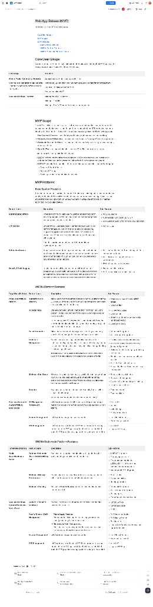

# Web App Release (MVP)

> **Source:** Confluence — Conscious Landbank workspace
> **Author:** Kevin
> **Read time:** 4 min
> **Reactions:** 10
> **Captured:** May 9, 2026

---

## Source fidelity notes (preserved as-is, not corrected)

- "Concisous Lanbank Operator" (in Core User Groups table) — kept verbatim.
- "Concisous Landbank Operator" / "Concisous Lanbank Operator" (in feature tables) — kept verbatim.
- "Stablecoin Tracking — Display the Proof of Reserve and the balance held in the user's connected wallet." — kept verbatim.
- The Stablecoin Platform table header row appears twice in the source (once at the section intro, once before the body). Both occurrences are preserved below to honor "don't delete anything."
- Curly apostrophes, em-dashes, and original punctuation kept exactly.

---

## Table of Contents

1. [Core User Groups](#core-user-groups)
2. [MVP Scope](#mvp-scope)
3. [MVP Features](#mvp-features)
   - [Base System Features](#base-system-features)
   - [UNERA Platform Features](#unera-platform-features)
   - [UNERA Stablecoin Platform Features](#unera-stablecoin-platform-features)

---

## Core User Groups

Core user groups represent the key stakeholders of the platform, ensuring the MVP focuses on the needs and priorities of those who interact with it most.

| User Group | Activities |
| --- | --- |
| **General Public / Community Members**  *Note: the MVP can target to early adopter (Community Members) before releasing to the public* | - Access the info of the Humanity Center (HC) - Purchase hCAD with traditional payment (INTERACT e-transfer or card payment) - Use hCAD to make a donation to HC - Remittance using hCAD |
| **Concisous Lanbank Operator** | - Manage the hCAD issuance - Manage HC profile - Manage a Proof of Reserve for treasury and provenance |

---

## MVP Scope

The MVP will deliver a responsive, cross-platform web app that enables users and operators to access the core stablecoin services. Designed for a rapid rollout, the MVP product is planned to launch within four months. The essential functionalities are organized into the following groups:

- **User Access & Security** – login, identity verification, notifications, and audit tracking.
- **Humanity Centre Information** – browse and view Humanity Centre profiles and program details.
- **Stablecoin Services for Users** – release the stablecoin and allow users to purchase, manage, donate, and send it.
- **Operator Tools** – manage stablecoin issuance, HC profiles, and proof of reserves.

These features will be organized into 2 services:

- **UNERA Platform**: provide all services relating to UNERA ecosystem excluding stablecoin redemption & issuance and governance voting (for the future governance system)
- **UNERA Stablecoin Portal**: handle all the features relating to stablecoin issuance & redemption:
  - Treasury & Proof of Reserve
  - On-ramp / Off-ramp
  - Tracking and Monitoring circulated stablecoins

---

## MVP Features

### Base System Features

Provides the foundational services that support the platform, including secure user authentication, identity verification (KYC), real-time notifications, and comprehensive auditing. These services ensure that users and operators can access the platform safely, stay informed, and maintain accountability across all activities.

| Feature Name | Description | Sub-Features |
| --- | --- | --- |
| **Authentication Service** | Provides a secure and easy way for users to access the platform, ensuring that only verified individuals can log in and manage their accounts, transactions, or donations. | - Account Creation - Authentication Service including 2FA - Role-based access control for users and operators |
| **KYC Service** | Ensures that all users are properly verified before accessing key platform features, such as purchasing or sending stablecoins. Supports integration with trusted third-party KYC providers to streamline verification while maintaining security and compliance with regulations.  *Note: this service can be optional for MVP, depending on regulatory compliance* | - KYC Services |
| **Notification Service** | Keeps users informed about important events, such as stablecoin purchases, donations, remittances, or verification updates. Ensures timely communication through multiple channels so users always know the status of their actions. | - Real-time notifications for transactions, donations, and account updates - Email alerts with clear action items or confirmations - SMS notifications for major event |
| **Security & Audit Logging** | Tracks and records all key actions on the platform to ensure transparency, accountability, and security. Provides operators and administrators with an easy-to-understand view of activity while maintaining detailed records for compliance and troubleshooting. | - Events and activities logs - Alerts for suspicious or unusual activity |

---

### UNERA Platform Features

#### Public Users / UNERA Platform

| Feature Name | Description | Sub-Features |
| --- | --- | --- |
| **Humanity Centre Directory** | Allows users to browse and explore all Humanity Centres within the CLB network through a responsive web app that adapts seamlessly across mobile, tablet, and desktop. | - Adaptive grid layout to view all HC details - Search & filter |
| **HC Detail Page** | Displays complete Humanity Centre (HC) information, including content, images, and sections for the best viewing experience on any screen size.  Users can browse HC overview details, see donation information, view simple donation statistics (daily, weekly, monthly, yearly), and donate directly from the same page. | - HC overview pages - Donation info - Statistics on donation (by day, weeks, months and years) - Donation function |
| **Wallet Connection** | Allows users to connect their crypto wallet so they can securely view, hold, and manage the stablecoins they've purchased. | - Metamask Integration - Wallet Connect Integration |
| **Stablecoin Management** | Provides users with a simple and intuitive overview of their stablecoin holdings and activity. Users can track balances, monitor transactions, and quickly access key actions like sending, donating, or purchasing stablecoins.  The service will bring users to the Stablecoin portal when users want to mint new stablecoin or redeem the Stablecoin for fiat. | - Display current stablecoin balances - View recent transactions with status (completed, pending) - Quick buttons for sending or purchasing stablecoins - Simple visual summaries of activity and balances - Alerts for transaction statuses - Access donation and remittance history in one place |
| **Stablecoin Remittance** | Shows users which stablecoins are available for remittance on their location, and lets users send hCAD to others with automatic conversion to a cashable crypto for the recipient, providing clear tracking and transfer confirmation. | - Send crypto to wallet address - Payee wallet management - Crypto-to-Crypto matching for cashing - Transfer confirmation |
| **Donation** | Enables users to donate stablecoins to Humanity Centres with a simple, intuitive process.  Users can use the function to view their donation history. | - Donation service - Donation history |

#### Concisous Landbank Operator / UNERA Admin Portal

| Feature Name | Description | Sub-Features |
| --- | --- | --- |
| **HC Management (Create/Edit)** | Let Operators create and edit Humanity Centre profiles through responsive web app forms that support media uploads and content editing. | - Create HC - Edit HC - Upload images - Activate/deactivate |
| **Account Management** | Let Operators manage the users' accounts. | - Lock/Unlock Account - Force reset password |
| **KYC Management** | Let Operators view and update KYC Status for users (for example, force users to do KYC again or update the status to completed when the KYC provider is having a problem syncing with our data). | - View KYC - Update KYC Status |

---

### UNERA Stablecoin Platform Features

> Source repeats the column header row twice. Both occurrences are preserved below to honor "no deletion."

| Target User/Platform | Feature Name | Description | Sub-Features |
| --- | --- | --- | --- |
| Target User/Platform | Feature Name | Description | Sub-Features |

#### Public Users / Stablecoin Portal

| Feature Name | Description | Sub-Features |
| --- | --- | --- |
| **Purchase Stablecoins (Fiat → hCAD/hUSD) by Fiat** | Enables users to purchase stablecoins with a guided flow that works smoothly on mobile, tablet, and desktop. | - INTERAC e-transfer - Card payment service - Crypto payment service (via USDC/USDT or any whitelisted stablecoin used for payment) - Exchange rate API integration |
| **Stablecoin Delivery Confirmation** | Provides users with a clear view of delivery status, transaction details, and receipts for their stablecoin purchases. | - Status tracker - Transaction history - Receipt generation |
| **Stablecoin Tracking** | Display the Proof of Reserve and the balance held in the user's connected wallet. | - Metamask Integration - Wallet Connect Integration - Balance query - Graph for stablecoin circulation |

#### Concisous Lanbank Operator / Stablecoin Admin Portal

| Feature Name | Description | Sub-Features |
| --- | --- | --- |
| **Stablecoin Issuance Dashboard** | Provides Operators a dashboard to mint and issue stablecoins based on fiat deposits. | - Minting Service - Minting audit logs - Supply |
| **Proof of Reserve (PoR) Management** | **Token Supply Tracking** — Records and displays the total token supply cross-chain managed securely by smart contracts.  **Reserve and Audit Transparency** — Publishes reserve backing and audit information in a clear, transparent, and easy-to-understand format. | - PoR Recording Service - PoR Display Service - Backing ratio - Update/Add Stablecoin addresses and supported chains |
| **Account Management** | Let Operators manage the users' accounts. | - Lock/Unlock Account - Force reset password |
| **KYC Management** | Let Operators view and update KYC Status for users (for example, force users to do KYC again or update the status to completed when the KYC provider is having a problem syncing with our data). | - View KYC - Update KYC Status |
