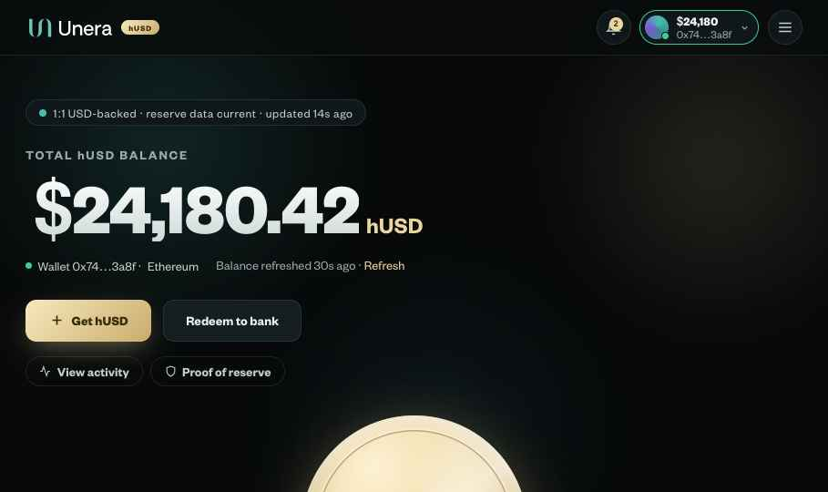
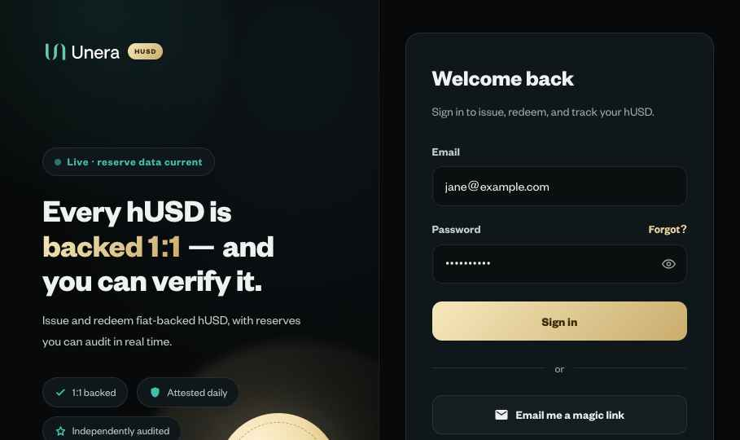
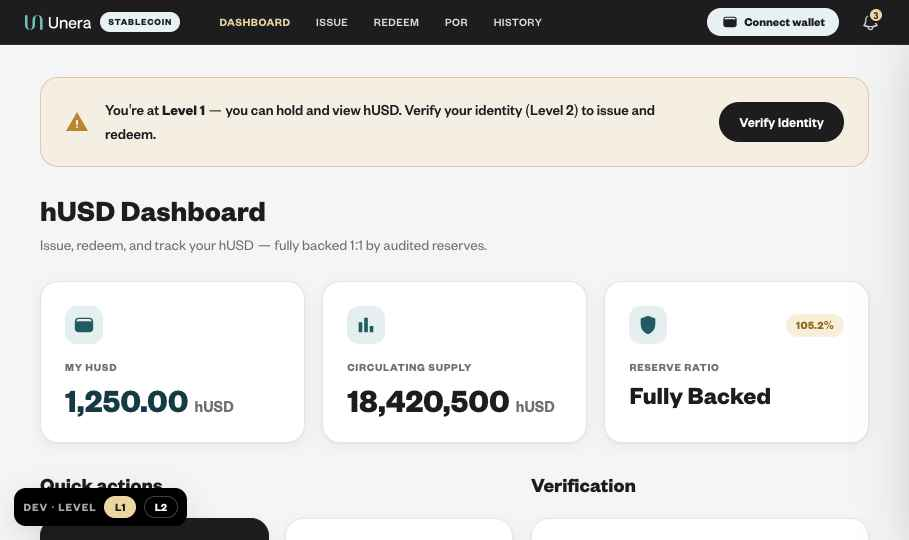

# UNERA hUSD — Responsive Test-Case Matrix

**Version:** 1.0 · **Compiled:** 2026-07-18
**Companion to:** `_audit/Master-Test-Cases-2026-07.md` (functional/validation/edge cases).
**Scope:** Responsive behaviour of all three artifacts across 9 standard widths — small &
large mobile, tablet, laptop, desktop — for every screen, component, and field.
**Requirements traced to** the live Confluence specs (PRD 61276166 v14, Issuance/Redemption
62259435 v5, Dashboard 66912287 v4 — *"Use responsive cards on mobile and avoid wide tables"*
§8 + AC "works responsively on desktop, tablet, and mobile" §12; Auth&KYC 20152341 v7; Wallet
Connection 30081028 v17; Notification Services 65634349 v8 §7.5.2.7; FE-155).

## Artifacts

| Key | File | Baseline screenshot |
|---|---|---|
| **PORT** | `UNERA hUSD Portal.dc.html` | `responsive/portal-dashboard-desktop.png` |
| **AUTH** | `ui_kits/auth/index.html` | `responsive/auth-login.png` |
| **KIT** | `ui_kits/stablecoin-app/index.html` | `responsive/kit-dashboard.png` |

## Standard test widths (device map)

| Width | Class | Representative device |
|---|---|---|
| **320px** | Small mobile | iPhone SE (1st/2nd gen), Galaxy Fold cover, smallest supported |
| **360px** | Mobile | Galaxy S-series, common Android baseline |
| **390px** | Mobile | iPhone 12/13/14/15 |
| **430px** | Large mobile | iPhone 15 Pro Max, Pixel 8 Pro |
| **768px** | Tablet portrait | iPad, iPad mini |
| **1024px** | Tablet landscape / small laptop | iPad Pro landscape, small notebooks |
| **1280px** | Laptop | 13″ laptops |
| **1440px** | Desktop | standard desktop / 15″ |
| **1920px** | Large desktop | 1080p monitors |

> ⚠️ **Capture note.** These reference screenshots are same-document renders at the preview
> width (~900–1440px). The authoring environment cannot rasterise nested iframes or resize the
> browser viewport, so true per-device-width screenshots must be captured in browser DevTools
> (responsive mode) or on a device. This matrix defines the **expected result at each width** so
> a tester or the background verifier can confirm each cell. Every expectation is derived from
> the artifact's actual `@media` rules (listed below) — not guessed.

---

# 0 · Authoritative breakpoint maps (from source `@media` rules)

## PORT — `UNERA hUSD Portal.dc.html` (`data-r` hooks)
| Breakpoint | What changes |
|---|---|
| `≤1080px` | `g2` two-col → **1 col** (holdings/activity split stacks) |
| `≤960px` | Desktop nav links **hidden**; **hamburger** appears; preview-state selector hidden (`hidemobile`); nav drawer enabled |
| `≤900px` | `g3` three-col → **2 col** |
| `≤720px` | container/nav padding reduced; `g3` → **1 col**; `g4` → **2 col**; `flexwrap` wraps; hero balance `bal` → **3rem**; `h1` → **1.95rem**; activity table → **horizontal-scroll** (row min-width 600px) |
| `≤640px` | Wallet cards → **column** stack; wallet action buttons wrap full-width |
| `≤560px` | `g2phone` (PoR 4-up stat grid) → **1 col** |
| `≤460px` | `g4` → **1 col**; `bal` → **2.5rem**; padding tightened; hero coin → **180px**; `h1` → **1.7rem**; auth buttons shrink |
| `≤380px` | Nav **"Log in"** button hidden (Sign up remains beside hamburger) |
| `prefers-reduced-motion` | all animation/transition collapsed to 0.01ms |

## AUTH — `ui_kits/auth/index.html`
| Breakpoint | What changes |
|---|---|
| `≤820px` | Split grid → **single column**; **brand panel hidden**; Remember-Me row shown (mobile-only, per SAD-3) |
| `≤520px` | Form padding 1.5rem/1rem; card radius 14px; OTP boxes flex; backup-code grid tightens |
| `≤360px` | Backup-code grid → **1 col** |

## KIT — `ui_kits/stablecoin-app/index.html`
| Breakpoint | What changes |
|---|---|
| `≤920px` | `kpi / actions / por-grid / por-hero / two-col / yield-split` → **1 col**; **nav links hidden** |
| `≤760px` | `hist-summary` → 2-col; `hist-hero-grid` → 1-col (stats border/padding reflow) |

> 🔴 **Two structural gaps in KIT (see Findings F-01/F-02):** below **920px the nav links are
> hidden with no hamburger/menu replacement** — primary navigation becomes unreachable on
> mobile; and there is **no breakpoint below 760px**, so 320–430px phones get only fluid
> scaling with no layout adaptation.

---

# Part A · Per-breakpoint checklists

Legend: fill `✓ / ✗ / n/a`. "No h-scroll" = page must not scroll horizontally (only
intentionally-scrollable regions like the activity table may).

## A1 · 320px — Small mobile (worst case)

| # | Artifact | Check | Expected | Result |
|---|---|---|---|---|
| R320-01 | PORT | Page h-scroll | None; all content fits 320px, tightened padding (14px) | |
| R320-02 | PORT | Nav | Hamburger only; **Log in hidden** (≤380), Sign up + burger fit | |
| R320-03 | PORT | Hero balance | `bal` 2.5rem, `$24,180.42` not clipped/overflowing | |
| R320-04 | PORT | Hero coin | 180px, centered, no overflow | |
| R320-05 | PORT | KPI/next-steps `g4` | 1 col | |
| R320-06 | PORT | Get/Redeem amount fields | Full-width; inline errors wrap; CTA full-width | |
| R320-07 | PORT | PoR stat grid `g2phone` | 1 col; 2.1rem figures don't crowd | |
| R320-08 | PORT | Activity table | Horizontal-scroll within card (row min-width 600) — page itself no h-scroll | |
| R320-09 | PORT | Wallets cards | Stacked column; action buttons wrap, each ≥44px tall | |
| R320-10 | PORT | Modals (connect, sign, receipt, confirm, bank) | Fit width with padding; no clipping; close reachable | |
| R320-11 | PORT | Notification panel | 340px panel may exceed 320 viewport → verify it clamps within screen | |
| R320-12 | AUTH | Login | Single column, brand hidden; card padding reduced; fields full-width | |
| R320-13 | AUTH | OTP boxes | 6 boxes fit on one row at 320 (flex) or wrap gracefully | |
| R320-14 | AUTH | Backup codes | 1 col grid | |
| R320-15 | AUTH | Password checklist | 1 col, readable | |
| R320-16 | KIT | Nav | 🔴 links hidden, **no menu** — flag (F-01) | |
| R320-17 | KIT | KPI / actions / PoR grids | 1 col (from ≤920) | |
| R320-18 | KIT | No sub-760 rule | Verify cards/hero/tables don't overflow at 320 with only fluid scaling (F-02) | |
| R320-19 | ALL | Touch targets | Buttons/links ≥44×44px (min scale rule) | |
| R320-20 | ALL | Font min | No body text below ~13px after scale-down | |

## A2 · 360px — Mobile (common Android)
Same set as 320px; additionally:
| # | Artifact | Check | Expected | Result |
|---|---|---|---|---|
| R360-01 | PORT | Nav Log in | Still hidden ≤380; reappears >380 | |
| R360-02 | PORT | `g4` | 1 col (≤460) | |
| R360-03 | AUTH | Backup grid | 1 col (≤360 boundary — verify at exactly 360) | |
| R360-04 | ALL | No h-scroll | Confirm | |

## A3 · 390px — Mobile (iPhone 12–15)
| # | Artifact | Check | Expected | Result |
|---|---|---|---|---|
| R390-01 | PORT | Nav Log in | **Visible** again (>380); Log in + Sign up + burger all fit | |
| R390-02 | PORT | `bal` | 2.5rem (≤460) | |
| R390-03 | PORT | PoR `g2phone` | 1 col (≤560) | |
| R390-04 | AUTH | Backup grid | multi-col again (>360) | |
| R390-05 | KIT | Layout | still 1-col stacks; no menu (F-01) | |

## A4 · 430px — Large mobile
| # | Artifact | Check | Expected | Result |
|---|---|---|---|---|
| R430-01 | PORT | `bal` | 2.5rem still (≤460) | |
| R430-02 | PORT | `g4` | 1 col (≤460) | |
| R430-03 | PORT | Wallet cards | stacked (≤640) | |
| R430-04 | PORT | Hero coin | 180px (≤460) | |
| R430-05 | ALL | No h-scroll; comfortable gutters | Confirm | |

## A5 · 768px — Tablet portrait
| # | Artifact | Check | Expected | Result |
|---|---|---|---|---|
| R768-01 | PORT | Nav | Hamburger (≤960); preview selector hidden | |
| R768-02 | PORT | `bal`/`h1` | 3rem / 1.95rem (≤720 applies; at 768 they're full size — verify 720↔768 boundary) | |
| R768-03 | PORT | `g2` | 1 col (≤1080) | |
| R768-04 | PORT | `g3` | 1 col (≤720) | |
| R768-05 | PORT | `g4` | 2 col (≤720) | |
| R768-06 | PORT | Wallet cards | still row (>640) | |
| R768-07 | PORT | Activity table | h-scroll (≤720) | |
| R768-08 | AUTH | Layout | single column, brand hidden (≤820) | |
| R768-09 | KIT | Grids | 1 col (≤920); **nav hidden, no menu** (F-01) | |
| R768-10 | KIT | History summary/hero | 2-col summary, 1-col hero (≤760 → at 768 just above; verify boundary) | |

## A6 · 1024px — Tablet landscape / small laptop
| # | Artifact | Check | Expected | Result |
|---|---|---|---|---|
| R1024-01 | PORT | Nav | Full nav links visible (>960); preview selector visible | |
| R1024-02 | PORT | `g2` | 1 col (≤1080 still applies) | |
| R1024-03 | PORT | `g3` | 2 col (≤... — at 1024 >900 so 3-col; verify) | |
| R1024-04 | AUTH | Split | **two-column** restored (>820): brand panel + form | |
| R1024-05 | KIT | Grids | multi-col restored (>920); nav links visible | |

## A7 · 1280px — Laptop
| # | Artifact | Check | Expected | Result |
|---|---|---|---|---|
| R1280-01 | PORT | `g2` | **2 col** (>1080) — holdings/activity side by side | |
| R1280-02 | PORT | Max-width | Content capped at 1240px, centered, even gutters | |
| R1280-03 | AUTH | Split | 1.05fr / 1fr grid, balanced | |
| R1280-04 | KIT | Full multi-col | KPI 3-up, actions/PoR multi-col | |

## A8 · 1440px — Desktop
| # | Artifact | Check | Expected | Result |
|---|---|---|---|---|
| R1440-01 | PORT | Max-width | 1240px container centered; no stretched line-lengths | |
| R1440-02 | ALL | Whitespace | Balanced; no orphaned empty regions | |
| R1440-03 | KIT | Layout | Full desktop grid; nav inline | |

## A9 · 1920px — Large desktop
| # | Artifact | Check | Expected | Result |
|---|---|---|---|---|
| R1920-01 | PORT | Centering | 1240px container centered; generous but not empty side gutters | |
| R1920-02 | ALL | Backgrounds/ambient | Fill viewport; no seams or cut-offs | |
| R1920-03 | ALL | Images/coin/gauges | Crisp, not upscaled-blurry | |

---

# Part B · Responsive QA matrix (per component / field)

Columns: **ID · Screen / Component / Field · Key width(s) · Expected · Result**

## B1 · PORT — global chrome
| ID | Component | Width | Expected | Result |
|---|---|---|---|---|
| PR-NAV-01 | Top nav links | ≤960 | Hidden; replaced by hamburger toggle | |
| PR-NAV-02 | Hamburger drawer | ≤960 | Opens full-width drawer; all destinations incl. Wallets; ≥44px rows | |
| PR-NAV-03 | Preview-state selector | ≤960 | Hidden (`hidemobile`); state still switchable via drawer if exposed | |
| PR-NAV-04 | Wallet pill | ≤460 | Shrinks; address + balance legible; dropdown fits viewport | |
| PR-NAV-05 | Log in / Sign up | ≤460 / ≤380 | Buttons shrink; Log in hidden ≤380, Sign up persists | |
| PR-NAV-06 | Notification bell + badge | all | Badge caps 99+; panel (340px) clamps within ≤360 viewports without h-scroll | |
| PR-NAV-07 | Notification panel rows | ≤360 | Title/body wrap; timestamp + icon aligned; no clip | |
| PR-NAV-08 | Signed-out banner | ≤720 | `flexwrap` wraps; dismiss + link reachable | |

## B2 · PORT — dashboard / portfolio
| ID | Component | Width | Expected | Result |
|---|---|---|---|---|
| PR-DASH-01 | Hero balance figure | ≤720 / ≤460 | 3rem / 2.5rem; never clips or overflows gutter | |
| PR-DASH-02 | Hero coin medallion | ≤460 | 180px; centered | |
| PR-DASH-03 | Status/trust chip row | ≤720 | Wraps (`flexwrap`); no overflow | |
| PR-DASH-04 | Quick-action CTAs (Get/Redeem/Activity/PoR) | ≤460 | Stack/wrap full-width; ≥44px | |
| PR-DASH-05 | Holdings ↔ activity split `g2` | ≤1080 | 1 col | |
| PR-DASH-06 | Balance-across-networks card | ≤720 | Rows readable; bars full-width | |
| PR-DASH-07 | Recent activity table | ≤720 | Card h-scroll; row min-width 600; page no h-scroll | |
| PR-DASH-08 | Network-activity aggregate `g3` | ≤900 / ≤720 | 2 col / 1 col | |
| PR-DASH-09 | Verify/connect banner | ≤720 | Text wraps; CTA full-width; icon aligned | |
| PR-DASH-10 | No-wallet next-steps `g4` | ≤720 / ≤460 | 2 col / 1 col | |

## B3 · PORT — Get / Issue flow (all fields)
| ID | Component / Field | Width | Expected | Result |
|---|---|---|---|---|
| PR-GET-01 | Fiat/crypto path toggle | ≤460 | Two buttons stay tappable; no clip | |
| PR-GET-02 | USD/CAD currency toggle | ≤460 | Fits; labels legible | |
| PR-GET-03 | "You pay" / "You receive" inputs | ≤360 | Full-width; large numerals don't overflow; currency suffix inline | |
| PR-GET-04 | Amount inline error | ≤360 | Wraps under field; icon + text aligned | |
| PR-GET-05 | Network selector (Ethereum/Base) | ≤360 | 2 buttons flex; fit row | |
| PR-GET-06 | 60-s quote card | ≤460 | Rows (rate/fee/limit) stack label↔value without overlap | |
| PR-GET-07 | Crypto deposit QR + address | ≤360 | QR centered; address wraps/truncates with copy button reachable | |
| PR-GET-08 | Allowlist warning | ≤360 | Full-width, readable | |
| PR-GET-09 | Confirmation-depth meter | ≤360 | Bar full-width; X/12 legible | |
| PR-GET-10 | Mint status timeline | ≤360 | Vertical timeline; dots/labels aligned; no overflow | |
| PR-GET-11 | Primary CTA | all | Full-width; label states blocker; ≥44px | |

## B4 · PORT — Redeem flow
| ID | Component / Field | Width | Expected | Result |
|---|---|---|---|---|
| PR-RED-01 | hUSD amount input | ≤360 | Full-width; balance line wraps | |
| PR-RED-02 | Bank-account selector / add | ≤360 | Rows stack; "Add bank" reachable | |
| PR-RED-03 | Redeem preview card | ≤460 | label↔value rows don't overlap | |
| PR-RED-04 | Liquidity-queue banner | ≤360 | Wraps; ETA legible | |
| PR-RED-05 | Burn timeline | ≤360 | Vertical; aligned | |

## B5 · PORT — Proof of Reserve
| ID | Component | Width | Expected | Result |
|---|---|---|---|---|
| PR-POR-01 | Reserve-ratio gauge | ≤460 | Scales; center label legible; not clipped | |
| PR-POR-02 | Composition chart | ≤560 | Full-width; legend wraps | |
| PR-POR-03 | 4-up stat grid `g2phone` | ≤560 | 1 col; 2.1rem figures fit | |
| PR-POR-04 | Custodian / maturity bars | ≤560 | Full-width; labels legible | |
| PR-POR-05 | 90-day trend chart | ≤560 | Scales; range control reachable | |
| PR-POR-06 | Contract-info card | ≤360 | Address truncates; copy + explorer reachable | |
| PR-POR-07 | Attestation list | ≤360 | Rows stack; download reachable | |
| PR-POR-08 | Yield → Humanity Centres split | ≤720 | Stacks | |

## B6 · PORT — Activity / Verify / Wallets
| ID | Component | Width | Expected | Result |
|---|---|---|---|---|
| PR-ACT-01 | Filter chips | ≤460 | Wrap to multiple rows; tappable | |
| PR-ACT-02 | Date-range pill | ≤460 | Fits; no clip | |
| PR-ACT-03 | Activity rows / receipt modal | ≤360 | Table h-scroll; modal fits width | |
| PR-VER-01 | Tier cards (L1/L2/L3) | ≤900 / ≤720 | 2 col / 1 col; reqs list readable | |
| PR-WAL-01 | Wallet card | ≤640 | Column stack; address + chips wrap | |
| PR-WAL-02 | Wallet action buttons (verify/switch/disconnect/remove/rename) | ≤640 | Row-wrap full-width; each ≥44px | |
| PR-WAL-03 | Bind-wallet CTA + empty state | ≤360 | Centered; button ≥44px; copy wraps | |
| PR-WAL-04 | Wallet summary stats | ≤560 | Stack; figures fit | |
| PR-WAL-05 | Rename inline editor | ≤360 | Input + save/cancel fit; no overflow | |
| PR-WAL-06 | Status notice toast | ≤360 | Full-width; dismiss reachable | |

## B7 · PORT — modals & overlays
| ID | Component | Width | Expected | Result |
|---|---|---|---|---|
| PR-MOD-01 | Connect-wallet modal | ≤360 | Provider rows full-width; mode sub-labels wrap; close reachable | |
| PR-MOD-02 | WalletConnect QR sub-step | ≤360 | QR centered; "I've scanned" button full-width | |
| PR-MOD-03 | Sign-message (SIWE) modal | ≤360 | Message rows wrap; Sign button ≥44px | |
| PR-MOD-04 | Receipt modal | ≤360 | Field rows wrap; download reachable; scrolls if tall | |
| PR-MOD-05 | Confirm (disconnect/remove) | ≤360 | Fits; both buttons reachable | |
| PR-MOD-06 | Bank-account modal + form | ≤360 | Inputs full-width; keyboard doesn't obscure submit | |
| PR-MOD-07 | Card checkout / add-card form | ≤360 | Fields stack; expiry/CVV row fits | |

## B8 · AUTH — every pane
| ID | Pane / Component | Width | Expected | Result |
|---|---|---|---|---|
| AU-01 | Split layout | ≤820 | Single column; **brand panel hidden** | |
| AU-02 | Remember-Me row | ≤820 | **Shown** (mobile-only per SAD-3) | |
| AU-03 | Login form | ≤520 | Card padding reduced; fields full-width; eye toggle reachable | |
| AU-04 | Signup + password checklist | ≤520 | Checklist 1 col; ToS row wraps | |
| AU-05 | OTP panes (verify/2FA/setup) | ≤520 / ≤360 | 6 boxes flex; fit or wrap; no h-scroll at 320 | |
| AU-06 | About-you (name/country) | ≤520 | Fields full-width; country combobox dropdown fits | |
| AU-07 | Protect-account cards | ≤520 | Stack full-width; ≥44px | |
| AU-08 | Backup-codes grid | ≤360 | **1 col** | |
| AU-09 | Reset / new-password | ≤520 | Fields + checklist fit; match error wraps | |
| AU-10 | KYC start / flow / selfie panes | ≤520 | ID slots + selfie circle scale; partner note wraps | |
| AU-11 | Idle-warning modal | ≤360 | Countdown + 2 buttons fit; not clipped | |
| AU-12 | Signed-out pane | ≤360 | Cause copy wraps; CTA full-width | |

## B9 · KIT — every screen
| ID | Screen / Component | Width | Expected | Result |
|---|---|---|---|---|
| KT-01 | Nav | ≤920 | 🔴 links hidden with **no menu** — navigation unreachable (F-01) | |
| KT-02 | Dashboard KPI grid | ≤920 | 1 col | |
| KT-03 | Quick actions | ≤920 | 1 col | |
| KT-04 | Level banner | ≤920 | Text wraps; CTA reachable | |
| KT-05 | Issue flow form | ≤760 / <760 | Verify no overflow below 760 (F-02 — no rule) | |
| KT-06 | Redeem flow form | <760 | Same — verify fluid scaling holds at 320 | |
| KT-07 | PoR grid / hero | ≤920 | 1 col | |
| KT-08 | History summary | ≤760 | 2 col | |
| KT-09 | History hero grid | ≤760 | 1 col; stats border/padding reflow | |
| KT-10 | History rows + detail drawer | <760 | Rows readable; drawer fits/scrolls; verify at 320 | |
| KT-11 | KYC screen | ≤920 / <760 | Single-col; verify capture UI fits 320 | |

---

# Part C · Cross-cutting responsive checks (all artifacts)

| ID | Check | Expected | Result |
|---|---|---|---|
| X-01 | Horizontal scroll @320 | No page-level h-scroll on any screen (only opt-in scroll regions) | |
| X-02 | Touch targets | Interactive elements ≥44×44px on ≤768 (min-scale rule) | |
| X-03 | Tap spacing | Adjacent tappables ≥8px apart; no mis-tap risk | |
| X-04 | Font legibility | No body copy <13px after mobile scale-down; numerals never clipped | |
| X-05 | Modal on mobile | Centered/attached, fits width, internal scroll if taller than viewport; backdrop dismiss + explicit close | |
| X-06 | Sticky nav | Doesn't cover content; drawer scrolls if taller than viewport | |
| X-07 | Landscape phone (≤430 × short height) | Modals/timelines scroll; nothing cut off | |
| X-08 | Long content | Long addresses/emails/amounts wrap or truncate with affordance | |
| X-09 | Browser zoom 200% | Layout reflows like a narrow viewport; no clipping/overlap (WCAG 1.4.10) | |
| X-10 | Dynamic viewport (mobile URL bar) | Uses `dvh`/safe-area where fixed elements are pinned; no jump-clip | |
| X-11 | Reduced motion | PORT & AUTH collapse animation (rule present); KIT — verify | |
| X-12 | Notification panel width vs viewport | 400px spec panel → full-width drawer <768 (Notif §7.5.2.7); PORT panel 340px must clamp ≤320 | |
| X-13 | Orientation change | No layout lock; re-flows on rotate | |

---

# Part D · Findings & gaps

| ID | Sev | Artifact | Finding | Fix |
|---|---|---|---|---|
| **F-01** | **P1** | KIT | Below **920px the nav links are hidden with no hamburger/menu** — primary navigation is unreachable on tablet & mobile. Dashboard §12 AC requires mobile support. | **FIXED** — added `.nav-toggle` hamburger (shown ≤920) + `.nav-drawer` with all destinations (≥44px rows); `toggleNavDrawer()`/`closeNavDrawer()`; `go()` closes it on navigate |
| **F-02** | **P2** | KIT | **No breakpoint below 760px** — 320–430px phones get only fluid scaling; forms/hero/history risk overflow & cramped tap targets. | **FIXED** — added `≤520` rules (wrap/nav padding, `.flow` full-width, page-head scale-down, compact connect-pill, hide nav wallet/network chips, notif panel full-width) + `≤380` (hide app-pill) |
| **F-03** | **P1** | KIT | Trust-copy violation surfaced during capture: dashboard reserve card reads **"Fully Backed"** and subtitle **"fully backed 1:1 by audited reserves"** — breaches Dashboard §8 (never use "Fully backed" as a status). Fixed in PORT, not KIT. | **FIXED** — reserve card now "105.2% backed"; subtitle now "backed 1:1 by audited reserves you can verify" |
| **F-04** | P2 | PORT | Notification panel is a fixed **340px** — at 320px viewport it can exceed the screen. Notif §7.5.2.7 wants a **full-width drawer <768px**. | **FIXED** — panel width now `min(340px, calc(100vw - 24px))` so it never exceeds the viewport |
| **F-05** | P3 | PORT | Breakpoint **720↔768 gap**: hero scale-downs and table-scroll trigger at ≤720, so 721–768px tablets keep desktop-size hero. | Confirm intended; consider raising table/hero rules to ≤768 |
| **F-06** | P3 | ALL | Touch-target audit not yet verified at ≤768; several icon buttons (28–38px) may be under 44px. | Verify + bump hit areas on mobile |
| **F-07** | P3 | KIT | Reduced-motion rule present in PORT/AUTH; **verify KIT** honors `prefers-reduced-motion`. | **FIXED** — added `@media (prefers-reduced-motion: reduce)` collapse to KIT |

> **How to verify** (since per-width screenshots can't be produced in-tool): open each file in
> Chrome DevTools → Device Toolbar, step through 320/360/390/430/768/1024/1280/1440/1920, and
> tick each cell. The background verifier can also `eval` `document.documentElement.clientWidth`
> and computed styles at forced widths to confirm the `@media` transitions above.

---

# Part E · Baseline reference screenshots

Captured at preview width (~900–1440px). For per-device widths use DevTools per Part D.

### PORT — dashboard

### AUTH — login (split → collapses ≤820)

### KIT — dashboard (note F-03 "Fully Backed" copy)

---

## Traceability

| Requirement | Spec | Covered by |
|---|---|---|
| "Works responsively on desktop, tablet, and mobile" | Dashboard §12 AC | Parts A/B, all artifacts |
| "Responsive cards on mobile, avoid wide tables" | Dashboard §8 | PR-DASH-07, PR-ACT-03, KT-08/09 |
| Notification panel full-width drawer <768 | Notif §7.5.2.7 | X-12, F-04, PR-NAV-06/07 |
| Mobile-only Remember Me | SAD-3 / Session | AU-02 |
| Wallet management (bind many, manage) responsive | Wallet Conn §6.1 | PR-WAL-01..06 |
| Reduced motion | design-system motion rule | X-11, F-07 |
| Trust copy (no "fully backed" status) | Dashboard §8 | F-03 |
