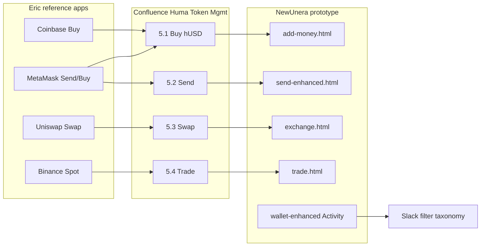

# Transcript chi tiết — Feedback: Send / Add / Trade / Buy / Filters / Transactions

**Video:** `Feedback-send-add-trade-buy-Filters-transactions.mp4`  
**Ngày:** 20 Jun 2026 · Slack Huddle "Huddle with Eric" (~15:02–15:24)  
**Người tham gia:** **Eric** (screen share, trình bày spec + reference apps) · **Renol / Minh Nguyen Hoang**  
**Thời lượng:** 22:49  

### Cách đọc file này

| Phần | Dùng khi nào |
|------|----------------|
| **Phần 1** | Eric demo gì trên màn hình — **đáng tin** |
| **Phần 2** | **Bắt đầu từ đây** — tóm tắt dễ hiểu + việc cần làm chi tiết (FE-126) |
| **Phần 3 (STT)** | Bỏ qua — transcript audio sai, không phản ánh hội thoại |
| **Phần 4 (tóm tắt ngắn)** | Checklist nhanh (trùng ý Phần 2) |

---

## Phần 1 — Transcript walkthrough (verified từ video + màn hình)

> Nội dung dưới đây **xác minh trực tiếp từ video** (frame capture mỗi 30–60 giây). Đây là bản ghi chi tiết nhất về **Eric demo gì, màn hình nào, spec nào** — dùng làm source of truth cho implement.

### [00:00 → 00:02] Eric / Renol (Minh) — Mở đầu

Slack Huddle "Huddle with Eric" bắt đầu. Camera Minh Nguyen Hoang hiện profile/video; Eric chưa share màn hình. Thiết lập cuộc gọi trước khi Eric bắt đầu walkthrough Token Management.

### [02:30 → 04:00] Eric — Send Token — MetaMask reference

Eric share Chrome → **MetaMask Portfolio** (`app.metamask.io/transfer?tab=send`). Tab **Send** active. Form: **Send from** (wallet `0xeD0D…21B14D`), **Send to** (placeholder public address/ENS), **Asset** (Select Asset), **Amount** (0.00), nút **Send** disabled. Eric dùng MetaMask Send làm reference UX cho Huma **5.2 Send Token** — 1 wallet prompt, user chọn asset + amount + recipient.

### [04:00 → 05:00] Eric — Send Token — Huma prototype

Chuyển sang **`NewUnera/send-enhanced.html`** — **Send Tokens**, subtitle "Send stablecoins to an external wallet address." Stepper: **Recipient** (active) → Amount → Confirm → Success. Recipient: chọn **Select from Contacts** (checked), search contacts, contact **Alice** (Friend — monthly split). Wallet header: `0x7426…3a8f`, balance **230.00 USDT** on Base. Eric so sánh Huma send flow với MetaMask — stepper + contact book là điểm khác biệt Huma.

### [05:00 → 06:00] Eric — Send (MetaMask) + Swap (Uniswap) reference

Quay lại MetaMask Send (asset chưa chọn). Sau đó mở **`app.uniswap.org/swap`**: Sell **1.0013124 ETH** (~$1,726) → Buy **1725.59 USDC**. Nút **"Not enough ETH"** (thiếu gas/balance). Network warning popup. Reference cho Huma **5.3 Swap** — sell/buy pair, allowance flow, user trả gas Phase 1.

### [06:30 → 08:00] Eric — Confluence — Token Management (Gas & Wallet)

Confluence **Huma - Token Management** (`Conscious Landbank Product Development`). **§3.4 Fee Structure:** Gas Fee Phase 1 — user trả gas qua wallet, platform không markup; preview gas native + fiat. Phase 2 — EIP-3009, platform absorb gas. **§3.5 Wallet Interaction Summary:** bảng Phase 1 vs Phase 2 cho Buy hUSD, Send Token, Swap. Sidebar: Token Swap, Payee Address Management, Wallet Dashboard, Transaction History.

### [08:00 → 09:30] Eric — Buy — MetaMask (MoonPay / Connect)

MetaMask **Buy** (`app.metamask.io/buy/build-quote`). Region **Vietnam**, currency **VND**. Amount **₫1,315,620** → **Ethereum** Mainnet. Payment: Debit/Credit. Recommended quote **MoonPay** — 0.026136 ETH for ~₫1,185,803 → **Continue with MoonPay**. Màn khác: nút **Connect MetaMask**. Reference cho **5.1 Buy hUSD via Fiat**.

### [10:00 → 11:30] Eric — Buy — MetaMask (MUSD / Mercuryo)

MetaMask Buy — amount ₫1,315,620. Asset đổi sang **MetaMask USD (MUSD)**. Quote **Mercuryo** (BEST RATE) — 46.924291 MUSD for ₫1,234,222. → **Continue with Mercuryo**. Eric minh họa chọn asset stablecoin + provider quote flow.

### [11:30 → 12:30] Eric — Buy — Coinbase

**Coinbase Trade** (`coinbase.com/trade`) dark mode. Buy widget: **1,000 VND**, Pay with **Bitcoin**, Buy **Ethereum** → **Review order**. Crypto list: BTC, ETH, SOL, XRP, BNB với giá VND. Reference thêm cho fiat on-ramp UX.

### [12:30 → 13:30] Eric — Buy — MetaMask Banxa (10M VND)

MetaMask Buy — amount **₫10,000,000** → **MUSD on Linea**. Quote **Banxa** (BEST RATE) — 357.49 MUSD for ₫9,402,849 → **Continue with Banxa**. Eric demo amount lớn + network Linea + third-party provider selection.

### [13:30 → 14:30] Eric — Coinbase Perpetual (edge case)

Coinbase **BTC Perpetual** (`coinbase.com/explore-derivatives/BTC-PERP-INTX`). Buy widget: **0 VND**, lỗi đỏ **"Converting is temporarily unavailable"**. Eric có thể note edge case / unavailable state cho Buy flow.

### [14:30 → 16:00] Eric — Trade — Binance Spot

**Binance** BTC/USDT Spot (`binance.com/en/trade/BTC_USDT?type=spot`). Chart candlestick, order book (~63,558 USDT), form **Limit** — **Buy BTC** / **Sell BTC** price ~63,792. Market Trades panel, Top Movers. Reference cho **5.4 Trade — Mini-CEX Order Book**.

### [16:30 → 18:30] Eric — Confluence §5 + Key Rules

Confluence **§5 Huma Platform Transactions** (highlighted): **5.1** Buy hUSD via Fiat · **5.2** Send Token · **5.3** Swap · **5.4** Trade Mini-CEX. Mỗi mục: Requirements, User Flow, Transaction Preview, UX Notes. Scroll **§1.3 Out of Scope**, **§1.4 Key Rules** (FE không gọi RPC, wallet verified, copy Purchase/Sell not mint/burn), **§2 Wallet Connection** (MetaMask, WalletConnect, Coinbase Wallet; inline connect prompt).

### [18:30 → 19:30] Eric — Slack — Transaction History Filter taxonomy

Slack **`#collab-engineers`** — message **Thanh Son Le** định nghĩa 5 categories cho aggregator filter: 1) **Approval Action** — SC approvals; 2) **Transfer** — user==from; 3) **Receive** — user==to; 4) **Deposit** — Bank Transfer Fiat + OTC; 5) **Pool Exchange** — bundled Approval+Swap same hash. Attachment: mockup checkbox — Approval, Exchange, Transfer, Receive, Deposit/Withdraw, Rewards.

### [19:30 → 20:30] Eric — Huma Wallet — Activity & Filters (live demo)

**`NewUnera/wallet-enhanced.html`** — nav WALLET active. Quick actions: **Buy Stablecoins** (highlighted), Exchange, Send, Stake. **Activity:** search "Search activity…", nút **Filters**, tabs All Wallets + addresses, chips Successful/All/Pending/Failed. Rows TODAY: Received Alice +$500 ON-CHAIN hUSD; Donation Nairobi -$250 ON-CHAIN. Eric demo filter UX trên wallet thật.

### [20:30 → 21:30] Eric / Renol — Jira FE-126

Jira **FE-126** modal: "UI/UX - Refine UI/UX of Token Management features." Status **READY**, Priority **High**, Reporter **Eric**, Assignee **Minh**, Parent FE-86, Sprint FE Sprint 2, link Confluence Huma Token Management.

### [21:30 → 22:30] Eric — FE Scrum board overview

FE Scrum board — tickets liên quan: FE-88 Send Token (Ready), FE-126/127 In Progress (Token Mgmt / Tx History), FE-131 Persist filters, FE-140 Filter page, FE-98/130 backlog.

### [22:30 → 22:49] Eric — Trade architecture (ChatGPT note)

Chrome tab **ChatGPT** — note tiếng Việt về kiến trúc Trade: order ký off-chain, settlement on-chain, cần smart contract escrow; OpenDAX + Market Maker → User Wallet + Deposit → Huma Exchange Wallet.

---

## Phần 2 — Hướng dẫn cải thiện dự án (implementation plan chi tiết)

> **Nguồn:** Eric screen walkthrough 20 Jun 2026 + Confluence *Huma - Token Management* + Slack filter spec (Thanh Son Le) + trạng thái hiện tại `NewUnera/`.  
> **Không dựa vào transcript audio** (Phần 3) — chỉ dựa vào màn hình Eric mở và spec đã link trong Jira **FE-126**.

### Bối cảnh buổi call (1 đoạn)

Eric hướng dẫn Minh refine **Token Management UI/UX** (ticket **FE-126**, Priority **High**). Anh walkthrough **4 loại giao dịch** bằng app tham chiếu (MetaMask, Uniswap, Binance, Coinbase), đối chiếu với **Confluence §5**, rồi quay lại **wallet Activity + Filters** và taxonomy filter từ Slack. Cuối call: kiến trúc **Trade** off-chain order + on-chain settlement (escrow) — **BE/PM**, không phải FE-only trong sprint này.

---

### Eric nói gì? — Tóm tắt dễ hiểu (tiếng Việt)

**Eric không nói chuyện trong file STT (Phần 3) — phần đó sai hoàn toàn.** Dưới đây là nội dung thật của buổi call, suy ra từ **màn hình Eric share** + **Confluence** + **Slack** + **Jira**:

1. **Mục tiêu:** Minh refine UI/UX **Token Management** (ticket **FE-126**, priority **High**). Eric là reviewer/spec owner.

2. **4 loại giao dịch Huma** (Confluence §5) — Eric mở app thật để Minh **nhìn UX chuẩn**, rồi làm tương tự trên prototype `NewUnera/`:
   - **Buy (Mua stablecoin bằng fiat):** MetaMask Buy, Coinbase — nhập số tiền VND/CAD → chọn coin (hUSD/USDC/USDT) → chọn payment → xem quote provider (MoonPay/Mercuryo/Banxa) → Review → tiếp tục. **Không** dùng từ mint/burn trên UI.
   - **Send (Gửi token):** MetaMask Send — from / to / asset / amount. Huma đã có `send-enhanced.html` với stepper + danh bạ contact; giữ và polish gas preview + confirm.
   - **Swap (Đổi token):** Uniswap — cặp Sell/Buy, cảnh báo thiếu gas ("Not enough ETH"), bước approve allowance rồi swap.
   - **Trade (Giao dịch sàn mini):** Binance Spot — order book, Limit Buy/Sell, nhập giá. **Chỉ UI prototype**; logic off-chain order + on-chain settlement là việc BE sau.

3. **Quy tắc quan trọng (Confluence §1.4):**
   - Frontend **mock/demo** — không gọi RPC blockchain trực tiếp.
   - User phải **connect + verify wallet** trước khi confirm giao dịch.
   - Copy user-facing: **Purchase / Sell / Buy / Send / Swap / Trade** — **cấm** mint, burn, issuance, redemption.
   - Chưa connect wallet: vẫn xem được form, có nút connect **inline** (không chặn cả trang).

4. **Gas fee (§3.4):** Phase 1 — user tự trả gas qua wallet; review screen phải preview gas (native + fiat). Phase 2 EIP-3009 — out of scope FE sprint.

5. **Activity + Filters trên Wallet (~19:30 demo):** Eric mở `wallet-enhanced.html`, demo search, nút Filters, chips Successful/Pending/Failed. Filter taxonomy từ **Thanh Son Le** (Slack `#collab-engineers`):
   - **Approval** — approve smart contract
   - **Transfer** — gửi đi (user là người gửi)
   - **Receive** — nhận vào
   - **Deposit** — nạp fiat (bank + OTC)
   - **Exchange** — giao dịch pool (approve + swap cùng hash)
   - Thêm **Rewards** trong mockup Slack

6. **Bug/link cần sửa ngay:** Nút **Buy Stablecoins** trên wallet vẫn trỏ `Stablecoin/get-unera-cad.html` (dòng ~5343) — phải đổi thành `add-money.html?intent=buy`.

7. **Filter modal hiện có vấn đề:** Section Method/Action vẫn hiện checkbox **mint** và **burn** (~6523–6528) — **vi phạm copy rules**, cần ẩn khỏi UI user.

8. **Jira liên quan:** FE-126 (assignee Minh), FE-88 Send, FE-127 Tx History, FE-131 persist filters, FE-140 filter page.

---

### Thứ tự làm việc đề xuất (Minh)

| Bước | Việc | File chính | Thời gian ước lượng |
|------|------|------------|---------------------|
| **1** | Fix Buy Stablecoins link + verify nav Add Tokens | `wallet-enhanced.html` L5342–5347 | 15 phút |
| **2** | Ẩn mint/burn khỏi filter; thêm section Activity type (Slack taxonomy) | `wallet-enhanced.html` `#filterModal` L6321+, JS filter | 2–3 giờ |
| **3** | Thêm demo rows Pending/Failed + `data-filter-type` trên `<tr>` | `wallet-enhanced.html` activity table | 1–2 giờ |
| **4** | Buy flow: fiat amount → asset → payment → quote → review | `add-money.html` | 4–6 giờ |
| **5** | Send: gas preview + review callout polish | `send-enhanced.html` | 2–3 giờ |
| **6** | Swap: insufficient balance/gas state + allowance copy | `exchange.html` | 2–3 giờ |
| **7** | Trade: limit order polish vs Binance reference | `trade.html` | 3–4 giờ |
| **8** | Screenshot + Jira comment cho Eric review | staging URL | 30 phút |

---

### Sơ đồ luồng Eric walkthrough

---

### P0 — Làm trước (FE-126, High)

#### P0.1 — Buy hUSD via Fiat (`add-money.html`)

**Eric reference:** MetaMask Buy (VND amount → chọn asset → payment method → provider quote MoonPay/Mercuryo/Banxa); Coinbase Buy (Review order).

**Gap vs prototype hiện tại:**

| Vấn đề | Hiện trạng | Cần làm |
|--------|------------|---------|
| Entry từ Wallet | Quick action **Buy Stablecoins** vẫn trỏ `Stablecoin/get-unera-cad.html` | Đổi → `add-money.html?intent=buy` (align June 05 decision: hUSD/USDC/USDT, không CAD hub) |
| Copy | Có thể còn mint/burn language | Chỉ dùng **Purchase** / **Sell** / **Buy stablecoins** — Confluence §1.4 |
| Flow shape | `add-money.html` có stepper | Bổ sung bước giống MetaMask: **Fiat amount (VND/CAD/USD)** → **Asset (hUSD / USDC / USDT)** → **Payment method** → **Quote / provider** → **Review** → **Success** |
| Wallet at buy time | Spec: không wallet prompt lúc buy; linked wallet = Receive To | UI preview “Tokens will be sent to `0x…`” trước confirm; inline connect nếu chưa link |
| Edge case | Coinbase “Converting temporarily unavailable” | Thêm state **unavailable** trên quote/review (disabled CTA + message đỏ, không crash flow) |

**Files:** `NewUnera/add-money.html`, `NewUnera/wallet-enhanced.html` (quick action ~L5342), `NewUnera/dashboard-enhanced.html` (Buy entry nếu có).

**Copy mẫu (EN UI):** “Purchase hUSD”, “Estimated quote”, “Payment provider”, “Continue with [Provider]” — không “Mint”, “Issue”.

**DoD:** Desktop + 768px + 480px; stepper theo `send-enhanced.html`; `.success-details` panel; wallet connect inline per Confluence §2.

---

#### P0.2 — Send Token (`send-enhanced.html`)

**Eric reference:** MetaMask Send (from / to / asset / amount); Huma send đã có stepper + contacts.

**Giữ & polish:**

| Element | Action |
|---------|--------|
| Stepper | Recipient → Amount → Confirm → Processing → Success — copy pattern `send-enhanced.html` |
| Contact picker | Giữ **Select from Contacts** + search; link `payee-management.html` |
| Gas preview | Review step: estimated gas (native + fiat equivalent) — Phase 1 user pays |
| Wallet prompt | Demo copy “1 wallet signature” trên confirm |
| Inline connect | Form xem được khi chưa connect; CTA connect inline, không block page |

**Gap:** Verify review step có `.send-review-callout` + gas row; align demo rows với Confluence Transaction Preview.

**Files:** `NewUnera/send-enhanced.html` (FE-88 Ready — implementation handoff từ design pass này).

**DoD:** Eric MetaMask Send side-by-side screenshot match về information hierarchy (không cần pixel-perfect MetaMask).

---

#### P0.3 — Swap (`exchange.html`)

**Eric reference:** Uniswap — Sell asset / Buy asset, allowance + swap, “Not enough ETH” khi thiếu gas.

**Cần làm:**

1. **Sell / Buy** pair selector (custom dropdown — `newunera-dropdown.mdc`), không native `<select>`.
2. **Review step:** hiển thị allowance status (“Approval required” → mock approve prompt copy).
3. **Insufficient balance/gas** state — disabled primary CTA + warning (giống Uniswap “Not enough ETH”).
4. Copy: **Swap**, không “Exchange” nếu spec §5.3 dùng Swap (nav có thể giữ Exchange label — body copy theo spec).

**Files:** `NewUnera/exchange.html`.

**DoD:** Multi-step với edge outcome pills (optional, `newunera-flow-edge-outcomes.mdc`).

---

#### P0.4 — Trade Mini-CEX (`trade.html`)

**Eric reference:** Binance Spot — chart, order book, Limit Buy/Sell, price field.

**Hiện trạng:** `trade.html` đã có order book layout, market/limit, quote — **align polish** với Eric demo:

| Item | Action |
|------|--------|
| Limit order | Price input + Buy/Sell tabs rõ như Binance (~63,792 USDT style) |
| Order book | Bid/ask columns readable; click price → fill limit field |
| Empty / paused book | Demo state “Trading paused” (Eric edge case tương tự Coinbase unavailable) |
| Activity link | Completed trade rows trong wallet Activity với `data-action="trade"` |

**Out of scope FE sprint:** off-chain signing, escrow SC, OpenDAX — note cuối call; UI prototype only.

**Files:** `NewUnera/trade.html`, nav link Trade nếu thiếu trong TRANSACT dropdown.

**DoD:** Limit buy flow end-to-end on prototype; Jira FE-126 acceptance screenshot Binance-like form.

---

### P0 — Activity & Filters (`wallet-enhanced.html`)

Eric demo ~19:30: Activity search, **Filters** modal, status chips (Successful / All / Pending / Failed), wallet scope tabs, rows với ON-CHAIN badges.

#### P0.5 — Align filter taxonomy với Slack (Thanh Son Le)

**Backend taxonomy (5 loại)** vs **UI hiện tại:**

| Slack / Aggregator | Logic | UI hiện tại `wallet-enhanced.html` | Action |
|--------------------|-------|-----------------------------------|--------|
| **Approval** | SC token approvals | Method/Action có `approve` | Gộp thành section **Transaction action** user-facing: **Approval** |
| **Transfer** | Outbound `user==from` | Tx type Send + Direction Sent | Label **Transfer** (outbound) |
| **Receive** | Inbound `user==to` | Tx type Receive | Giữ **Receive** |
| **Deposit** | Bank fiat + OTC | Category `fiat-in`, actions `interac_deposit` | Label **Deposit** (gộp fiat + OTC) |
| **Pool Exchange** | Bundled Approval+Swap same hash | Tx type Swap + act swap | Label **Exchange** (bundled pool tx) |

**Slack mockup checkboxes:** Approval, Exchange, Transfer, Receive, Deposit/Withdraw, Rewards.

**Cần thêm / đổi trong `#filterModal` (~L6321+):**

1. Section mới **Activity type** (user language) — map sang `data-action` / `data-category` trên rows:
   - Approval, Exchange, Transfer, Receive, Deposit/Withdraw, Rewards
2. Giữ **Transaction Type** (Buy, Trade, Swap, Send, Receive) cho product flows — **OR** merge nếu Kevin/Eric chọn một layer; tạm **cả hai**: user-facing (Slack) + product (Confluence).
3. **Method/Action** (`mint`, `burn`) — **ẩn khỏi UI user-facing** (vi phạm copy rules §1.4); dev-only hoặc remove khỏi modal.
4. Status toolbar chips — đã có; verify **Failed** + **Pending** rows demo (Kevin UX).

**Data attributes trên activity rows:** mỗi `<tr>` cần `data-filter-type="approval|exchange|transfer|receive|deposit|reward"` để JS filter đúng.

**Files:** `NewUnera/wallet-enhanced.html` (filter modal, filter JS, demo rows ~L5470+).

**Jira:** FE-127 (Refine Tx History), FE-131 (persist filters on nav), FE-140 (filter page).

**DoD:** Chọn Approval + Pending → chỉ rows matching; preset save/load vẫn hoạt động (7-day TTL, max 3).

---

#### P0.6 — Wallet Activity polish

| Item | File | Action |
|------|------|--------|
| Subtitle Activity | `wallet-enhanced.html` ~L5376 | Giữ “All wallet activity — on-chain and off-chain” |
| Rail badges | Activity rows | **Off-chain** / **On-chain** — đã có pattern Build 06; verify bank pending row |
| Buy entry | Quick actions ~L5342 | Fix href → `add-money.html?intent=buy` |
| Search | `#searchInput` | Search name, address, token, action, amount |
| Table scroll | `.activity-table-wrap` | Hidden scrollbar per repo rule |

---

### P1 — Sau P0

| # | Task | Notes |
|---|------|-------|
| P1.1 | **Wallet connection UX** (Confluence §2) | Inline connect trên Send/Buy/Swap/Trade; MetaMask / WalletConnect / Coinbase Wallet labels |
| P1.2 | **Gas fee copy** (§3.4) | Phase 1 vs Phase 2 tooltip trên review screens — không implement EIP-3009 |
| P1.3 | **FE Scrum alignment** | FE-88 Send implementation sau design pass; FE-98/130/140 backlog order |
| P1.4 | **Trade architecture doc** | PM/BE: off-chain order, on-chain settlement, escrow — ChatGPT note cuối call; **không build SC trong FE-126** |
| P1.5 | **Transcript audio** | Re-run Whisper nếu cần lời Eric verbatim — file hiện tại **không dùng được** |

---

### Mapping Eric demo → file → Jira

| Thời điểm video | Eric show | File target | Jira |
|-----------------|-----------|-------------|------|
| ~3–5 min | MetaMask Send + Huma Send | `send-enhanced.html` | FE-88, FE-126 |
| ~6 min | Uniswap Swap | `exchange.html` | FE-126 |
| ~8–14 min | MetaMask/Coinbase Buy | `add-money.html` | FE-126 |
| ~15 min | Binance Spot | `trade.html` | FE-126 |
| ~17–18 min | Confluence §5 + rules | Spec reference | FE-126 |
| ~19 min | Slack filter taxonomy | `wallet-enhanced.html` `#filterModal` | FE-127, FE-131, FE-140 |
| ~20 min | Wallet Activity demo | `wallet-enhanced.html` | FE-127 |
| ~21 min | Jira FE-126 | — | Assignee Minh |

---

### Quy tắc bắt buộc (Confluence §1.4 + repo rules)

- FE **không** gọi blockchain RPC trực tiếp — mock/demo only.
- Copy: **Purchase / Sell / Buy / Send / Swap / Trade** — **không** mint, burn, issuance, redemption trên user-facing UI.
- Tokens: **hUSD, USDC, USDT** — không CAD hub on wallet platform.
- Brand: `NewUnera/` tokens, TestFoundersGrotesk, no CSS gradients on product HTML.
- Filters: custom checkboxes `.checkbox-label`; dropdowns per `newunera-dropdown.mdc`.
- Accessibility: skip link, focus rings, 768/480 responsive, hidden table scrollbars.

---

### Out of scope (Confluence §1.3 — không làm trong FE-126)

- Portfolio/dashboard BE, transaction history API, smart contract code, reserve/compliance export.
- Full OpenDAX / market maker integration.
- EIP-3009 gasless (Phase 2 future).

---

### Definition of done — FE-126 (Minh sign-off)

- [ ] 4 flows (Buy, Send, Swap, Trade) match Eric reference **information architecture** (screenshots in Jira comment).
- [ ] Wallet Buy Stablecoins → `add-money.html?intent=buy`.
- [ ] Activity filter modal includes Slack taxonomy labels; mint/burn hidden from user filters.
- [ ] Status chips + rail badges on unified Activity feed.
- [ ] Confluence §1.4 copy rules — no mint/burn in UI.
- [ ] Responsive 768px / 480px; WCAG AA on changed surfaces.
- [ ] Eric review on staging URL (`conscious-landbank.github.io/newUnera/...`).

---

### Nếu cần lời thoại Eric chính xác

Phần 3 (STT) **không dùng được**. Options: (1) `OPENAI_API_KEY` + script `_transcript_work/transcribe_whisper.py`, (2) Zoom/Slack export `.vtt`, (3) Minh ghi 5–10 bullet phút Eric nói gì → merge vào doc.

---

## Phần 3 — Transcript audio (Vosk STT — **KHÔNG DÙNG**)

> **Bỏ qua phần này** khi implement — transcript audio sai. Dùng **Phần 1 + Phần 2** thay thế.  
> **Cảnh báo:** Model offline `vosk-model-small-vn-0.4` không đủ chính xác cho Slack Huddle (tiếng Việt + English + audio nén). Raw output lưu riêng; không paste vào doc chính.

**Raw data (không đọc trong doc này):** `_transcript_work/transcript_vosk_combined.json` — 153 segments, 2988 words.

**Ví dụ chất lượng STT (sai):**

| Timestamp | STT output | Thực tế (từ video) |
|-----------|------------|---------------------|
| 00:17 | "hộ shop" | Eric chưa share màn hình — đang setup Huddle |
| 02:30–05:00 | (noise) | Eric demo MetaMask Send + `send-enhanced.html` |
| 19:30 | (noise) | Eric demo `wallet-enhanced.html` Activity + Filters |

**Cách có transcript lời thoại đúng:** (1) Set `OPENAI_API_KEY` → chạy `_transcript_work/transcribe_whisper.py`, hoặc (2) export `.vtt` từ Zoom/Slack, hoặc (3) Minh ghi 5–10 bullet Eric nói gì sau call.

## Phần 4 — Tóm tắt nhanh (checklist)

> Chi tiết đầy đủ nằm ở **Phần 2** phía trên.

### 1. Token Management UI/UX — Jira FE-126 + Confluence spec

Eric walkthrough 4 transaction types, mỗi loại có **reference app** và **Huma target behavior**:

| # | Feature | Reference (Eric demo) | Huma deliverable |
|---|---------|----------------------|-------------------|
| **5.1** | Buy hUSD via Fiat | MetaMask Buy (MoonPay/Mercuryo/Banxa), Coinbase Buy | Amount fiat VND, chọn asset (hUSD/USDC/USDT), payment method, provider quote screen. Copy: **Purchase/Sell** — không mint/burn/issuance. CEX-style OTC; linked wallet = Receive To. |
| **5.2** | Send Token | MetaMask Send + `send-enhanced.html` | Stepper Recipient→Amount→Confirm→Success. ERC-20 `transfer`, **1 wallet prompt**, user trả gas (Phase 1). Contact picker giữ như demo. |
| **5.3** | Swap | Uniswap swap | Sell/Buy assets, allowance check → approve prompt → swap prompt. User trả gas. Bundle Approval+Swap khi cùng hash. |
| **5.4** | Trade Mini-CEX | Binance Spot limit order | Order book UI, Limit Buy/Sell forms. Order **off-chain signed**, settlement **on-chain** via escrow smart contract (note cuối call). |

**Key rules (Confluence §1.4):**
- FE **không** gọi blockchain RPC trực tiếp.
- Wallet **connected + verified** trước mọi transaction action.
- Copy tránh mint/burn/issuance/redemption → **Purchase / Sell**.
- Chưa connect: form vẫn xem được, **inline connect prompt** — không block cả page.

**Gas (§3.4–3.5):** Phase 1 user trả gas · Phase 2 EIP-3009 platform absorb (future scope).

---

### 2. Transaction History / Activity Filters — Thanh Son Le (Slack) + wallet demo

Implement filter taxonomy trên **`wallet-enhanced.html` Activity** (Eric demo ~19:30):

| Filter label | Logic |
|--------------|--------|
| **Approval** | Smart contract token allowance approvals |
| **Transfer** | Outbound — `user == from` |
| **Receive** | Inbound — `user == to` |
| **Deposit** | Gộp **Bank Transfer (Fiat)** + **OTC Transfer** |
| **Pool Exchange** | Bundled tx (e.g. Approval + Swap) cùng **transaction hash** |

UI mockup Slack: checkbox **Approval, Exchange, Transfer, Receive, Deposit/Withdraw, Rewards**.

**Jira:** FE-127 (Refine Transaction History UI), FE-131 (Persist filters on page navigation), FE-140 (Filter page implementation), FE-98 (Tx history page).

---

### 3. Wallet Activity UI — đã demo, polish tiếp

- Unified Activity feed: search + **Filters** modal (custom dropdown per repo rules).
- Status toolbar: **Successful / All / Pending / Failed** (Kevin failed/pending UX).
- Wallet scope tabs: All Wallets + per-address.
- Rail badges **Off-chain** vs **On-chain** trên rows (Build 06 pattern).
- Subtitle Activity section (Eric feedback từ June 05 plan).

---

### 4. Out of scope — Confluence §1.3 (không làm trong pass này)

Portfolio/dashboard chi tiết, transaction history BE implementation, smart contract code, stablecoin reserve/compliance export.

---

### 5. Trade architecture — follow-up BE/PM (Eric note ~22:30)

- Order ký **off-chain**, settlement **on-chain**.
- Cần **smart contract escrow**.
- Kiến trúc tham chiếu: OpenDAX + Market Maker → User Wallet + Deposit → Huma Exchange Wallet.

---

### 6. Priority & ownership

| Item | Owner | Priority |
|------|-------|----------|
| FE-126 Token Management UI/UX refine | Minh (Renol) | **High** |
| FE-127 Transaction History refine | Minh | In Progress |
| FE-131 Persist Activity filters | Backlog/Ready | — |
| FE-140 Filter page | Sprint Backlog | — |
| Filter taxonomy alignment | Align UI với Thanh Son Le Slack spec | — |
