# UNERA — Eric ↔ Minh feedback call · 25 Aug 2026 — detailed task spec

**Source:** `GMT20260825-093134_Recording_1920x976.mp4` (57:20, Zoom) + `GMT20260825-093134_Recording.transcript.vtt`
**Participants:** Eric (screen share, feedback) · Minh Nguyen Hoang (Renol)
**Jira board:** [FE Scrum board](https://conscious-landbank.atlassian.net/jira/software/c/projects/FE/boards/38)

How to read this file: each task has **Current state** (what is on screen in the video), **Change to** (the specific requirement, with exact names/labels where Eric or Kevin gave one), and **Evidence** (video timestamp / Slack / Jira text visible on screen). Quotes are verbatim from what Eric/Kevin typed on screen; the Zoom audio transcript is noisy Vietnamese ASR, so anything reconstructed only from audio is marked *(verify)*.

---

## 0. Scope of the call — the four READY tickets + one created live

At [01:40] Eric opens Sprint 6; the call reviews the four UI/UX tickets in READY, all assigned to Minh:

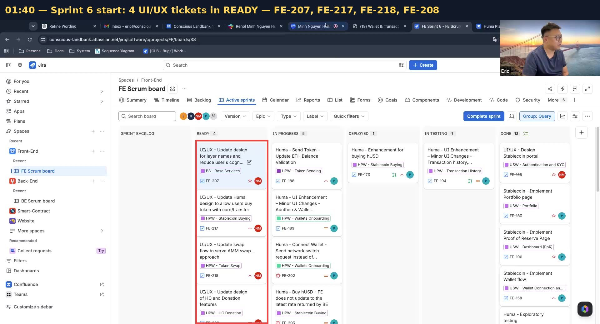

| Ticket | Summary | Priority | Status (30 Aug) |
|---|---|---|---|
| [FE-207](https://conscious-landbank.atlassian.net/browse/FE-207) | UI/UX — Update design for layer names and reduce user's cognitive load | Highest | **Done** ✅ |
| [FE-217](https://conscious-landbank.atlassian.net/browse/FE-217) | UI/UX — Update Huma design to allow users buy token with card/transfer | High | READY |
| [FE-218](https://conscious-landbank.atlassian.net/browse/FE-218) | UI/UX — Update swap flow to serve AMM swap approach | Highest | READY |
| [FE-208](https://conscious-landbank.atlassian.net/browse/FE-208) | UI/UX — Update design of HC and Donation features | Medium | READY |
| [FE-219](https://conscious-landbank.atlassian.net/browse/FE-219) | UI/UX — Stablecoin — Update design for buying token flow (**created live at [26:30]**) | Low | Backlog |

---

## 1. FE-207 — Layer names & cognitive load ([ticket](https://conscious-landbank.atlassian.net/browse/FE-207) · board says Done ✅ — verify each item below actually shipped)

Eric typed three bullets into the FE-207 comment at [11:00] while talking:

> • Make buttons smaller
> • Enhance Visual hierarchy to flowing user's focusing
> • Fix menu bar for non-logged-in (Get Started) and logged-in users (Launch App)

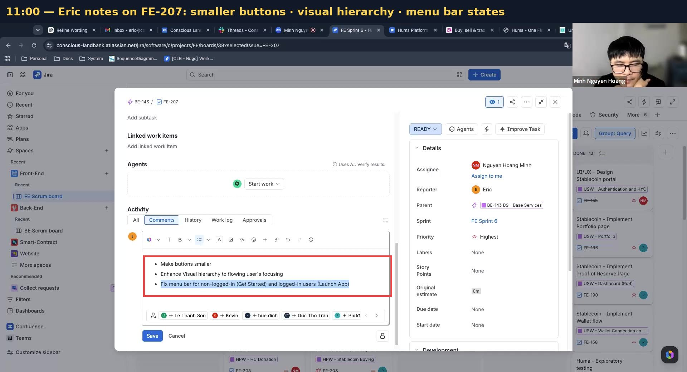

### 1.1 Make buttons smaller — [00:47–03:45]
- [ ] **Current:** the quick-action tiles (the row of 4–5 big cards Minh calls "một hai ba bốn năm cái ô" — Buy / Send / Swap / Trade on the Balances block, "Ready to give?" style cards on dashboard) are large, full-width tiles that dominate the screen. Eric: "Cái này nó hơi to" (this is a bit big).
- [ ] **Change to:** shrink them to compact buttons. Follow-up from Eric in Slack #collab-fe [49:00]: *"these button can smaller, and be placed under Portfolio block"* — i.e. the **Buy / Send / Swap / Trade** row moves **below the Portfolio block**, not above it.

  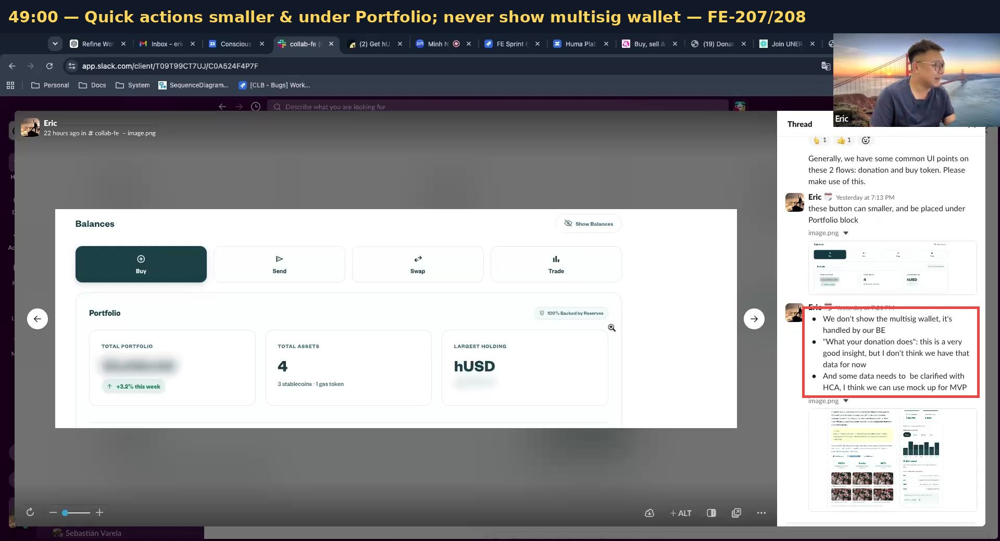

### 1.2 Visual hierarchy — [01:31–02:30]
- [ ] **Current:** too many equally-weighted components side by side ("components hơi nhiều"); nothing tells the eye where to look first. Eric compared with other wallet products where "nhìn vô là mình thấy cái này liền" (you see the main thing instantly).
- [ ] **Change to:** one clear primary element per screen; demote sibling boxes (smaller type, muted background) so the primary action/stat stands out. Applies to dashboard stat boxes and the Swap page Eric opened at [01:56] *(verify exact screens with Eric — audio only)*.

### 1.3 Menu bar by login state — [04:00–09:52]
- [ ] **Current (landing `index.html`):** nav = `HOW IT WORKS · IMPACT · CENTERS · [Get Started]`, where **Get Started** opens a dropdown `Sign Up / Log In / Log In with Wallet` ([04:50]).
- [ ] **Change to:** keep the menu items **fixed and identical in both states**; only the right-hand button changes:
  - logged **out** → `Get Started` (existing dropdown),
  - logged **in** → **`Launch App`** in the same slot, which opens the app.
  Eric [09:39]: "nếu user chưa log in thì cái button này nó sẽ là Get Started… nếu đã log in rồi thì nó chính là button [Launch App], còn mấy menu này thì y chang."

  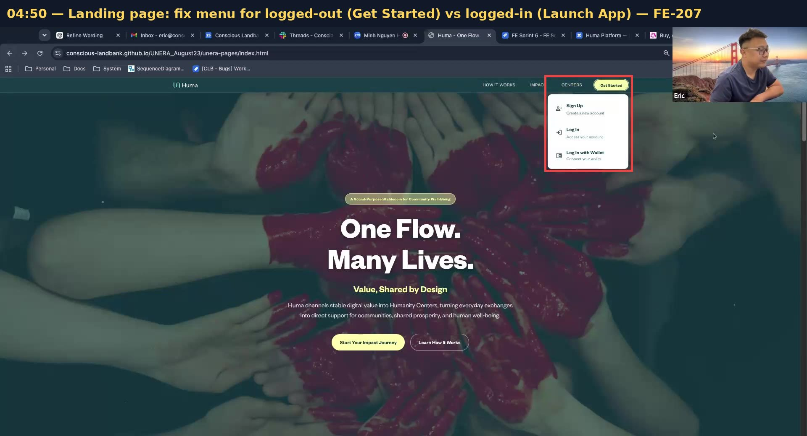

### 1.4 Landing page ↔ app touchpoint — [07:18–08:55]
- [ ] **Current:** the marketing landing page and the Huma app are disconnected; the landing page has no route into the app's Humanity Centres.
- [ ] **Change to:** landing page stays a separate marketing page (it belongs to the marketing team), but add **one section lower on the landing page with a button that links to the app's Centres page**. Minh [08:00]: "mình sẽ thêm một cái section nào đó… người ta click vào đó thì nó sẽ qua cái Center page của mình." Eric [08:22]: "nhẹ nhàng như vậy thì nó dễ hơn." Guests can view Centres; anything personal still requires log-in ([11:18–11:30]).

### 1.5 Standardise page width — [15:26–17:20]
- [ ] **Current:** pages render at different content widths/scales — Eric on his smaller screen: the Donations page looks right, but "bấm thử qua cái Wallet… thấy nó bị bự ra" (switch to Wallet and it blows up bigger), leaving stat columns sparse.
- [ ] **Change to:** pick **one standard content width** and apply it to every page — explicitly agreed for **Wallet** and the **Transaction/history page** *(page name garbled in ASR — verify)*. Minh: "để anh check lại standard size… cho nó consistent"; Eric: "xài Standard nha."

### 1.6 Remove the Trade page — [11:46–12:12] *(verify — audio only)*
- [ ] **Current:** `TRANSACT` dropdown still contains Trade; a Trade/order-book page exists in the prototype.
- [ ] **Change to:** **drop Trade entirely** — remove the page and its nav entry. Eric: "cái này thì mình sẽ bỏ cái Trade đi… lâu lắm mới làm mà làm cũng khó nữa." Epic [FE-144 (HPW - Token Trading)](https://conscious-landbank.atlassian.net/browse/FE-144) stays Backlog.

---

## 2. FE-208 — HC & Donation features ([ticket](https://conscious-landbank.atlassian.net/browse/FE-208) · READY — **top priority; Eric asked for 2.1 + 2.2 mocked by Thu 28 Aug**)

### 2.1 Donation by fiat — new flow — [28:54–29:10] + [46:30–48:35]
- [ ] **Steps (from the mock Eric showed in #collab-fe):** `1 Center → 2 Amount → 3 Review → 4 Complete`, titled "Give to a Humanity Center by fiat or by crypto".
- [ ] **Payment methods: `Card` and `Bank transfer`** — Eric (Slack, [45:45]): *"For Fiat donating, we support card and bank transfer, this concept is rather same with buying token that Kevin shares in another thread."*
- [ ] **Method is chosen BEFORE currency** (same Kevin rule as the buy flow, §3.2).
- [ ] **Bank transfer step shows the receiving account:** Eric (Slack, edited note): *"Note: for bank transfer, we will show the receiving account info which user sends money to"* — bank name / account holder / number with copy buttons *(field list inferred from the buy-flow analogue — verify)*.

  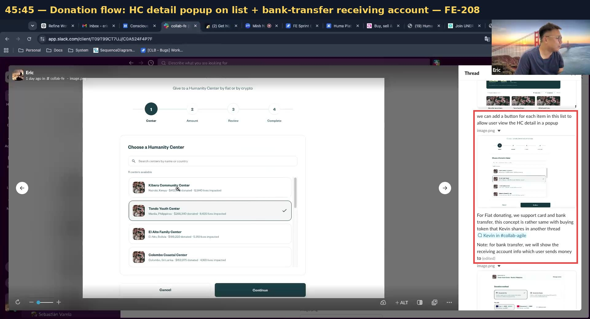

### 2.2 Donation by crypto — new flow — [29:05–29:35] + [51:05–52:10]
- [ ] Same 4-step structure as 2.1; ~"99%" identical to the stablecoin flow Kevin commented on, **except no wallet screen is shown** — the transfer is "xử lý ở dưới background" (handled in the background by BE) [51:26–51:43].
- [ ] **Accepted tokens: USDC and USDT.** If the donor holds something else they must **swap into USDC/USDT first** — Eric [29:17]: "mình chỉ nhận donation bằng USDC, USDT… thì họ phải swap qua một trong hai cái này."
- [ ] **Asset list display** (Kevin, #collab-agile, on screen at [19:30]): *"regarding payment with crypto, you may extend like USDC. USDT. BTC. ETH. or more — if the space is permitted; if not, we won't show anything, because we want to avoid impression that we only accept stablecoin for crypto."*
- [ ] Roadmap confirms the order: *"donation by crypto … USDT and USDC supported first, then BTC and ETH"* ([29:00], Release Roadmap page).

  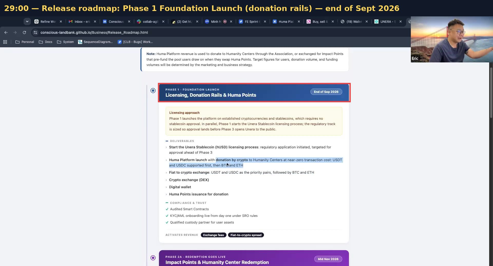

### 2.3 Merge Centres + Dashboard into one donation-first page — [12:12–15:30] + [17:20–18:50]
- [ ] **Current:** two overlapping pages — `explore-centres.html` ("Humanity Centers", tabs `Centers · My Impact · History`) and `donations.html` ("Donations & Impact", same three tabs) — plus a separate dashboard.
- [ ] **Change to:** **one merged main page named "Dashboard"** (naming discussed: Eric floated a donation name, Minh wasn't sold on "Centre"-based names; Eric settled [14:54–15:19]: "em nghĩ có thể mình nên để là **Dashboard**… chỗ này mình show cái **Impact** và **Huma Points** nữa, sau này nếu có **Impact Passport** mình cũng show lên luôn — nó không chỉ là về donation." Minh: "Dashboard nó sẽ cover đủ cái ý nghĩa hơn.").
- [ ] Keep the tab structure `Centers · My Impact · History`; **History lists donation-related entries only** — Eric [17:47]: "cái này là History nhưng nó chỉ là những history liên quan tới donation thôi."
- [ ] **Menu rename** — Eric (Slack #collab-fe, on screen [44:20]): *"Dashboard menu should be changed to Humanity Centers, or Donation"* → pick one label *(decide with Eric; the merged page itself is called Dashboard)*.

  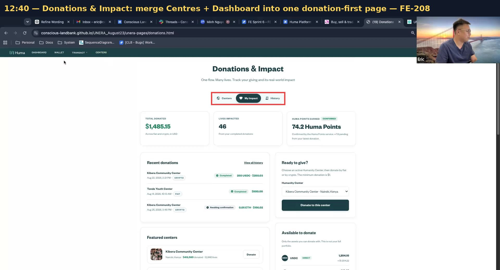

### 2.4 Dashboard is the first page after login; split Portfolio out — [44:00–45:00]
Eric's Slack bullets (verbatim, on screen at [44:20]):

> • Dashboard menu should be changed to Humanity Centers, or Donation
> • **Dashboard page should be the first page which user sees when logging in to the portal**
> • Dashboard page should be **separated with Portfolio page**, so that below information should be displayed in Dashboard page
>   ◦ **Activities these 2 pages are separated, too**

- [ ] **Change to:** after login, land on the merged Dashboard (donation-first), not Wallet.
- [ ] Move the **Portfolio block** (`Total Portfolio / Total Assets / Largest Holding` + Balances) out of the Wallet page onto its **own Portfolio page**; the Activity feed splits accordingly (donation activity on Dashboard, wallet/portfolio activity on Portfolio) — call agreement [44:20–44:47]: "đem cái đó ra khỏi chỗ Wallet để nó rõ."

  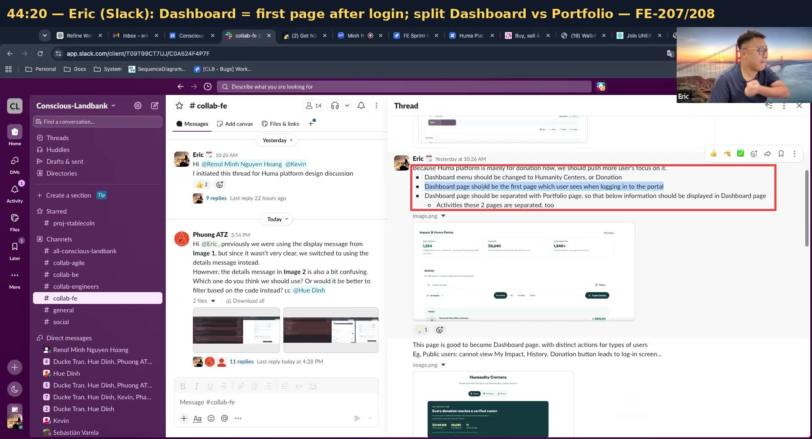

### 2.5 Guest (public visitor) rules — [44:55–45:35]
- [ ] Eric (Slack): *"Public users: cannot view My Impact, History, Donation button leads to log-in screen."*
- [ ] For blocks a guest can't use, decision on the call: **hide them, don't show disabled** — Minh [45:15]: "nếu người ta bấm vào mà không có thông tin gì hết thì mình **hide** luôn"; Eric: "Disable hay là hide?" → "**Hide luôn đi.**"

### 2.6 HC detail popup from the centre list — [45:40–46:30]
- [ ] **Current:** in donate step 1 ("Choose a Humanity Center"), rows show only name · location · $ donated · lives impacted; to see details you must leave the flow. Eric: centres "cũng hơi giống giống nhau" (look similar), people want to double-check before committing.
- [ ] **Change to:** Eric (Slack): *"we can add a button for each item in this list to allow user view the HC detail in a popup"* — a per-row button opening a **popup with a trimmed version of the HC detail page** ("một version của detail page" [46:10]): name, country, category, mission blurb, verified badge, totals — without the full page's long content.

### 2.7 HC detail page data cleanup — [49:05–50:36]
- [ ] **Remove the multisig wallet block** — currently the detail page shows `Humanity Center multisig wallet: 0x5C1f...6019`. Eric (Slack): *"We don't show the multisig wallet, it's handled by our BE."*
- [ ] **Remove the "What your donation does" tier table** — currently `$25 → course materials for 2 learners / $50 → a month of lab time / $100 → adult-education scholarship / $250 → business starter kit`. Eric (Slack): *"this is a very good insight, but I don't think we have that data for now"*; on the call [50:29]: "chưa làm được cái đó… thôi mình bỏ cái đó ra luôn."
- [ ] **Remaining unclear data → mock for MVP** — Eric (Slack): *"And some data needs to be clarified with HCA, I think we can use mock up for MVP."*

  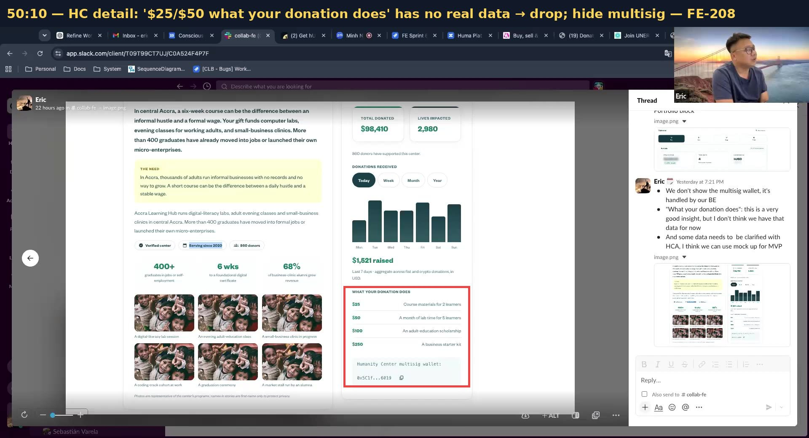

### 2.8 Impact images / content column narrower — [48:38–49:40]
- [ ] **Current:** the impact photos render too wide ("để vậy thì nó to quá").
- [ ] **Change to:** reduce the **horizontal width of the content column** ("làm cái chiều ngang của cái content này nhỏ lại") and re-evaluate; keep the images already re-hosted by the team.

---

## 3. FE-217 — Buy token with card / bank transfer ([ticket](https://conscious-landbank.atlassian.net/browse/FE-217) · READY)

The ticket description Eric showed at [41:05] (verbatim):

> Bank transfer
> • Show bank account info
> • Other platform: Wise, Moneygram

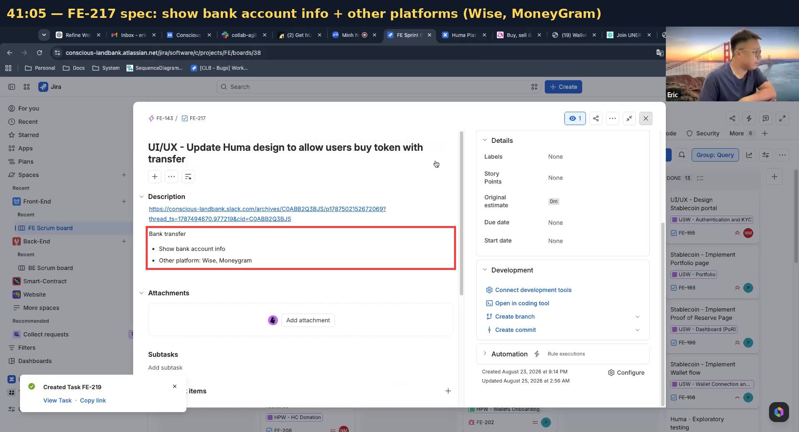

### 3.1 Add "Bank transfer" as a payment method — [21:30–24:30]
- [ ] **Current (`add-money.html`):** Buy = `1 Amount → 2 Review → 3 Payment → 4 Complete`, "Buy hUSD with fiat", card only, `You pay $ USD` first.
- [ ] **Change to:** one payment step offering **two options stacked on one page** (Eric [23:48]: "mình cứ show qua hai cách đó ở trên cùng một page"):
  1. **Top — bank account information** the user copies and transfers to ("show cái bank account information để user copy" [23:22]);
  2. **Below — transfer apps: `Wise`, `MoneyGram`** (Interac-style rails discussed as the Canada example [22:04–23:15]) for users whose bank can't reach the account directly.
- [ ] This is a **mock-up for Kevin to review** — Eric [23:41]: "cái đó em hỏi mà Kevin cũng chưa chốt được… cứ show cái mockup lên."

  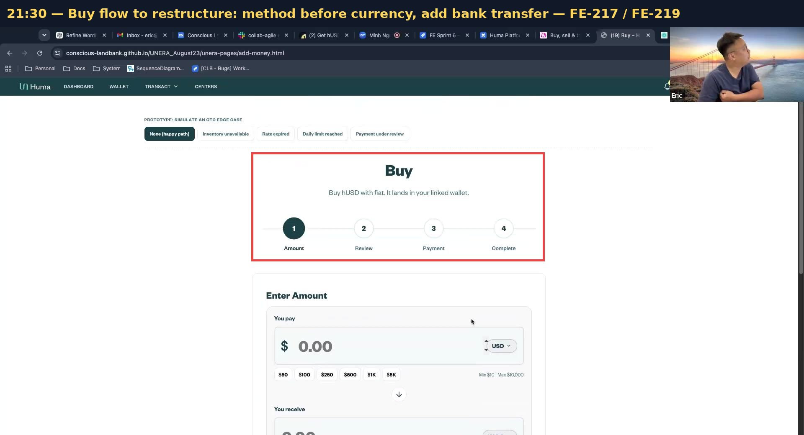

### 3.2 Restructure fiat payment: method first, then currency — [19:30]
Kevin's #collab-agile comments (verbatim, on screen):

> regarding the payment in fiat:
> • the type of payment currency is only meaningful for bank transfer
> • for card method, we can accept any and the card company will do the conversion
>   ◦ we may not have access to the conversion as well until the payment is made
>   ◦ so we can't show the exchange rate for card method as well
> *"it means that you need to restructure the payment in fiat, properly to select the method first before currency"*

- [ ] **Change to:** step order becomes **choose method (Card | Bank transfer) → then currency/amount**; the currency selector (USD/CAD…) appears **only for bank transfer**; for card, accept any currency and **show no FX rate**.

  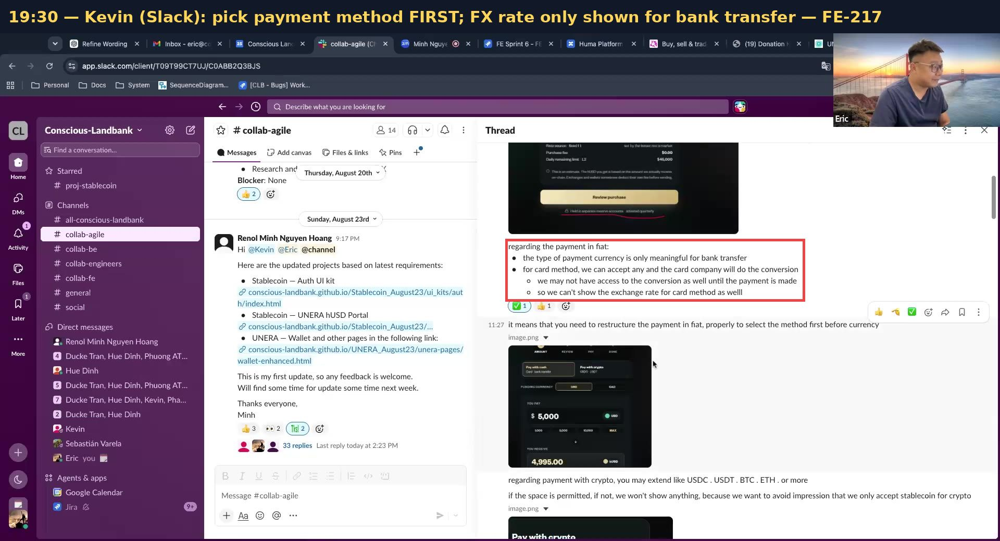

### 3.3 Token scope — [19:58–20:39] + [27:58–28:40]
- [ ] The Huma release adds **buy USDC and USDT by fiat** ("nó sẽ là mua USDC và USDT bằng fiat" — same concept as buying hUSD, on-ramp). Make the asset picker cover **USDC / USDT** (hUSD remains on the stablecoin portal, §5). Release target discussed: **4 September** *(date from audio — verify)*.
- Implementation counterparts (Phương): [FE-175](https://conscious-landbank.atlassian.net/browse/FE-175) buy USDC/USDT by fiat (In Progress) · [FE-214](https://conscious-landbank.atlassian.net/browse/FE-214) buy by bank transfer (Backlog).

---

## 4. FE-218 — AMM swap flow ([ticket](https://conscious-landbank.atlassian.net/browse/FE-218) · READY)

- [ ] **Apply the existing comments — mostly renames** — [40:57–42:10]: Eric: "comment chủ yếu là **đổi tên field hoặc review field** thôi" (mainly renaming fields / review-step fields); he'll drop the remaining comments into the ticket quickly ("comment swap càng nhanh hơn nữa… nó không có nhiều thay đổi đâu" [53:11]). *(Exact old→new field names weren't spoken on the call — pull them from the FE-218 comments.)*
- [ ] **Sweep leftover "trade/exchange" wording** — [42:54–43:35]: with Trade dropped (§1.6), anywhere the UI still points at trading should align with the swap/donation-first direction; on the System landing "mình mua luôn chứ không phải đổi" (that block is a *buy*, not an exchange) — check labels there *(verify — audio only)*.

---

## 5. FE-219 — Stablecoin portal buy flow ([ticket](https://conscious-landbank.atlassian.net/browse/FE-219) · Backlog, Low — created live at [26:30])

- [ ] Eric created the ticket on the call: *"UI/UX — Stablecoin — Update design for buying token flow"*. Scope [26:31–26:52]: the stablecoin portal's **Buy flow covering: buy by card, buy by crypto (marked as slower), and bank transfer** — same concepts as §3 but for **hUSD** on the stablecoin portal.
- [ ] Explicitly **not urgent** — do after the donation flows and FE-217 ("mình sẽ không lấy cái này làm ưu tiên" [26:47–26:52] *(verify)*).

  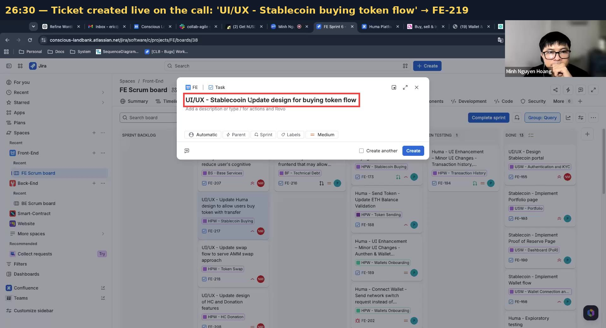

---

## 6. Priorities & deadlines agreed — [52:47–56:10]

| # | Work | Target |
|---|---|---|
| 1 | **Donation flows: fiat + crypto** (§2.1, §2.2) | mock by **Thu 28 Aug** ("tốt nhất là thứ Năm có được cái này" [55:18]) |
| 2 | **Bank transfer for Huma buy** (§3) | right after, before/around the holiday week |
| 3 | Remaining FE-208 comments (§2.3–2.8) + swap renames (§4) | after the holiday ("sau lễ là xong" [56:27]) |
| 4 | Stablecoin buy flow (§5) | last, low priority |

Context: Release Roadmap **Phase 1 — Foundation Launch (Licensing, Donation Rails & Huma Points) — End of Sep 2026**; Huma release (buy USDC/USDT by fiat) targeted ~4 Sep *(verify)*; next week was the holiday week (team off).

---

## 7. Quick status view (board as of 30 Aug)

| Call item | Ticket | Board status | Your status |
|---|---|---|---|
| Smaller buttons, hierarchy, Get Started/Launch App, width, Trade removal, landing touchpoint | FE-207 | Done ✅ | ☐ verify each |
| Donation fiat + crypto flows (Thu 28 Aug) | FE-208 | READY | ☐ |
| Dashboard merge & rename, first-page-after-login, Portfolio split, guest hide, HC popup, multisig, tiers, column width | FE-208 | READY | ☐ |
| Method-first fiat + bank transfer (account info, Wise/MoneyGram) | FE-217 | READY | ☐ |
| Swap field renames + trade-wording sweep | FE-218 | READY | ☐ |
| Stablecoin buy flow (card/crypto/bank transfer, hUSD) | FE-219 | Backlog | ☐ |

**No explicit ticket found for:** the landing-page touchpoint section (§1.4), standard page width (§1.5), and removing the Trade page (§1.6) — they exist only as FE-207 comments, and FE-207 is already closed. Consider a small follow-up ticket so they don't get lost.
