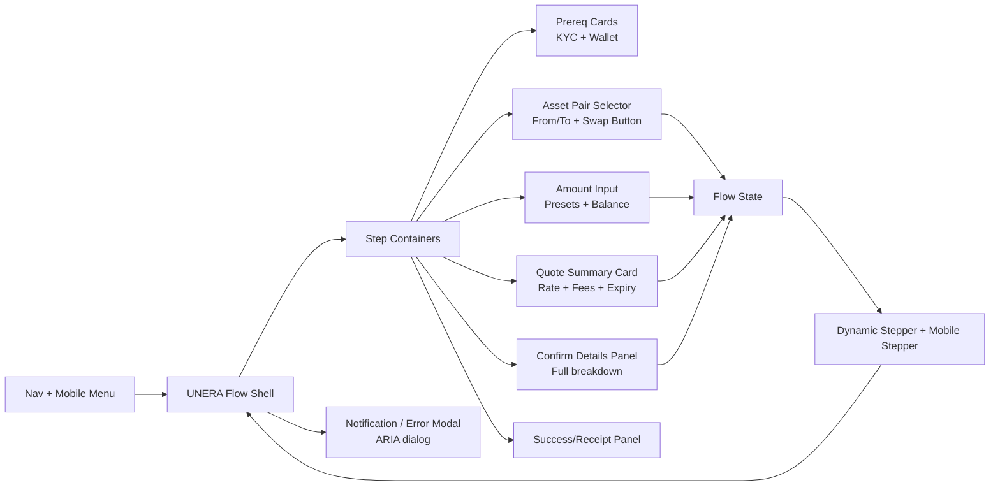

# UNERA exchange.html Redesign and Front‑End Implementation Report

## Executive summary

This report defines a rigorous redesign and implementation plan to make `exchange.html` visually, functionally, and accessibly consistent with `add-money.html`, targeting **90–95% UI reuse** from `add-money.html` while staying consistent with the broader UNERA experience shown in `dashboard-enhanced.html`, `wallet-enhanced.html`, and `account-security.html`. The approach is to treat `add-money.html` as the **canonical “UNERA Flow Template”** (navigation + stepper + step sections + button system + modal patterns) and re‑platform `exchange.html` onto that template, keeping exchange-specific requirements to a tight **5–10% delta** (asset pair selection, quoting/slippage semantics, and swap-specific edge cases).

Key improvements center on:

- **Unifying page shell + flow mechanics:** Adopt `add-money.html`’s dynamic stepper model (including optional prerequisites step) and its consistent layout cadence and bottom action bar behavior (evidence: `add-money.html` dynamically builds the stepper and can hide prerequisites when completed; see HTML lines ~2755–2788 in the uploaded file).  
- **Making interaction patterns accessible by default:** Fix custom “card option” components to be fully keyboard-operable and screen-reader-friendly (a known risk for both pages today), align error messaging to WCAG 2.1 requirements for financial transactions (error identification, suggestions, and confirmation/review). citeturn1search13turn3search0turn1search11  
- **Improving trust primitives:** Bring “transparent quote + fee breakdown + preview/confirm” behavior up to the standard of leading exchange experiences: show users a clear breakdown and lock/refresh semantics before confirmation (Wise emphasizes showing fees and exchange rate upfront; Coinbase exposes spread/fees at preview and uses spread to temporarily lock quotes; Revolut explicitly discloses plan/market condition fees; PayPal describes a transaction exchange rate that includes a conversion fee/spread). citeturn2search1turn7search0turn0search3turn7search1  
- **Addressing color-contrast risks that affect action clarity:** Current brand accent usage (green/blue gradients with white text) is likely to miss WCAG AA contrast for normal-size text, especially in primary call-to-action buttons and “active” nav/step colors; this is not unique to exchange and should be treated as a shared token fix.

Open gaps: `index.html` was referenced by other pages’ navigation but was not included among the uploaded files; the report therefore treats it as an **open input** and derives context from the available screens only.

## UNERA product context and user flows across provided screens

Across the provided screens, UNERA presents as an **impact-oriented wallet** (“One Flow. Many Lives.”) with:

- A home/dashboard hub (`dashboard-enhanced.html`) with navigation to wallet and other areas.
- A rich wallet view (`wallet-enhanced.html`) centered around balances, transactions, and “impact” messaging.
- A security and audit center (`account-security.html`) that highlights account protection (e.g., “✅ 2FA enabled” appears in the Security Status card; see `account-security.html` lines ~720–734 in the uploaded file).
- Two multi-step “money movement” flows:
  - `add-money.html` (top-up/fiat-to-stable or similar) with a **dynamic stepper** and a consistent multi-step template.
  - `exchange.html` (crypto swap) with a similar step structure but divergent implementation, components, and modal accessibility.

From a flow standpoint, both `add-money.html` and `exchange.html` establish a consistent prerequisite gate: **Identity verification (KYC)** + **Wallet connection** before allowing the user to proceed (both pages check `localStorage` for `kycStatus` and `walletAddress`).

The **most important consistency opportunity** is that `add-money.html` already implements a robust “flow shell”:

- Sticky nav with skip-link pattern.
- Desktop stepper + compact mobile stepper.
- Step sections with bottom action buttons.
- A reusable modal overlay pattern with ARIA attributes and Escape-to-close behavior (e.g., notification modal uses `role="dialog"`, `aria-modal="true"`, and is ESC-dismissable; see `add-money.html` lines ~2244–2295 and ~2988–2994).

`exchange.html`, by contrast, duplicates many of these ideas but with **mismatched structure** (static stepper; different step IDs; simplified modal lacking ARIA; different layout sizing; mobile menu omissions).

## Web research synthesis on exchange best practices and standards

This section distills patterns from leading payment/wallet exchange experiences and primary standards, focusing on **preview/confirmation**, **fee transparency**, **quote refresh/locking**, **error handling**, **security**, and **accessibility**.

image_group{"layout":"carousel","aspect_ratio":"16:9","query":["Wise app convert currency fee breakdown screen","Revolut app exchange currencies preview fee screen","Coinbase convert preview screen fees spread tooltip","PayPal currency calculator exchange rate screen"],"num_per_query":1}

### Fee transparency and “true cost” disclosure

A consistent best practice is to show users a **line-item fee breakdown** and the applied rate **before** they commit:

- Wise positions its pricing as transparent: users should “always know what you’re paying upfront” and it separates “mid-market rate” from fees. citeturn2search1turn2search12  
- Revolut discloses exchange fees and limits by plan (fair-usage limits) and makes weekend markup fees explicit, with defined time windows. This establishes a pattern UNERA can copy: show “why” fees exist and “when” they apply. citeturn0search3  
- PayPal explains that its **transaction exchange rate** is adjusted regularly and includes a currency conversion fee/spread applied to a base wholesale-rate reference. This supports a crucial UI principle: rates can change and the rate used is transaction-time specific. citeturn7search1turn0search1

**Implication for UNERA exchange.html:**  
The Confirm screen must contain a **complete, user-readable breakdown** of:
- Amount sold (from asset)  
- Estimated amount bought (to asset)  
- Effective exchange rate  
- Fees (platform fee, network fee, spread/price impact if applicable)  
- Total cost / net received  
- Quote timestamp + freshness/expiry semantics

### Preview/confirm pattern and quote “lock” semantics

Crypto exchanges commonly use a preview step for two reasons: (1) legal/financial error prevention and (2) volatility management.

- Coinbase documents that fees and spread are shown in the trade preview and that “spread helps … lock in your quoted price temporarily while processing your order.” citeturn7search0  
- Coinbase also states that convert trades execute immediately and can’t be canceled; thus the confirmation step is not optional—it is fundamental to user trust. citeturn0search7

**Implication for UNERA:**  
Add a “Quote may change” / “Quote expires in …” note on Confirm (or Amount) steps, and ensure the final action clearly signals irreversibility for executed swaps (especially if on-chain).

### Error handling expectations

Material Design’s error guidelines emphasize: preserve user input, validate early, explain what happened, and how to fix it; disabling submission until errors are resolved is acceptable when errors are clearly indicated. citeturn3search0  

For multi-step transactions, errors should be:
- Specific (“Insufficient BTC balance for network fee”)  
- Actionable (“Reduce amount or add funds”)  
- Non-destructive to user input (do not wipe fields)

**Implication for UNERA:**  
Standardize exchange errors into:
- Inline field errors (amount, asset selection)
- Inline banners for quote expiry or connectivity
- Modal only for rare, blocking “can’t proceed” states (avoid overuse)

### Security expectations and re-auth patterns

Although UNERA is a web UI prototype, mature payment UX patterns strongly encourage **explicit intent confirmation** and, for high-risk actions, re-authentication (biometric/passcode).

- Apple describes payment authorization as requiring the device to confirm intent and authenticate the user (biometrics or passcode). citeturn4search0  
- For modals, keyboard focus must stay within the modal and return to the invoking element after dismissal (WAI-ARIA modal dialog pattern). citeturn1search11

**Implication for UNERA:**  
Define a tiered policy (open question decided by product/security) where:
- Normal swaps: confirm step + receipt  
- High-value or risky swaps: confirm step + re-auth (2FA, passkey, wallet signature, etc.)

### Accessibility requirements relevant to exchange flows

Because an exchange is a **financial transaction**, the bar is higher:

- WCAG 2.1 requires error identification and labels/instructions, and for financial transactions requires review/confirmation or reversibility (SC 3.3.1–3.3.4). citeturn1search13  
- Modal dialogs must trap focus, support Escape to close when appropriate, and restore focus after close. citeturn1search11

**Implication for UNERA:**  
The Confirm step is not only UX best practice—it also supports WCAG’s transaction safety intent. Additionally, all custom selection widgets (asset cards, dropdowns) must be fully keyboard-operable.

## Detailed audit of add-money.html as the canonical “UNERA Flow Template”

This audit treats `add-money.html` as the “golden” flow implementation to be reused, but it also identifies a few issues that must be corrected (or mitigated) when exchange inherits the same components.

### Layout, hierarchy, and component system strengths

`add-money.html` establishes a consistent visual hierarchy:

- **Global shell:** skip link, sticky nav, consistent type system (Space Grotesk + Inter), neutral gradient page background.
- **Flow header:** large gradient title + explanatory subtitle.
- **Stepper:** desktop stepper complemented by a compact mobile stepper.
- **Step structure:** semantic step containers: `step-prereq`, `step-payment`, `step-amount`, `step-confirm`, `step-complete` (see the HTML IDs near lines ~1846, ~1889, ~2071, ~2132, ~2179 in the uploaded file).
- **Dynamic stepper logic:** `add-money.html` builds stepper steps via JS and can hide the prerequisites step when already completed (`prerequisitesHidden` toggles the step set). This is a mature reuse foundation for exchange (see lines ~2756–2788).

### Interaction design and microcopy strengths

- **Progressive disclosure:** prerequisites before payment/amount reduces failure later.
- **LocalStorage continuity:** users who completed KYC and wallet connection can skip repetitive setup.
- **Validation gating:** Continue buttons can be disabled until amount validity is satisfied (pattern supports Material guidance). citeturn3search0  

Microcopy tone matches UNERA: friendly, benefit-oriented (e.g., “Benefits of adding now…” content). Exchange should echo this tone but switch to exchange-relevant guidance (rates, fees, irreversibility).

### Accessibility and responsiveness review

Strong points:
- Skip link exists and is focusable.
- Reduced motion support (`prefers-reduced-motion`) is present.
- Stepper uses `role="progressbar"` and updates ARIA values in JS.
- Notification modal uses ARIA role + `aria-modal` and ESC key closes it (see `add-money.html` lines ~2244–2254 and ~2988–2994; aligns with WAI-ARIA dialog guidance). citeturn1search11  

Risks / gaps to fix (exchange should not inherit these):
- **Keyboard operability in custom “card options”:** several selectable tiles are `<div>` elements with `onclick` and `tabindex="0"`, but without key handlers for **Enter/Space**, which can violate WCAG keyboard access expectations when the element is not a native control. citeturn1search13  
- **Color contrast:** key brand accents (e.g., white text on green/blue gradient primary buttons) are likely below WCAG AA for normal text. Fixing this is a shared-token issue, not only an exchange issue.
- **Inline styles:** some content blocks use inline CSS, reducing reusability and consistency (e.g., benefit reminder block in Confirm step).

Performance considerations:
- Page is single-file with large inline CSS (fast for a prototype, but duplicates styles across pages). A practical improvement is introducing a shared CSS/JS bundle to reduce duplication and long-term drift (see implementation plan).

## Reuse mapping from add-money.html to exchange.html

### Target reuse strategy

To reach **90–95% UI reuse**, the recommended engineering strategy is:

1. Start with `add-money.html` as the base template.
2. Replace payment-specific step content with exchange-specific step content, while keeping:
   - the global shell,
   - stepper system,
   - button system,
   - input system,
   - modal system,
   - responsive rules.

This minimizes divergence and supports WCAG consistency requirements such as consistent navigation and identification across pages. citeturn1search13

### Reuse mapping table

| add-money.html element (canonical) | Reuse in exchange.html | Notes for engineers |
|---|---|---|
| Skip link + focus styling | Reuse as-is | Keep `#main-content` anchor target and focus-visible styling. |
| Nav bar layout + hamburger + mobile overlay menu | Reuse, minor text/link updates | Current exchange lacks mobile menu entirely; copy add-money’s mobile menu markup + `toggleMobileMenu()` logic (see `add-money.html` around ~1790 and JS around ~33–46). |
| Page header (title + subtitle styling) | Reuse with new microcopy | Keep visual hierarchy; update subtitle to include transparency cues (fees, quote freshness). |
| Dynamic stepper injection and mobile compact stepper | Reuse with step names updated | Exchange should mirror add-money’s “prereq optional” logic rather than static 6-step structure. |
| `.step-content` show/hide pattern | Reuse | Rename exchange step IDs to semantic names to match add-money style. |
| Button system (`.btn`, `.btn-primary`, `.btn-secondary`) | Reuse with token fixes | Adjust colors for contrast; keep sizing and spacing. |
| Form/input system (`.input-group`, `.input-wrapper`, hints/errors) | Reuse; extend ARIA | Exchange already uses `aria-describedby`; standardize this across reused components. citeturn1search13 |
| Summary card / rate banner pattern (“Updated now/30s ago”) | Reuse | Replace “exchange rate” semantics with swap quote semantics; add expiry/refresh if needed. citeturn7search0 |
| Confirm details rows (`.confirm-detail`) | Reuse | Add irreversibility note + fee breakdown consistent with industry patterns. citeturn0search7turn2search1 |
| Success screen card with icon and actions | Reuse | Exchange success should show receipt-like details: pair, rate, fees, timestamp, tx hash (if applicable). |
| Notification modal (ARIA dialog + ESC close) | Reuse as-is | Current exchange modal lacks ARIA. Must adopt add-money pattern. citeturn1search11 |

### Exchange-specific delta (the remaining 5–10%)

These are the elements that should be new or uniquely configured, with explicit design specs:

1. **Asset pair selection block (From/To with swap direction)**
   - Two selectors (dropdown or list) with balances.
   - “Swap direction” control.
   - Prevent selecting identical assets.
2. **Quote semantics and risk parameters**
   - Optional slippage tolerance display (and settings if supported).
   - Quote freshness + expiry (“Updated now”, “Expires in 15s”).
   - Spread/price impact line item if applicable. citeturn7search0
3. **Swap-specific error states**
   - Insufficient balance (including fees).
   - Quote expired / rate changed.
   - Asset temporarily unavailable.
   - Wallet disconnected mid-flow.
4. **Exchange receipt details**
   - Pair, executed rate, fees, timestamp.
   - Transaction ID/hash and explorer link (if on-chain; open question).

## Proposed exchange.html redesign with annotated wireframes, specs, and implementation guidance

### Proposed IA and step flow

Replace exchange’s static 6-step layout with add-money’s **5-step canonical flow**, where “Processing” is a sub-state of Confirm (button loading + inline progress) rather than a standalone page step. This increases reuse and reduces complexity.

**Steps:**
- `prereq` (optional, can be hidden when met)
- `currencies` (asset pair selection)
- `amount`
- `confirm` (includes processing sub-state)
- `complete`

This matches exchange industry norms: a clear preview/confirm stage before execution. citeturn0search7turn2search1turn7search0

### Annotated wireframe mockup (SVG)

The following wireframe illustrates the “Currencies” and “Amount” steps using add-money’s structure and components, plus minimal exchange-specific additions (swap direction + quote expiry).

<svg width="100%" viewBox="0 0 980 520" xmlns="http://www.w3.org/2000/svg" role="img" aria-label="Wireframe of redesigned UNERA exchange flow using add-money layout">
  <rect x="10" y="10" width="960" height="500" rx="14" fill="#fff" stroke="#E2E8F0" stroke-width="2"/>
  <text x="40" y="50" font-size="18" font-family="Inter, sans-serif" fill="#0F172A">Exchange Crypto</text>
  <text x="40" y="74" font-size="12" font-family="Inter, sans-serif" fill="#475569">Transparent quote • Fees shown upfront • Confirm before swap</text>

  <!-- Stepper -->
  <rect x="40" y="95" width="900" height="54" rx="12" fill="#F9FAFB" stroke="#E2E8F0"/>
  <text x="60" y="128" font-size="12" font-family="Inter, sans-serif" fill="#475569">Stepper (reuse add-money dynamic stepper)</text>

  <!-- Currencies step header -->
  <text x="40" y="185" font-size="14" font-family="Inter, sans-serif" fill="#0F172A">Step: Select assets</text>
  <text x="40" y="205" font-size="12" font-family="Inter, sans-serif" fill="#475569">[Reuse section-title + section-desc styles]</text>

  <!-- From dropdown -->
  <rect x="40" y="230" width="405" height="70" rx="12" fill="#FFFFFF" stroke="#E2E8F0" stroke-width="2"/>
  <text x="60" y="255" font-size="12" font-family="Inter, sans-serif" fill="#475569">From (dropdown reuse)</text>
  <text x="60" y="280" font-size="13" font-family="Inter, sans-serif" fill="#0F172A">BTC • Balance: 0.50</text>

  <!-- Swap button -->
  <rect x="465" y="246" width="50" height="40" rx="12" fill="#F3F4F6" stroke="#E2E8F0"/>
  <text x="478" y="272" font-size="16" font-family="Inter, sans-serif" fill="#0F172A">⇅</text>
  <text x="528" y="270" font-size="11" font-family="Inter, sans-serif" fill="#475569">Swap direction (new)</text>

  <!-- To dropdown -->
  <rect x="535" y="230" width="405" height="70" rx="12" fill="#FFFFFF" stroke="#E2E8F0" stroke-width="2"/>
  <text x="555" y="255" font-size="12" font-family="Inter, sans-serif" fill="#475569">To (dropdown reuse)</text>
  <text x="555" y="280" font-size="13" font-family="Inter, sans-serif" fill="#0F172A">USDC • Balance: 5,000</text>

  <!-- Quote banner -->
  <rect x="40" y="315" width="900" height="46" rx="12" fill="#F9FAFB" stroke="#E2E8F0"/>
  <text x="60" y="344" font-size="12" font-family="Inter, sans-serif" fill="#0F172A">Quote: 1 BTC ≈ 43,210 USDC</text>
  <text x="260" y="344" font-size="12" font-family="Inter, sans-serif" fill="#475569">Updated now • Expires in 20s (if supported)</text>

  <!-- Amount step -->
  <text x="40" y="395" font-size="14" font-family="Inter, sans-serif" fill="#0F172A">Step: Amount</text>
  <rect x="40" y="415" width="900" height="60" rx="12" fill="#FFFFFF" stroke="#E2E8F0" stroke-width="2"/>
  <text x="60" y="448" font-size="13" font-family="Inter, sans-serif" fill="#0F172A">Amount (BTC) input + presets (25% / 50% / Max)</text>

  <!-- Bottom actions -->
  <rect x="40" y="485" width="900" height="0" fill="none"/>
</svg>

### Component specs and code-level guidance

Below are concrete specs for the exchange-specific delta, while reusing add-money’s component system wherever possible.

#### Stepper and step containers

**Goal:** Use the same dynamic stepper builder from add-money, but with exchange step keys.

**Recommended step keys**
- `prereq`, `currencies`, `amount`, `confirm`, `complete`

**JS (adaptation sketch)**
```js
// Exchange flow step config (based on add-money’s dynamic stepper pattern)
const stepContents = ['prereq', 'currencies', 'amount', 'confirm', 'complete'];
const stepTitles = {
  prereq: 'Prerequisites',
  currencies: 'Currencies',
  amount: 'Amount',
  confirm: 'Confirm',
  complete: 'Complete',
};

// If prerequisites are satisfied, hide prereq step (reuse add-money prerequisitesHidden logic)
let prerequisitesHidden = false;
let currentVisibleStep = 1;

function getVisibleSteps() {
  return prerequisitesHidden
    ? ['currencies', 'amount', 'confirm', 'complete']
    : ['prereq', 'currencies', 'amount', 'confirm', 'complete'];
}
```

Accessibility annotation:
- Keep `role="progressbar"` and update `aria-valuenow`/`aria-valuemax` on every step change (already implemented well in add-money, and aligns with predictable progress patterns).

#### Asset selection (From/To) using reused dropdown styling

**Design spec**
- Reuse `.dropdown`, `.dropdown-toggle`, `.dropdown-menu`, `.dropdown-search`, `.dropdown-item`.
- Add an `exchange-selector` wrapper to support side-by-side layout on desktop and stacked layout on mobile.

**Responsive spec**
- ≥768px: two dropdowns in a 2-column grid with a center “swap direction” button.
- <768px: stack dropdowns, place swap direction button between them full-width.

**Accessible dropdown behavior**
- Toggle button: `aria-haspopup="listbox"`, `aria-expanded`, `aria-controls`.
- Listbox: `role="listbox"`.
- Items: `role="option"`, `aria-selected`.
- Keyboard:
  - Enter/Space: open dropdown if closed; select item if focused
  - ArrowUp/ArrowDown: move focus between options
  - Escape: close and return focus to toggle (dialog/listbox behavior parallels WAI guidance for keyboard containment and Escape-to-dismiss). citeturn1search11

**HTML skeleton**
```html
<div class="exchange-selector">
  <div class="dropdown" data-exchange="from">
    <button
      class="dropdown-toggle"
      id="fromAssetToggle"
      aria-haspopup="listbox"
      aria-expanded="false"
      aria-controls="fromAssetList"
      type="button">
      <span class="selected-currency">
        <span class="currency-flag">₿</span>
        <span>
          <strong id="fromAssetCode">BTC</strong>
          <span class="muted" id="fromAssetMeta">Balance: 0.50</span>
        </span>
      </span>
      <span class="chevron" aria-hidden="true">▾</span>
    </button>

    <div class="dropdown-menu" id="fromAssetMenu">
      <div class="dropdown-search">
        <input type="search" inputmode="search" placeholder="Search assets…" aria-label="Search from assets">
      </div>
      <div class="dropdown-list" id="fromAssetList" role="listbox" tabindex="-1"></div>
    </div>
  </div>

  <button class="btn-swap-direction" type="button" aria-label="Swap from and to assets">⇅</button>

  <div class="dropdown" data-exchange="to">
    <!-- mirror of from -->
  </div>
</div>
```

**CSS additions (minimal)**
```css
.exchange-selector {
  display: grid;
  grid-template-columns: 1fr auto 1fr;
  gap: 1rem;
  align-items: center;
}

.btn-swap-direction {
  width: 44px; height: 44px;
  border-radius: 12px;
  border: 1px solid var(--border-subtle);
  background: var(--neutral-100);
}

@media (max-width: 768px) {
  .exchange-selector {
    grid-template-columns: 1fr;
  }
  .btn-swap-direction {
    width: 100%;
  }
}
```

Open question note:
- If UNERA supports a long asset list, consider upgrading the dropdown to a true ARIA combobox pattern. Otherwise, a listbox-with-search approach can be sufficient but must be carefully tested with screen readers.

#### Amount input and quote breakdown

Reuse add-money’s `.amount-section`, `.input-group`, `.summary-card`, and “Updated now/30s ago” banner.

Add exchange-specific line items based on the transparency patterns noted above (fees + spread/price impact when applicable). citeturn2search1turn7search0

**Error handling (WCAG + Material)**
- Show inline error text only after user interaction; preserve input; disable Continue until resolved. citeturn3search0turn1search13  
- Use `aria-invalid="true"` and wire hint/error via `aria-describedby` (exchange already does this for amount; standardize across all fields).

**HTML example**
```html
<label for="exchangeAmount" class="input-label">Amount (BTC)</label>
<div class="input-wrapper">
  <span class="input-prefix" aria-hidden="true">₿</span>
  <input
    id="exchangeAmount"
    class="amount-input"
    type="number"
    min="0"
    step="0.00000001"
    inputmode="decimal"
    aria-describedby="exchangeAmountHint exchangeAmountError"
  />
</div>
<p class="input-hint" id="exchangeAmountHint">Max: 0.50 BTC • Fees apply</p>
<p class="input-error" id="exchangeAmountError" role="alert" style="display:none;"></p>
```

#### Confirm step (error prevention + irreversibility messaging)

Best practice is to make the confirm screen a **final review** with all costs and a clear “cannot be canceled” warning for immediate execution flows. citeturn0search7turn1search13  

**Confirm panel content**
- Pair (From → To)
- Amount sold
- Estimated bought
- Effective rate
- Fee breakdown
- Quote timestamp and expiry (if supported)
- Irreversibility warning:
  - “Once submitted, this swap can’t be canceled.”
- Security hint (in UNERA tone):
  - If account-security indicates 2FA enabled, show “2FA enabled” badge; if not, show “Enable 2FA for higher limits” (policy open).  

#### Notification modal (replace exchange’s current simplified modal)

Exchange currently has a modal overlay without ARIA. Replace with add-money’s modal overlay structure and behaviors, including ESC closing and focus return, consistent with WAI-ARIA modal dialog guidance. citeturn1search11

### Error/edge cases inventory for exchange.html

Below is the minimum set of swap-specific states that should be expressed in UI and code:

- **Selection errors**
  - From asset not selected
  - To asset not selected
  - From == To (block Continue with inline message)
- **Amount errors**
  - Amount <= 0
  - Amount exceeds available balance
  - Amount leaves insufficient balance for fees (if fee-in-from-asset)
  - Amount precision too high (rounding)
- **Quote/market errors**
  - Quote expired (show “Refresh quote” action)
  - Rate changed beyond tolerance (show old vs new and require re-confirm)
  - Asset temporarily unavailable / maintenance
- **Wallet/security**
  - Wallet disconnected mid-flow
  - KYC status changed (block and return to prereq)
  - “High-risk swap” requires re-auth (open question)
- **Network/processing**
  - Timeout while submitting
  - Tx submitted but status unknown (offer “View in wallet” / tracking)
- **Success receipt**
  - If on-chain: tx hash, confirmation count, explorer link
  - If off-chain: internal reference ID

## Implementation checklist, estimated effort, comparison table, and diagrams

### Prioritized implementation checklist (with effort)

| Priority | Item | Effort | Code-level notes |
|---|---|---:|---|
| P0 | Re-platform `exchange.html` onto add-money’s flow shell (nav, stepper, step containers) | Med | Start from add-money template; rename steps; remove static stepper; reuse dynamic stepper builder (`updateStepperAndVisibility`). |
| P0 | Replace exchange modal with add-money ARIA modal pattern | Low | Copy modal markup/JS (`role="dialog"`, `aria-modal`, ESC close, restore focus). citeturn1search11 |
| P0 | Make asset selection fully keyboard-operable | Med | Support Enter/Space selection + Arrow navigation; prefer native controls where feasible (WCAG keyboard). citeturn1search13 |
| P0 | Implement Confirm step as true “preview” with full cost breakdown + irreversibility copy | Med | Mirror Coinbase preview pattern (fees/spread visible) and add “cannot be canceled” warning. citeturn7search0turn0search7 |
| P1 | Add quote freshness/expiry semantics (“Updated now”, “Quote expires in…”) | Med | Reuse add-money rate banner; add countdown only if backend provides `expiresAt`. citeturn7search0turn2search1 |
| P1 | Fix contrast for primary action and accent text tokens used in exchange | Med | Introduce accessible action color tokens; ensure ≥4.5:1 for normal text. (Applies across flows.) citeturn5search2turn1search13 |
| P1 | Add structured error messaging + ARIA wiring across all fields | Low | Standardize `aria-invalid`, `aria-describedby`, avoid color-only errors. citeturn1search13turn3search0 |
| P2 | Factor shared CSS/JS into `unera-flow.css` + `unera-flow.js` to prevent drift | High | Recommended once exchange parity is reached; reduces duplication across pages long-term. |
| P2 | Add receipt details and tracking integration (tx hash / internal ID) | Med | Depends on backend/on-chain design; treat as open requirement. |

### Current exchange.html issues vs proposed fixes and expected impact

| Current issue in exchange.html | Proposed fix (aligned to add-money) | Expected UX/a11y impact |
|---|---|---|
| Static stepper and numeric step IDs diverge from add-money dynamic step model | Adopt add-money dynamic stepper + semantic step IDs; optionally hide prereq | Stronger consistency, fewer cognitive jumps; easier maintenance |
| Mobile nav collapses but has no mobile menu overlay | Copy add-money mobile menu overlay + toggle function | Restores navigation on mobile; supports WCAG consistent navigation intent citeturn1search13 |
| Notification modal lacks dialog role/labels and ESC close | Reuse add-money modal component & focus management | Accessible modal behavior; reduced “keyboard trap” risk citeturn1search11 |
| Custom radio-card asset selection lacks keyboard activation | Implement keyboard selection or use native controls | Meets keyboard access expectations; improves screen reader usability citeturn1search13 |
| Confirm step lacks market-risk semantics (quote lock/expiry) and irreversibility clarity | Add preview semantics: quote freshness/expiry, “can’t be canceled” message | Higher trust; fewer “surprise” outcomes; aligned to industry behavior citeturn7search0turn0search7 |
| Primary CTAs and accent colors likely fail contrast | Introduce accessible action colors or overlay treatment | Improves readability and action discoverability; aligns with accessibility guidance citeturn5search2turn1search13 |
| Error handling not standardized across steps | Use Material-style inline validation, preserve input, actionable text | Faster recovery from errors; less frustration citeturn3search0 |

### Mermaid diagrams

#### Page flow

```mermaid
flowchart TD
  A[Open exchange.html] --> B{KYC verified AND wallet connected?}
  B -- No --> C[Step: Prerequisites\nComplete KYC + connect wallet]
  C --> B

  B -- Yes --> D[Step: Currencies\nSelect From + To assets]
  D --> E{Valid pair? (From != To)}
  E -- No --> D
  E -- Yes --> F[Step: Amount\nEnter amount + see quote + fees]
  F --> G{Amount valid + sufficient balance?}
  G -- No --> F
  G -- Yes --> H[Step: Confirm\nPreview full breakdown\nCannot cancel warning]
  H --> I{Quote still valid?}
  I -- No --> F
  I -- Yes --> J[Submit swap\nProcessing state]
  J --> K{Success?}
  K -- No --> H
  K -- Yes --> L[Step: Complete\nReceipt + actions]
```

#### Component relationships



### Priority vs effort chart (SVG)

<svg width="100%" viewBox="0 0 880 360" xmlns="http://www.w3.org/2000/svg" role="img" aria-label="Chart mapping implementation priority versus effort">
  <rect x="40" y="20" width="820" height="300" rx="12" fill="#fff" stroke="#E2E8F0" stroke-width="2"/>
  <text x="60" y="55" font-size="14" font-family="Inter, sans-serif" fill="#0F172A">Priority vs Effort</text>

  <!-- Axes -->
  <line x1="100" y1="280" x2="820" y2="280" stroke="#94A3B8" stroke-width="2"/>
  <line x1="100" y1="280" x2="100" y2="80" stroke="#94A3B8" stroke-width="2"/>

  <text x="420" y="315" font-size="12" font-family="Inter, sans-serif" fill="#475569">Effort → (Low to High)</text>
  <text x="55" y="185" font-size="12" font-family="Inter, sans-serif" fill="#475569" transform="rotate(-90 55 185)">Priority ↑ (Low to High)</text>

  <!-- Grid labels -->
  <text x="100" y="300" font-size="11" font-family="Inter, sans-serif" fill="#64748B">Low</text>
  <text x="455" y="300" font-size="11" font-family="Inter, sans-serif" fill="#64748B">Med</text>
  <text x="800" y="300" font-size="11" font-family="Inter, sans-serif" fill="#64748B">High</text>

  <text x="70" y="280" font-size="11" font-family="Inter, sans-serif" fill="#64748B">Low</text>
  <text x="70" y="185" font-size="11" font-family="Inter, sans-serif" fill="#64748B">Med</text>
  <text x="70" y="90" font-size="11" font-family="Inter, sans-serif" fill="#64748B">High</text>

  <!-- Points -->
  <circle cx="220" cy="110" r="7" fill="#0F172A"/>
  <text x="232" y="114" font-size="11" font-family="Inter, sans-serif" fill="#0F172A">Flow shell parity (P0)</text>

  <circle cx="200" cy="140" r="7" fill="#0F172A"/>
  <text x="212" y="144" font-size="11" font-family="Inter, sans-serif" fill="#0F172A">ARIA modal swap (P0)</text>

  <circle cx="460" cy="120" r="7" fill="#0F172A"/>
  <text x="472" y="124" font-size="11" font-family="Inter, sans-serif" fill="#0F172A">Keyboard asset selection (P0)</text>

  <circle cx="500" cy="150" r="7" fill="#0F172A"/>
  <text x="512" y="154" font-size="11" font-family="Inter, sans-serif" fill="#0F172A">Preview + irreversibility (P0)</text>

  <circle cx="560" cy="190" r="7" fill="#0F172A"/>
  <text x="572" y="194" font-size="11" font-family="Inter, sans-serif" fill="#0F172A">Quote expiry semantics (P1)</text>

  <circle cx="600" cy="210" r="7" fill="#0F172A"/>
  <text x="612" y="214" font-size="11" font-family="Inter, sans-serif" fill="#0F172A">Contrast token fix (P1)</text>

  <circle cx="760" cy="230" r="7" fill="#0F172A"/>
  <text x="772" y="234" font-size="11" font-family="Inter, sans-serif" fill="#0F172A">Shared CSS/JS bundling (P2)</text>
</svg>

### Open questions and assumptions

Assumptions made because backend/product details are unspecified:

- Asset universe is unknown (current `exchange.html` hardcodes a small set like BTC/ETH/USDC/SOL/USDT/DAI).
- Fee model is unknown:
  - Is there a platform fee?
  - Is there a network fee?
  - Is spread/price impact modeled?
- Execution model is unknown:
  - On-chain swap (wallet signature + tx hash)?
  - Off-chain/internal conversion?
  - Can users cancel before submit? (Post-submit likely cannot be canceled, consistent with immediate execution patterns). citeturn0search7
- Quote model is unknown:
  - Does backend return `quoteId` and `expiresAt`?
  - Are quotes locked briefly during confirmation (Coinbase describes temporary quote lock behavior)? citeturn7search0  
- Security policy is unknown:
  - When is step-up auth required (2FA/passkey/wallet signature)?
  - Are there thresholds by amount, asset volatility, or device risk?

Dependencies needed from product/backend to finalize UI:

- Quote API response fields: `fromAsset`, `toAsset`, `fromAmount`, `estimatedToAmount`, `rate`, `feeBreakdown[]`, `expiresAt`, `minAmount`, `maxAmount`, `precisionRules`.
- Error taxonomy: structured error codes for insufficient funds, quote expired, wallet disconnected, KYC required, maintenance, network failure.
- Receipt fields: transaction ID/hash, timestamps, status progression.

If `index.html` nav structure and IA must be enforced across the product, it should be provided; currently it is referenced by dashboard/wallet navigation but not available in the uploaded set.