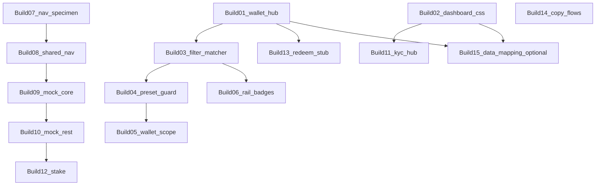
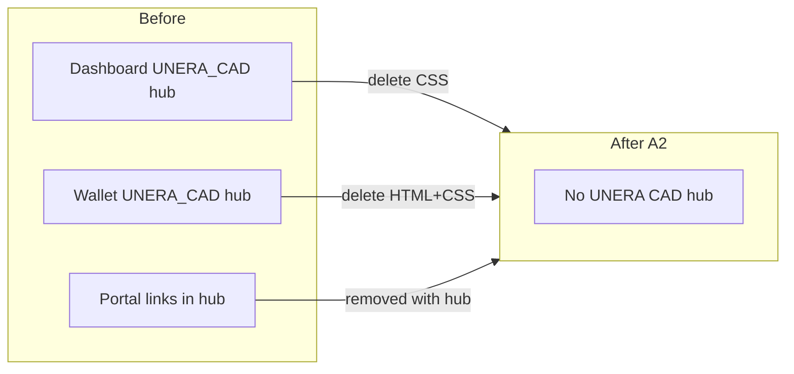

# June 05 Feedback — Non-Send Improvements Plan (Implementation-Ready)

**Version:** 1.4 · **Date:** 2026-06-06  
**Changelog (v1.4):** Added [Composer build playbook](#composer-build-playbook-14-sessions) — 14 ordered sessions with prompts; Chunk A–H specs unchanged as reference detail.  
**Scope:** `NewUnera/` design/HTML only — **excludes** `NewUnera/send-enhanced.html` (handled separately)  
**Decision makers:** Eric + Minh (team alignment ~99 min call); **Kevin** (final) + Eric (secondary) on filter presets; Eric on CAD/Buy

---

## Goal and scope

Ship remaining design/UX fixes from:

| Source | Path |
|--------|------|
| Team alignment video | `Feedback/June05/TeamAlignmentJune05/GMT20260605-080131_Recording_1920x974.mp4` |
| Meeting transcript | `Feedback/June05/TeamAlignmentJune05/GMT20260605-080131_Recording.transcript.vtt` |
| CAD & Buy screenshot | `Feedback/June05/CAD&BuyStablecoins/Screenshot 2026-06-05 at 14.05.35.png` |
| Filter Slack thread | `Feedback/June05/Filters/*.png` (14 screenshots) |
| Prior synthesis | `markdown/feedback-summary-june05.md`, `Feedback/June05/TeamAlignmentJune05/june05_team_alignment_improvements_875d92c8.plan.md` |

### In scope

- Buy Stablecoins + remove UNERA CAD surfaces (Eric ~01:22–01:25, CAD screenshot)
- Activity filters + wallet scope (Kevin/Eric filter thread + meeting)
- Token list: **hUSD, USDC, USDT only** — no HBAR/CAD hub (Eric ~01:25:09) — **all wallet-platform pages**; see [NewUnera-wide token standard](#newunera-wide-token-standard-global-rule--extends-chunk-b-b5)
- Nav chrome merge + unsupported network (Eric ~00:30:28, ~00:32:39) — propagate via shared nav files
- `add-money.html` as in-app Buy destination (`?intent=buy`) — **deferred this sprint** (Chunk B); spec retained for future sprint

### Explicit non-goals

- `NewUnera/send-enhanced.html` — out of scope for this document
- Backend APIs, Swagger implementation, `consumer-app-nav.js` production contracts (mock/stub only)
- Notification TV (Eric spec — next week, ~00:31:15)
- Token Management per-token action matrix (Eric spec — blocked)
- Swap/Exchange UI build (Eric ~01:25:41 — USDC↔USDT future only) — `exchange.html` demo assets stay until swap chunk ships
- `NewUnera/Stablecoin/*` mint portal — **separate product**; do not merge with Black Form Buy (Eric ~01:22:46); remove **links into** portal from wallet platform only
- Archive drafts (`*_June*.html`, `wallet-enhanced_2.html`, `send-enhanced_June*.html`) — do not ship; ignore unless explicitly syncing
- `NewUnera/UneraAdmin/*`, `NewUnera/USAdmin/*` — operator admin; out of consumer wallet scope
- Top nav label rename “Transaction History → Activity” (Eric: section only; **do not change nav**)
- BE-synced filter presets (Kevin ~14.10.54: **FE cache only**, 1 week TTL)

---

## Decision log (authoritative)

| # | Decision | Source | Status in repo |
|---|----------|--------|----------------|
| 1 | No CAD in wallet platform UI — **hUSD** not “UNERA CAD” | Eric Slack + ~01:25 | **Partial** — dashboard body clean; wallet still has CAD hub (HTML + CSS) |
| 2 | Buy Stablecoins stays **in-app**; no Stablecoin portal redirect | Eric ~01:22:05–01:23:36 | **Partial / deferred** — dashboard links `add-money.html?intent=buy`; wallet Buy + add-money buy flow **deferred this sprint** (leave portal href until Chunk B ships) |
| 3 | Buy (Black Form) ≠ Mint (Stablecoin) — **independent flows** | Eric ~01:22:46 | Design note only — do not merge flows in UI |
| 4 | Token list: **hUSD, USDC, USDT** — no HBAR | Eric ~01:25:09 | **Partial** — portfolio/filter on main wallet/dashboard **done**; stake, mocks, onboarding copy, add-money buy path **not done** — see [audit matrix](#page-by-page-audit-matrix-tier-1--2--production-consumer) |
| 5 | Remove UNERA CAD banner/hub entirely (Minh decision in prior plan) | Eric ~01:24:48 + open item #2 | **Partial** — dashboard HTML gone; **both files** need full hub removal (wallet HTML+CSS; dashboard CSS) |
| 6 | Filters: remove **Status**, remove **Bank Transfers** | Eric Slack + Son | **Done** in `wallet-enhanced.html` filter modal |
| 7 | Transaction type labels: **Received / Sent** (meeting over Slack Recipient/Sender) | Eric meeting | **Done** in filter modal |
| 8 | Presets: **localStorage**, max **3**, **7-day TTL**, invalid-preset signal | Kevin ~14.10.54 (final) | **Mostly done** — missing “must apply filters before save” guard |
| 9 | Activity rename section → **Activity** (not nav) | Eric ~14.08.49 | **Done** |
| 10 | Wallet scope: **All Wallets** vs **current wallet** tabs; sync with nav wallet | Hue ~14.09.13, Son BE note | **UI done** — filtering logic + default tab **not done** |
| 11 | Unified Activity feed: combine Web2 pending + Web3 completed (Eric) | Eric ~14.08.49 | **Demo rows exist** — needs rail badge polish |
| 12 | Nav: merge wallet pill + network into **one dropdown** | Eric ~00:30:28 | **Not done** (still split controls) |
| 13 | Unsupported network warning → opens network picker | Eric ~00:32:39 | **Not done** |
| 14 | Mobile: single notification badge; no duplicate bell in drawer | Huệ ~01:30:30 | **Partial** — wallet uses text link; verify all pages |
| 15 | Wallet edge states (disconnected/empty/wrong network) | Minh ~01:20 | **Deferred** — `wallet-edge.html` reference only |

---

## Deferred this sprint (user directive 2026-06-06)

| Item | Was | Now | Rationale |
|------|-----|-----|-----------|
| Wallet Buy quick action (Chunk A §A1) | P0 | **Deferred** | Do not touch broken `Stablecoin/get-unera-cad.html` href yet |
| Chunk B — add-money buy intent | P0 | **Deferred** | Do not implement `?intent=buy` flow on `add-money.html` yet |
| Chunk F §F1 Buy card → `add-money?intent=buy` | P2 | **Deferred** | Depends on Chunk B; avoid linking to unimplemented buy mode |
| Sepolia removal from Activity filter (Chunk C §C2) | P2 | **P3 / backlog** | Not prioritized; duplicate send + account-settings pattern when touched |

**Still in scope immediately:** Chunk A §A2 (UNERA CAD hub removal on wallet + dashboard CSS), Chunks C, D, E, G, H (except buy-dependent H1 `issueAsset` buy URL).

**Start here:** [Composer build playbook (14 sessions)](#composer-build-playbook-14-sessions) — one build per Composer chat; do not read the full doc unless debugging.

---

## Composer build playbook (14 sessions)

Use this section to execute work. Each **Build** = one Composer 2.5 session. Detailed specs live in [Chunk A–H sections](#chunk-index-build--01--14) below.

### Session rules

- **One build = one Composer chat** (max 2 related files per session).
- **Never parallel-edit** `NewUnera/wallet-enhanced.html` — Builds 01, 03, 04, 05, 06, 13 must run **in order**.
- **Verify in browser** after Builds **01**, **03**, **07**, **09** (highest-risk visual/JS changes).
- **Skip all deferred items** (A1, B, F1, H1 buy URL, C2 Sepolia) unless explicitly un-deferred.
- Paste the **Composer prompt** from each build card; do not ask Composer to “do the whole plan.”

### Session matrix (active this sprint)

| Build | Name | Primary file(s) | Maps to | Est. | Depends |
|-------|------|-----------------|---------|------|---------|
| **01** | Remove UNERA CAD hub — wallet | `wallet-enhanced.html` | A §A2.1 | 1 pass | — |
| **02** | Remove UNERA CAD hub — dashboard CSS | `dashboard-enhanced.html` | A §A2.2 | 1 pass | — |
| **03** | Activity filter matcher (date + network) | `wallet-enhanced.html` | C §C1 | 1 pass | **01** |
| **04** | Preset guard + filter polish | `wallet-enhanced.html` | C §C3–C5 | 1 pass | **03** |
| **05** | Wallet scope tabs + mock rows | `wallet-enhanced.html` | D | 1 pass | **03** |
| **06** | Activity rail badges | `wallet-enhanced.html`, `dashboard-enhanced.html` | G | 1 pass | **03** |
| **07** | Nav merge specimen | `account-settings.html` | E §E1–E2 | 1 pass | — |
| **08** | Shared nav JS/CSS | `consumer-app-nav.js`, `consumer-app-nav.css` | E §E1–E5 | 1 pass | **07** |
| **09** | Nav mock cleanup — core pages | dashboard, wallet, add-money, account-settings, notifications, account-security | E §E3, H §H3 partial | 1 pass | **08** |
| **10** | Nav mock cleanup — remaining pages | governance, explore-centres, centre-detail, payee-management, email-notification-templates, exchange, stake, kyc-verify-new, proof-of-reserve-public | H §H3 partial | 1 pass | **09** |
| **11** | KYC dashboard CAD hub removal | `dashboard-kyc-blocked.html`, `dashboard-kyc-retry.html` | F §F2 | 1 pass | **02** |
| **12** | Stake token picker | `stake.html` | H §H2 | 1 pass | **10** |
| **13** | Redeem stub (no portal) | `wallet-enhanced.html` | H §H1 partial | 1 pass | **01** |
| **14** | Onboarding copy + flow diagrams | kyc-verify, wallet-creation, instructions; flow-stablecoin-management (+ remittance footnote) | H §H5, H §H6 | 1 pass | — |
| **15** *(optional)* | Data-mapping remittance sync | `data-mapping/token-mgmt-remittance/screens/*` | H §H8 | 1 pass | **01**, **02** |

### Recommended order

**01 → 02 → 03 → 04 → 05 → 06 → 07 → 08 → 09 → 10 → 11 → 12 → 13 → 14** (+ optional **15**)

Builds **01** and **02** can run in parallel (different files). Builds **07** and **03** can run in parallel after **01** if two chats — but not two wallet edits at once.

### Dependency diagram



### Weekly grouping (optional)

| Week | Builds | Outcome |
|------|--------|---------|
| **Week 1** | 01 → 02 → 03 → 04 → 05 | Wallet Activity filters + scope fully functional |
| **Week 2** | 06 → 07 → 08 → 09 | Nav chrome + core mock cleanup |
| **Week 3** | 10 → 11 → 12 → 13 → 14 (+15) | Cross-page consistency |

### Deferred / backlog builds (do not schedule)

| Build | Chunk | When |
|-------|-------|------|
| B-01 | B entire | add-money buy intent un-deferred |
| A-01 | A §A1 | after B-01 |
| F-01 | F §F1 | after B-01 |
| H-01 | H §H1 `issueAsset` buy URL | after B-01 |
| C-02 | C §C2 Sepolia | backlog P3 |
| H-04, H-07 | purchase-receipt, PoR body | product decision |

---

### Build 01 — Remove UNERA CAD hub (wallet)

**Goal:** Delete hub HTML + CSS only.  
**Files:** `NewUnera/wallet-enhanced.html`  
**Detail:** [Chunk A §A2.1](#a21--wallet-enhancedhtml-html--css)  
**Do NOT:** Change Buy button href (A1 deferred); touch filter JS or Activity rows.

**Composer prompt:**

> Implement **Build 01** from `markdown/june05-non-send-improvements-plan.md` only.  
> File: `NewUnera/wallet-enhanced.html`. Delete `.unera-cad-hub-card` HTML ~L5224–5242 and CSS ~L1569–1710 per A2.1. Do **not** change Buy Stablecoins href. Grep: zero `unera-cad-hub` on wallet file.

**Exit checklist:** [A3](#a3-verification--chunk-a) wallet bullets; layout intact after hub removal.

---

### Build 02 — Remove UNERA CAD hub (dashboard CSS)

**Goal:** Delete orphan `.unera-cad-hub-*` CSS; body already clean.  
**Files:** `NewUnera/dashboard-enhanced.html`  
**Detail:** [Chunk A §A2.2](#a22--dashboard-enhancedhtml-css-only--html-already-absent)  
**Do NOT:** Change Buy card; touch Activity feed markup.

**Composer prompt:**

> Implement **Build 02** from `markdown/june05-non-send-improvements-plan.md` only.  
> File: `NewUnera/dashboard-enhanced.html`. Delete CSS block ~L966–1116 per A2.2. Grep: zero `unera-cad-hub`.

**Exit checklist:** [A3](#a3-verification--chunk-a) dashboard bullets.

---

### Build 03 — Activity filter matcher (date + network)

**Goal:** Wire date/network into `matchesTxAdvancedFilters`; add mock `data-*` on rows.  
**Files:** `NewUnera/wallet-enhanced.html`  
**Detail:** [Chunk C §C1](#c1-apply-date-range-in-filter-matcher)  
**Do NOT:** Remove Sepolia radio (C2 backlog); change preset save logic yet.

**Composer prompt:**

> Implement **Build 03** from `markdown/june05-non-send-improvements-plan.md` only.  
> File: `NewUnera/wallet-enhanced.html`. Extend `matchesTxAdvancedFilters` ~L6494 per C1; add `data-tx-date` and `data-network` to mock `.transaction-item` rows. Skip C2 Sepolia. Test: Apply date range + Base network filters mock list.

**Exit checklist:** [C6](#c6-verification--chunk-c) date + network filter bullets only.

---

### Build 04 — Preset guard + filter polish

**Goal:** Apply-before-save guard, emoji token icon fix, preset schema version.  
**Files:** `NewUnera/wallet-enhanced.html`  
**Detail:** [Chunk C §C3–C5](#c3-preset-save-guard-erickevin)  
**Do NOT:** Re-open filter matcher from Build 03 unless broken.

**Composer prompt:**

> Implement **Build 04** from `markdown/june05-non-send-improvements-plan.md` only.  
> File: `NewUnera/wallet-enhanced.html`. Add preset save guard (C3), replace hUSD emoji in filter (C4), add `schemaVersion: 1` (C5).

**Exit checklist:** [C6](#c6-verification--chunk-c) preset + emoji bullets.

---

### Build 05 — Wallet scope tabs + mock rows

**Goal:** Default tab = current wallet; scope filters Activity rows.  
**Files:** `NewUnera/wallet-enhanced.html`  
**Detail:** [Chunk D](#chunk-d--wallet-scope-tabs--multi-wallet-mock-p1)  
**Do NOT:** Change filter modal or CAD hub areas.

**Composer prompt:**

> Implement **Build 05** from `markdown/june05-non-send-improvements-plan.md` only.  
> File: `NewUnera/wallet-enhanced.html`. Per Chunk D: default `activeWalletScope = 'current'`, wire `matchesTxAdvancedFilters` wallet scope, add `data-wallet` on ~30% mock rows, `syncWalletScopeTabFromNav` on load.

**Exit checklist:** [D5](#d5-verification--chunk-d).

---

### Build 06 — Activity rail badges

**Goal:** Off-chain / On-chain badges on Activity rows (wallet + dashboard).  
**Files:** `NewUnera/wallet-enhanced.html`, `NewUnera/dashboard-enhanced.html`  
**Detail:** [Chunk G](#chunk-g--activity-web2web3-visual-distinction-p2-polish)  
**Do NOT:** Change filter logic from Builds 03–05.

**Composer prompt:**

> Implement **Build 06** from `markdown/june05-non-send-improvements-plan.md` only.  
> Files: `wallet-enhanced.html`, `dashboard-enhanced.html`. Add `.activity-rail-badge` CSS + markup per G1/G2 on bank vs on-chain demo rows.

**Exit checklist:** [G1/G2](#g1-rail-badge-on-transaction-rows) visually verified at 768px.

---

### Build 07 — Nav merge specimen

**Goal:** Combined wallet·network trigger + unsupported network state on reference page.  
**Files:** `NewUnera/account-settings.html`  
**Detail:** [Chunk E §E1–E2](#e1-target-nav-control-desktop)  
**Do NOT:** Propagate to all pages yet; do not edit `consumer-app-nav.js`.

**Composer prompt:**

> Implement **Build 07** from `markdown/june05-non-send-improvements-plan.md` only.  
> File: `NewUnera/account-settings.html`. Add `.nav-wallet-network-trigger` merged control + unsupported network styling per E1–E2. Ethereum + Base only in dropdown.

**Exit checklist:** [E6](#e6-verification--chunk-e) first 2 bullets on account-settings only.

---

### Build 08 — Shared nav JS/CSS

**Goal:** Port specimen patterns to shared nav assets.  
**Files:** `NewUnera/consumer-app-nav.css`, `NewUnera/consumer-app-nav.js`  
**Detail:** [Chunk E §E1–E5](#chunk-e--nav-merge--unsupported-network-p1)  
**Do NOT:** Bulk-replace CTC mocks (Build 09); edit send-enhanced.html.

**Composer prompt:**

> Implement **Build 08** from `markdown/june05-non-send-improvements-plan.md` only.  
> Files: `consumer-app-nav.css`, `consumer-app-nav.js`. Sync merged wallet·network trigger + dropdown behavior from account-settings specimen. E4: Ethereum + Base only.

**Exit checklist:** Shared JS loads without error on wallet + dashboard spot-check.

---

### Build 09 — Nav mock cleanup (core pages)

**Goal:** CTC → hUSD nav mocks on 6 high-traffic pages.  
**Files:** `dashboard-enhanced.html`, `wallet-enhanced.html`, `add-money.html`, `account-settings.html`, `notifications.html`, `account-security.html`  
**Detail:** [Chunk E §E3](#e3-mock-balancetoken-cleanup-all-nav-instances), [H §H3 partial](#h3-nav--notification-mock-cleanup-extends-chunk-e-e3)  
**Do NOT:** Change add-money body (hCAD Add Money flow); merge nav if Build 08 not done.

**Composer prompt:**

> Implement **Build 09** from `markdown/june05-non-send-improvements-plan.md` only.  
> Replace `292.22559 CTC` → `2,500.00 hUSD`, `CTC · Polygon` → `hUSD · Base`, notification seed CTC → USDC/hUSD on the 6 core pages listed in Build 09 matrix. Nav only on add-money.

**Exit checklist:** `rg '292\.22559 CTC' NewUnera/{dashboard-enhanced,wallet-enhanced,add-money,account-settings,notifications,account-security}.html` → zero.

---

### Build 10 — Nav mock cleanup (remaining pages)

**Goal:** CTC cleanup on remaining Tier 1 nav-bearing pages + account-settings mock rows.  
**Files:** governance, explore-centres, centre-detail, payee-management, email-notification-templates, exchange, stake, kyc-verify-new, proof-of-reserve-public (+ account-settings hCAD mock rows if not done in 09)  
**Detail:** [H §H3](#h3-nav--notification-mock-cleanup-extends-chunk-e-e3)  
**Do NOT:** Edit stake token cards (Build 12).

**Composer prompt:**

> Implement **Build 10** from `markdown/june05-non-send-improvements-plan.md` only.  
> Apply E3/H3 replace table to remaining Tier 1 pages in Build 10 matrix. account-settings: hCAD mock activity rows → hUSD/USDC/USDT ~L3335–3381.

**Exit checklist:** No CTC in nav on Tier 1 pages per H3 list (except deferred/archives).

---

### Build 11 — KYC dashboard CAD hub removal

**Goal:** Remove UNERA CAD hub HTML + CSS on KYC-blocked variants.  
**Files:** `dashboard-kyc-blocked.html`, `dashboard-kyc-retry.html`  
**Detail:** [Chunk F §F2](#f2-remove-unera-cad-hub-active)  
**Do NOT:** Change Buy card href (F1 deferred).

**Composer prompt:**

> Implement **Build 11** from `markdown/june05-non-send-improvements-plan.md` only.  
> Files: `dashboard-kyc-blocked.html`, `dashboard-kyc-retry.html`. Delete `.unera-cad-hub-card` + CSS per F2 / A2 pattern. Leave Buy → portal href unchanged.

**Exit checklist:** [F3](#f3-verification--chunk-f).

---

### Build 12 — Stake token picker

**Goal:** hUSD / USDC / USDT only; remove hCAD/hEUR/HUMA cards.  
**Files:** `NewUnera/stake.html`  
**Detail:** [Chunk H §H2](#h2-stakehtml--token-picker)  
**Do NOT:** Re-edit nav if Build 10 complete.

**Composer prompt:**

> Implement **Build 12** from `markdown/june05-non-send-improvements-plan.md` only.  
> File: `stake.html`. Replace token cards + JS `tokenData` per H2 table.

**Exit checklist:** [H9](#h9-verification--chunk-h) stake bullet.

---

### Build 13 — Redeem stub (no portal)

**Goal:** `redeemAsset()` shows toast instead of Stablecoin portal redirect.  
**Files:** `NewUnera/wallet-enhanced.html`  
**Detail:** [Chunk H §H1 partial](#h1-wallet-enhancedhtml--portfolio-issue--redeem-helpers)  
**Do NOT:** Change `issueAsset` (H-01 deferred); re-edit filters.

**Composer prompt:**

> Implement **Build 13** from `markdown/june05-non-send-improvements-plan.md` only.  
> File: `wallet-enhanced.html`. Stub `redeemAsset()` per H1 — toast only, no `Stablecoin/redeem-unera-cad.html`. Skip `issueAsset` buy URL.

**Exit checklist:** Click Redeem on portfolio row → toast, no navigation to portal.

---

### Build 14 — Onboarding copy + flow diagrams

**Goal:** hUSD-first copy on onboarding pages; update flow diagram IA.  
**Files:** `kyc-verify.html`, `wallet-creation.html`, `instructions.html`, `flow-stablecoin-management.html`, `flow-stablecoin-remittance.html` (footnote)  
**Detail:** [H §H5](#h5-onboarding--internal-copy-tier-2), [H §H6](#h6-flow-diagrams)  
**Do NOT:** Edit purchase-receipt (H-04); PoR body (H-07); index.html unless time permits.

**Composer prompt:**

> Implement **Build 14** from `markdown/june05-non-send-improvements-plan.md` only.  
> Apply H5 copy table to kyc-verify, wallet-creation, instructions. Update flow-stablecoin-management Mermaid per H6. Remittance footnote only if needed.

**Exit checklist:** [H9](#h9-verification--chunk-h) onboarding + flow diagram bullets.

---

### Build 15 — Data-mapping remittance sync (optional)

**Goal:** Sync remittance mapping copies after production wallet/dashboard are clean.  
**Files:** `data-mapping/token-mgmt-remittance/screens/*.html`  
**Detail:** [H §H8](#h8-data-mapping-remittance-screens)  
**Depends:** Builds **01**, **02** (minimum).

**Composer prompt:**

> Implement **Build 15** from `markdown/june05-non-send-improvements-plan.md` only.  
> Diff-sync remittance dashboard + wallet screens from post-Build-01/02 production files; fix CTC mocks on remittance notifications.

**Exit checklist:** Remittance wallet/dashboard copies match hub-removal state.

---

## Current vs target — audit summary

### ✅ Already implemented (verify only)

| Area | File | Evidence |
|------|------|----------|
| Dashboard Buy CTA copy + link | `NewUnera/dashboard-enhanced.html` | ~L2792–2797: `add-money.html?intent=buy`, “Buy hUSD, USDC or USDT” |
| Dashboard UNERA CAD hub **body markup removed** | `NewUnera/dashboard-enhanced.html` | No `.unera-cad-hub-card` in `<body>`; **CSS cleanup still pending** (~L966–1116) — same P0 as wallet |
| Activity section title | `NewUnera/wallet-enhanced.html` | ~L5248: `Activity` |
| Filter modal structure | `NewUnera/wallet-enhanced.html` | ~L5726–5893: no Status; no Bank Transfers; Received/Sent; hUSD/USDC/USDT |
| Presets localStorage + TTL + max 3 | `NewUnera/wallet-enhanced.html` | ~L6481–6483, ~L7285–7355 |
| Portfolio tokens | `NewUnera/wallet-enhanced.html` | hUSD, USDC, USDT rows ~L5067–5190 |
| Recent Activity tokens | `NewUnera/dashboard-enhanced.html` | hUSD in feed ~L2861+ |

### ❌ Still wrong or incomplete

| Gap | File(s) | Severity |
|-----|---------|----------|
| Wallet **Buy Stablecoins** → `Stablecoin/get-unera-cad.html` | `wallet-enhanced.html` ~L5195–5199 | **Deferred** — leave href unchanged this sprint; do not implement A1 |
| **Remove UNERA CAD hub entirely** (HTML + CSS) | `wallet-enhanced.html` + `dashboard-enhanced.html` | **P0** |
| `add-money.html?intent=buy` **not handled** — page is CAD/hCAD Add Money | `add-money.html` | **Deferred** — no HTML/JS changes to add-money this sprint (Chunk B) |
| Wallet scope tabs **don’t filter** rows; default is All Wallets not current | `wallet-enhanced.html` JS ~L6479, ~L7027 | **P1** |
| Date / network filters **not applied** in `matchesTxAdvancedFilters` | `wallet-enhanced.html` ~L6494 | **P1** |
| Save preset allowed **without Apply Filters** | `wallet-enhanced.html` ~L7391 | **P1** (Eric ~14.10.44) |
| Sepolia in network filter (product = Ethereum + Base only) | `wallet-enhanced.html` ~L5880–5883 | **P3 / backlog** — not prioritized; canonical: `send-enhanced.html` `SUPPORTED_SEND_NETWORKS` ~L4190–4212, `account-settings.html` network pills |
| Nav mock **CTC / Polygon**; split wallet+network controls | All consumer pages — see [H3 file list](#h3-nav--notification-mock-cleanup-extends-chunk-e-e3) | **P1** |
| KYC dashboard variants still portal + CAD hub | `dashboard-kyc-blocked.html`, `dashboard-kyc-retry.html` | **P2** — CAD hub removal only (F2); Buy link deferred (F1) |
| **Stake** still offers hCAD / hEUR / HUMA | `stake.html` ~L1900–2295 | **P1** |
| **Onboarding copy** still UNERA CAD / hCAD-first | `kyc-verify.html`, `wallet-creation.html`, `instructions.html` | **P2** |
| **`redeemAsset()`** routes to Stablecoin portal | `wallet-enhanced.html` ~L7552–7553 | **P1** |
| Mint receipt at repo root (not Buy) | `purchase-receipt.html` ~L1052–1126 | **P2** |
| Flow diagram still shows CAD hub + portal Buy | `flow-stablecoin-management.html` ~L301–346 | **P2** |
| Data-mapping remittance screens stale | `data-mapping/token-mgmt-remittance/screens/*` | **P2** |

**UNERA CAD hub removal — per-file state (P0 detail):**

| File | Current state | Action |
|------|---------------|--------|
| `wallet-enhanced.html` | Live HTML ~L5224–5242 + CSS ~L1569–1710 | Delete markup block **and** all `.unera-cad-hub-*` rules (keep `.action-btn` at ~L1712+) |
| `dashboard-enhanced.html` | Body HTML **already removed**; orphan CSS ~L966–1116 | Delete entire CSS block only; grep confirms zero `.unera-cad-hub-card` in `<body>` |

---

## NewUnera-wide token standard (global rule — extends Chunk B §B5)

Eric (~01:25:09): wallet platform tokens are **hUSD, USDC, USDT** — not HBAR, not UNERA CAD/hCAD, not legacy CTC mock. Chunk B §B5 (“Only hUSD, USDC, USDT — no CAD/hCAD on buy path”) is the **minimum bar for `add-money.html?intent=buy`**; this section extends that rule to **every in-scope page under `NewUnera/`** (88 HTML files audited 2026-06-06).

### What “compliant” means on wallet platform (Tier 1)

| Surface | Required | Forbidden |
|---------|----------|-----------|
| Portfolio / balances | hUSD, USDC, USDT rows only | hCAD, hEUR, hGBP, HUMA, HBAR, CTC |
| Buy / on-ramp | `add-money.html?intent=buy`; token picker hUSD / USDC / USDT | Links to `Stablecoin/get-unera-cad.html`; UNERA CAD hub/banner |
| Activity filters | Token filter options: hUSD, USDC, USDT | hCAD, CAD, Status, Bank Transfers |
| Activity / notification mocks | hUSD, USDC, USDT amounts | CTC, Polygon-as-default-chain copy |
| Nav wallet pill + drawer meta | e.g. `2,500.00 hUSD` · `hUSD · Base` | `292.22559 CTC`, `CTC · Polygon` |
| Issue / Get per asset | `add-money.html?intent=buy&token=<code>` (when Token Mgmt spec lands) | Portal redirect for Buy |
| Redeem per asset | **Deferred** — hide or stub until Token Management spec (Eric ~00:18:44) | `Stablecoin/redeem-unera-cad.html` from wallet platform |
| Stake token picker | hUSD, USDC, USDT only (align with portfolio) | hCAD, hEUR, HUMA cards |
| KYC / onboarding copy | “Buy, sell, and stake **hUSD, USDC, or USDT**” | “UNERA CAD tokens”, hCAD-first onboarding |

**Buy (Black Form) ≠ Mint (Stablecoin portal)** — Eric ~01:22:46. Tier 3 pages under `NewUnera/Stablecoin/` may keep UNERA CAD / mint copy; Tier 1 must never route Buy actions there.

### Scope tiers

| Tier | Path pattern | Token rule | Action in this plan |
|------|--------------|------------|---------------------|
| **1 — Wallet platform** | `dashboard-enhanced.html`, `wallet-enhanced.html`, `add-money.html`, `stake.html`, `exchange.html`, `notifications.html`, `payee-management.html`, `governance.html`, `explore-centres.html`, `centre-detail.html`, `account-settings.html`, `account-security.html`, `email-notification-templates.html` | **hUSD / USDC / USDT only** | Fix in Chunks A–H |
| **2 — Onboarding / public copy** | `kyc-verify.html`, `kyc-verify-new.html`, `wallet-creation.html`, `instructions.html`, `proof-of-reserve-public.html`, `index.html` | Copy + nav aligned to hUSD; no hCAD-first UX | Chunk H |
| **3 — Stablecoin mint portal** | `NewUnera/Stablecoin/*.html` | UNERA CAD / mint flows OK **inside portal** | **Do not edit**; remove inbound links from Tier 1 only |
| **4 — Admin / archives / excluded** | `UneraAdmin/*`, `USAdmin/*`, `*_June*.html`, `wallet-enhanced_2.html`, `send-enhanced.html`, `brand-style-guide.html`, `Mobile App/*` | N/A | Do not edit (send = separate plan) |
| **5 — Reference / edge specimens** | `wallet-edge.html` | Old multi-asset demo | Reference only (decision #15); do not copy patterns into production wallet |
| **6 — Flow / mapping docs** | `flow-stablecoin-management.html`, `flow-stablecoin-remittance.html`, `data-mapping/token-mgmt-remittance/**` | Diagrams must reflect post-A2 IA | Chunk H (diagrams); remittance screens sync after A2 |

### Page-by-page audit matrix (Tier 1 + 2 — production consumer)

Status key: **✅ Compliant** · **⚠️ Partial** · **❌ Non-compliant** · **⏸ Deferred** · **🚫 Out of scope**

#### Tier 1 — Core wallet platform

| Page | Status | Findings (grep / line refs) | Chunk |
|------|--------|----------------------------|-------|
| `wallet-enhanced.html` | ⚠️ | Buy → `Stablecoin/get-unera-cad.html` ~L5196 **deferred (A1)**; UNERA CAD hub HTML ~L5224–5242 + CSS ~L1569–1710; `redeemAsset()` → portal ~L7552–7553; portfolio/filter rows **✅** hUSD/USDC/USDT | **A2**, C, D, G, **H1** |
| `dashboard-enhanced.html` | ⚠️ | Buy card **✅** `add-money.html?intent=buy` ~L2792–2797; body hub **✅** removed; orphan `.unera-cad-hub-*` CSS ~L966–1116; nav CTC mock | **A2**, E, G |
| `add-money.html` | ⏸ | Default `selectedCurrency: 'hCAD'` ~L2945; no `?intent=buy` handler — **deferred** (Chunk B); no edits this sprint | **—** |
| `stake.html` | ❌ | hCAD token card ~L1900–1905; tip “stake hCAD or hUSD” ~L1953; JS rates for hCAD/hEUR/HUMA ~L2287–2295; CTC nav | **H2**, E |
| `exchange.html` | ⏸ | Demo assets BTC/ETH/SOL/DAI/USDC/USDT ~L1635–1917 — **not** wallet token list; Eric deferred swap to USDC↔USDT only | Future swap chunk; **E** (CTC nav only this sprint) |
| `notifications.html` | ❌ | Nav CTC ~L864; drawer `CTC · Polygon` ~L1043; mock feed uses CTC ~L1271–1280, ~L1568 | **H3**, E |
| `payee-management.html` | ❌ | Nav CTC ~L898; drawer ~L1083; notification seeds CTC ~L2649–2658 | **H3**, E |
| `account-settings.html` | ⚠️ | Connected-wallet mock rows show **hCAD** ~L3335–3381; notification n5 hCAD ~L4987; nav CTC | **H3**, E |
| `account-security.html` | ⚠️ | Nav CTC only ~L856 | E |
| `governance.html` | ⚠️ | Nav CTC ~L1192; drawer ~L1293 | E |
| `explore-centres.html` | ⚠️ | Nav CTC (same pattern as governance) | E |
| `centre-detail.html` | ⚠️ | Nav CTC ~L1460; drawer ~L1639 | E |
| `email-notification-templates.html` | ❌ | Nav CTC ~L423; email body templates `{{amount}} CTC` ~L560–649 | **H3**, E |

#### Tier 1 — KYC-blocked dashboard variants

| Page | Status | Findings | Chunk |
|------|--------|----------|-------|
| `dashboard-kyc-blocked.html` | ❌ | Buy → portal ~L3179 **deferred (F1)**; full UNERA CAD hub ~L3222–3232 + CSS — remove (F2) | F |
| `dashboard-kyc-retry.html` | ❌ | Same as blocked variant | F |

#### Tier 2 — Onboarding, KYC, public, receipts

| Page | Status | Findings | Chunk |
|------|--------|----------|-------|
| `kyc-verify.html` | ❌ | Bullet “Buy, sell and stake **UNERA CAD tokens**” ~L2961 | **H5** |
| `kyc-verify-new.html` | ⚠️ | Nav CTC only ~L696–727; body copy clean | E |
| `wallet-creation.html` | ❌ | hCAD-first onboarding ~L836, ~L1084–1111 | **H5** |
| `instructions.html` | ❌ | Internal spec lists hCAD/hEUR/HUMA ~L524, ~L542 | **H5** |
| `purchase-receipt.html` | ❌ | Mint receipt: “250.00 UNERA CAD”, links `Stablecoin/get-unera-cad.html` ~L1052–1126 — **mint product**, not Buy | **H4** |
| `proof-of-reserve-public.html` | ⚠️ | Public reserve page uses **hCAD** throughout ~L1361–1669; nav CTC | **H7** + E |
| `index.html` | ⚠️ | Marketing landing mentions hCAD donation ~L1443 — not wallet app; optional copy pass | **H5** (optional) |

#### Tier 5 — Reference only (do not ship as-is)

| Page | Status | Findings | Action |
|------|--------|----------|--------|
| `wallet-edge.html` | ❌ (expected) | Full legacy stack: hCAD portfolio ~L5097+, UNERA CAD hub ~L5371+, portal links, CTC, hEUR filters | **Do not edit** — edge-state reference; integrate patterns only when prioritized (decision #15) |

#### Tier 6 — Flow diagrams & data-mapping copies

| Page | Status | Findings | Chunk |
|------|--------|----------|-------|
| `flow-stablecoin-management.html` | ❌ | Mermaid: Buy → `get-unera-cad.html`, UNERA CAD hub, portfolio hCAD/hEUR/HUMA ~L301–346 | **H6** |
| `flow-stablecoin-remittance.html` | ⚠️ | References root `purchase-receipt.html` | **H6** (footnote only) |
| `data-mapping/token-mgmt-remittance/screens/token-mgmt-remittance-dashboard-enhanced.html` | ❌ | Copy of pre-A2 dashboard (CAD hub likely present) | **H8** after A2 |
| `data-mapping/token-mgmt-remittance/screens/token-mgmt-remittance-wallet-enhanced.html` | ❌ | Copy of pre-A2 wallet | **H8** after A2 |
| `data-mapping/token-mgmt-remittance/screens/token-mgmt-remittance-send-enhanced.html` | — | Send mapping — **out of scope** (send plan) | — |
| `data-mapping/token-mgmt-remittance/screens/token-mgmt-remittance-notifications.html` | ⚠️ | Likely CTC mocks | **H8** |

#### Tier 3 — Stablecoin portal (exempt from Tier 1 token rule)

These **keep** UNERA CAD / mint UX internally. This plan only removes **inbound** links from Tier 1.

| Page | Note |
|------|------|
| `Stablecoin/get-unera-cad.html` | Mint / Get UNERA CAD — independent from Black Form Buy |
| `Stablecoin/redeem-unera-cad.html` | Redeem to fiat |
| `Stablecoin/dashboard.html`, `mint-history.html`, `purchase-receipt.html`, etc. | Portal product surfaces |

#### Tier 4 — No action (archives, admin, excluded)

| Pattern | Files (sample) |
|---------|----------------|
| Send (separate plan) | `send-enhanced.html`, `send-enhanced_June*.html` |
| Archive drafts | `wallet-enhanced_June05.html`, `wallet-enhanced_2.html`, `account-settings_June06*.html` |
| Brand spec | `brand-style-guide.html` |
| Admin | `UneraAdmin/*`, `USAdmin/*` |
| Auth-only (no token surfaces) | `login_2.html`, `signup_2.html`, `forgot-password.html`, `verify-email.html`, `setup-2fa.html`, `verify-2fa.html`, `password-reset.html`, `magic-link-sent.html`, `connect-social.html`, `reset-storage.html` |
| Mobile specimen | `Mobile App/Android/dashboard.html` |

### Grep verification (run after Chunks A–H)

```bash
# Tier 1 must return ZERO hits (wallet platform consumer root pages)
rg -l 'Stablecoin/get-unera-cad|unera-cad-hub' NewUnera/*.html \
  --glob '!*_June*' --glob '!wallet-enhanced_2.html' --glob '!send-enhanced*.html'

# CTC / Polygon nav mock — should be ZERO on updated Tier 1 pages
rg '292\.22559 CTC|CTC · Polygon' NewUnera/*.html \
  --glob '!*_June*' --glob '!wallet-edge.html' --glob '!send-enhanced*.html'

# hCAD on buy path — add-money only when flowMode !== 'buy'; Tier 1 portfolio zero
rg 'data-asset="hCAD"|data-token="hCAD"' NewUnera/wallet-enhanced.html NewUnera/dashboard-enhanced.html NewUnera/stake.html

# Portal inbound links from Tier 1 (allow Stablecoin/ folder itself)
rg 'Stablecoin/get-unera-cad|Stablecoin/redeem-unera-cad' NewUnera/*.html \
  --glob '!Stablecoin/**' --glob '!purchase-receipt.html' --glob '!flow-*' --glob '!*_June*'
```

Expected post-sprint: first command returns **no files** except `wallet-enhanced.html` Buy href (deferred until A1) and `purchase-receipt.html` (until H4). Fourth command may still match wallet Buy portal link until Chunk B + A1 ship.

---

## Chunk index (Build 01–14)

Legacy letter chunks map to numbered builds. **Detailed specs remain in Chunk sections below** — use the [playbook](#composer-build-playbook-14-sessions) for execution order.

| Build | Chunk | Status |
|-------|-------|--------|
| 01, 02 | A §A2 | Active |
| — | A §A1, B | Deferred |
| 03, 04 | C §C1, C3–C5 | Active (skip C2 Sepolia) |
| 05 | D | Active |
| 06 | G | Active |
| 07, 08, 09 | E | Active |
| 10 | H §H3 partial | Active |
| 11 | F §F2 | Active (F1 deferred) |
| 12 | H §H2 | Active |
| 13 | H §H1 partial | Active (buy URL deferred) |
| 14 | H §H5, H6 | Active |
| 15 | H §H8 | Optional |

---

## Chunk A — Remove UNERA CAD hub (P0) — Buy link fix deferred

**Build sessions:** **01** (wallet), **02** (dashboard)

**Files:** `NewUnera/wallet-enhanced.html`, `NewUnera/dashboard-enhanced.html`  
**Time estimate:** 1 Composer pass  
**Active this sprint:** §A2 only (hub removal). §A1 is reference spec — do not implement until Chunk B ships.

### A1. Fix wallet Quick Action — Buy Stablecoins

> **DEFERRED — do not implement this sprint.** Leave wallet Buy button href as `Stablecoin/get-unera-cad.html` until Chunk B ships. Content below is **future spec** for when A1 is un-deferred.

**Find** (~L5195–5199):

```html
<button class="action-btn primary"
        onclick="window.location.href='Stablecoin/get-unera-cad.html'"
        aria-label="Buy stablecoins - Recommended action">
```

**Replace with:**

```html
<button class="action-btn primary"
        onclick="window.location.href='add-money.html?intent=buy'"
        aria-label="Buy stablecoins - Recommended action">
    <svg class="action-btn-icon" xmlns="http://www.w3.org/2000/svg" width="24" height="24" viewBox="0 -960 960 960" fill="currentColor" aria-hidden="true"><path d="M440-280h80v-160h160v-80H520v-160h-80v160H280v80h160v160Zm40 200q-83 0-156-31.5T197-197q-54-54-85.5-127T80-480q0-83 31.5-156T197-763q54-54 127-85.5T480-880q83 0 156 31.5T763-763q54 54 85.5 127T880-480q0 83-31.5 156T763-197q-54 54-127 85.5T480-80Zm0-80q134 0 227-93t93-227q0-134-93-227t-227-93q-134 0-227 93t-93 227q0 134 93 227t227 93Zm0-320Z"/></svg>
    <span>Buy Stablecoins</span>
</button>
```

Optional: add visible sub-label under button if wallet quick actions support two lines (match dashboard desc “Buy hUSD, USDC or USDT”).

### A2. Remove UNERA CAD hub (both pages)

Eric (~01:24:48–01:25:17): no CAD on wallet platform; tokens are **hUSD, USDC, USDT**. Minh (~01:24:22): remove the bottom hub entirely. Do **not** rebrand hub to hUSD — wait for Token Management spec before any Get/Redeem CTA returns. Hub removal does **not** depend on A1 Buy link fix (deferred).



*Buy Stablecoins quick action → `add-money.html?intent=buy` (A1) is deferred — not part of this sprint.*

#### A2.1 — `wallet-enhanced.html` (HTML + CSS)

**Delete HTML** — entire sibling after `.quick-actions` closing `</div>`, before Activity section (~L5224–5242):

```html
            <div class="unera-cad-hub-card" role="region" aria-labelledby="wallet-unera-cad-hub-title">
                <div class="unera-cad-hub-card-head">
                    <div class="unera-cad-hub-icon" aria-hidden="true">
                        <svg xmlns="http://www.w3.org/2000/svg" width="26" height="26" viewBox="0 -960 960 960" fill="currentColor" aria-hidden="true"><path d="m422-232 207-248H469l29-227-185 267h139l-30 208ZM320-80l40-280H160l360-520h80l-40 320h240L400-80h-80Zm151-390Z"/></svg>
                    </div>
                    <div>
                        <h3 id="wallet-unera-cad-hub-title" class="unera-cad-hub-title">UNERA CAD</h3>
                        <p id="wallet-unera-cad-hub-desc" class="unera-cad-hub-desc">Get or redeem UNERA CAD — managed by UNERA Stablecoin. KYC &amp; AML compliance required.</p>
                        <div class="entity-chip" aria-label="Managed by UNERA Stablecoin">...</div>
                    </div>
                </div>
                <div class="unera-cad-hub-actions" role="group" aria-label="UNERA CAD actions">
                    <a href="Stablecoin/get-unera-cad.html" class="btn btn-secondary" ...> Get UNERA CAD</a>
                    <a href="Stablecoin/redeem-unera-cad.html" class="btn btn-secondary" ...> Redeem to Fiat</a>
                </div>
            </div>
```

**Layout after delete:** Quick Actions row ends at Stake button (~L5222); next block is `<!-- Activity Section -->` (~L5245). One blank line between sections — no empty wrapper gap.

**Delete CSS** — from comment through responsive rule (~L1569–1710):

- **Start:** `/* UNERA CAD — full-width hub (matches dashboard-enhanced Quick Actions module) */`
- **End:** closing `}` of `@media (max-width: 480px) { .unera-cad-hub-actions { grid-template-columns: 1fr; ... } }` (~L1705–1710)
- **Keep:** `.action-btn {` block that follows (~L1712+)

**Optional token cleanup** (same edit pass):

- Grep `--surface-cad-hub` in `:root`; if unused after CSS delete, remove that token line.

**Grep verification:**

```bash
rg 'unera-cad-hub|Get UNERA CAD|Redeem to Fiat|UNERA CAD' NewUnera/wallet-enhanced.html
# Expected: zero matches (remove stray comments too)
```

#### A2.2 — `dashboard-enhanced.html` (CSS only — HTML already absent)

**No body edits** — confirm: no `class="unera-cad-hub-card"` anywhere in markup (grep body only).

**Delete CSS** — block ~L966–1116:

- **Start:** `/* UNERA CAD — full-width hub inside Quick Actions (two primary flows, one module) */`
- **End:** `@media (max-width: 480px) { .unera-cad-hub-actions { grid-template-columns: 1fr; max-width: none; } }` (~L1111–1116)
- **Keep:** `/* Recent Activity Feed - Enhanced */` + `.activity-section {` (~L1118+)

**Optional:** comment at ~L2014 (`Impact modal tip — aligned with Get UNERA CAD …`) is not rendered UI — reword or leave; not blocking.

**Grep verification:**

```bash
rg 'unera-cad-hub' NewUnera/dashboard-enhanced.html
# Expected: zero matches after cleanup
```

### A3. Verification — Chunk A

- [ ] `wallet-enhanced.html`: no `.unera-cad-hub-card` in DOM; no `unera-cad-hub` in CSS
- [ ] `dashboard-enhanced.html`: no `unera-cad-hub` in CSS (body was already clean)
- [ ] No strings: `UNERA CAD`, `Get UNERA CAD`, `Redeem to Fiat`, `Stablecoin/get-unera-cad.html` on either page **except** wallet Buy quick-action href (A1 deferred — leave unchanged)
- [ ] Wallet Buy href **unchanged** — still `Stablecoin/get-unera-cad.html` (A1 deferred)
- [ ] Dashboard Buy card unchanged (`Buy hUSD, USDC or USDT` → `add-money.html?intent=buy`)
- [ ] Quick Actions / wallet section layout intact (no visual hole where hub was)

---

## Chunk B — `add-money.html` Buy intent flow (DEFERRED)

**Build sessions:** **B-01** (future — entire chunk deferred)

> **DEFERRED — do not implement this sprint.** Entire Chunk B is reference spec for a future sprint. Do not edit `NewUnera/add-money.html` for `?intent=buy` until explicitly un-deferred.

**File:** `NewUnera/add-money.html`  
**Reference patterns:** token dropdown from `NewUnera/exchange.html` (~L1673–1708); stepper from `NewUnera/add-money.html` existing stepper; rules: `.cursor/rules/newunera-dropdown.mdc`, `wallet-action-pages.mdc`

### B1. Behavioral contract

| Query param | Behavior |
|-------------|----------|
| (none) | Existing **Add Money** flow (fiat on-ramp demo) — unchanged default |
| `?intent=buy` | **Buy Stablecoins** mode: user picks **hUSD, USDC, or USDT** first, then payment method |
| `?intent=buy&token=USDC` | Skip token picker; preselect USDC |

Eric (~01:23:27): stay on wallet platform; user can choose which stablecoin to buy.

### B2. Page chrome when `intent=buy`

On `DOMContentLoaded`, parse URL:

```javascript
(function initBuyIntent() {
    const params = new URLSearchParams(window.location.search);
    const intent = params.get('intent');
    if (intent !== 'buy') return;

    document.title = 'Buy Stablecoins – UNERA | One Flow. Many Lives.';
    const pageTitle = document.querySelector('.page-title');
    const pageSubtitle = document.querySelector('.page-subtitle');
    if (pageTitle) pageTitle.textContent = 'Buy Stablecoins';
    if (pageSubtitle) pageSubtitle.textContent = 'Buy hUSD, USDC, or USDT with card, bank, or crypto';

    appState.flowMode = 'buy'; // add to appState object ~L2945
    appState.allowedTokens = ['hUSD', 'USDC', 'USDT'];

    const preselect = params.get('token');
    if (preselect && appState.allowedTokens.includes(preselect.toUpperCase())) {
        appState.selectedBuyToken = preselect.toUpperCase();
    }
})();
```

Set `<body data-nav-active="transact">` if not already.

### B3. New Step 0 — Choose stablecoin (buy mode only)

Insert **before** current Step 1 payment method panel inside `#main-content`. Use selection row pattern from `.cursor/rules/newunera-selection-check.mdc`.

**Markup skeleton** (insert after stepper, before first `.step-content`):

```html
<div class="step-content" id="step-buy-token" data-step="buy-token" hidden>
    <div class="card">
        <h2 class="card-title" id="buy-token-heading" tabindex="-1">Choose stablecoin</h2>
        <p class="card-subtitle" style="color: var(--text-secondary); margin-bottom: 1.25rem;">
            Select which stablecoin you want to buy. Prices settle 1:1 in USD terms for demo.
        </p>
        <div class="send-options" role="radiogroup" aria-labelledby="buy-token-heading">
            <!-- hUSD -->
            <div class="send-option selected" role="radio" aria-checked="true" tabindex="0"
                 data-buy-token="hUSD" onclick="selectBuyToken('hUSD', this)"
                 onkeydown="handleBuyTokenKey(event, 'hUSD', this)">
                <div class="send-option-body">
                    <div class="send-option-title">hUSD</div>
                    <div class="send-option-desc">UNERA USD stablecoin</div>
                </div>
                <div class="method-check send-option-check" aria-hidden="true"></div>
            </div>
            <!-- USDC -->
            <div class="send-option" role="radio" aria-checked="false" tabindex="0"
                 data-buy-token="USDC" onclick="selectBuyToken('USDC', this)"
                 onkeydown="handleBuyTokenKey(event, 'USDC', this)">
                <div class="send-option-body">
                    <div class="send-option-title">USDC</div>
                    <div class="send-option-desc">USD Coin on Ethereum or Base</div>
                </div>
                <div class="method-check send-option-check" aria-hidden="true"></div>
            </div>
            <!-- USDT -->
            <div class="send-option" role="radio" aria-checked="false" tabindex="0"
                 data-buy-token="USDT" onclick="selectBuyToken('USDT', this)"
                 onkeydown="handleBuyTokenKey(event, 'USDT', this)">
                <div class="send-option-body">
                    <div class="send-option-title">USDT</div>
                    <div class="send-option-desc">Tether USD</div>
                </div>
                <div class="method-check send-option-check" aria-hidden="true"></div>
            </div>
        </div>
        <div class="btn-actions" style="margin-top: 1.5rem;">
            <button type="button" class="btn-primary" onclick="continueFromBuyToken()">Continue</button>
        </div>
    </div>
</div>
```

**CSS:** Copy `.send-option` / `.send-option.selected` rules from `NewUnera/send-enhanced.html` (~L775–789, ~L1468–1476) — do not link send page; duplicate minimal CSS into `add-money.html` if missing.

**JS:**

```javascript
const UNERA_CHECKMARK_SVG = '<svg class="unera-checkmark" viewBox="0 0 24 24" fill="none" stroke="currentColor" stroke-width="3" stroke-linecap="round" stroke-linejoin="round" aria-hidden="true"><path d="M5 13l4 4L19 7"/></svg>';

function selectBuyToken(token, el) {
    appState.selectedBuyToken = token;
    document.querySelectorAll('[data-buy-token]').forEach(function(row) {
        const on = row === el;
        row.classList.toggle('selected', on);
        row.setAttribute('aria-checked', on ? 'true' : 'false');
    });
    syncSendOptionCheckmarks(document.getElementById('step-buy-token'));
}

function continueFromBuyToken() {
    // Hide step-buy-token; show existing step 1 (payment method)
    document.getElementById('step-buy-token').classList.remove('active');
    document.getElementById('step-buy-token').hidden = true;
    goToAddMoneyStep(1); // use existing step navigation
    updateBuyTokenLabels(); // replace hCAD/CAD badges in summary with selectedBuyToken
}

function updateBuyTokenLabels() {
    const t = appState.selectedBuyToken || 'hUSD';
    document.querySelectorAll('.currency-badge').forEach(function(el) {
        if (appState.flowMode === 'buy') el.textContent = t;
    });
    const receiveEl = document.getElementById('youReceive');
    if (receiveEl && appState.flowMode === 'buy') {
        receiveEl.textContent = '0.00 ' + t;
    }
}
```

When `flowMode === 'buy'`:
- Hide or disable **hCAD / CAD** currency options in legacy dropdown (~L2972 `currencies` array filter)
- Success screen: `+0.00 hUSD` / `USDC` / `USDT` not hCAD
- Remove misleading copy “1 hCAD = $1.00 CAD” on buy path

### B4. Stepper labels (buy mode)

| Step | Label |
|------|-------|
| 1 | Choose Stablecoin |
| 2 | Payment Method |
| 3 | Amount |
| 4 | Review |
| 5 | Complete |

Renumber visible steps in `buildStepper()` / `updateStepperAndMobile()` when `appState.flowMode === 'buy'`.

### B5. Verification — Chunk B

**When Chunk B is un-deferred:**

- [ ] `add-money.html?intent=buy` shows Buy title + token picker first
- [ ] **Global token rule:** Only hUSD, USDC, USDT on buy path — no CAD/hCAD labels, dropdown options, success amounts, or exchange-rate copy when `flowMode === 'buy'`
- [ ] Default `add-money.html` (no query) **unchanged** — still CAD/hCAD Add Money flow for legacy demo
- [ ] `?intent=buy&token=USDC` skips picker with USDC selected
- [ ] Stepper, focus, reduced-motion, skip link preserved
- [ ] From dashboard + wallet Buy buttons land here correctly
- [ ] Post-Chunks A–H: grep confirms no Tier 1 page links Buy to `Stablecoin/get-unera-cad.html` (see [grep verification](#grep-verification-run-after-chunks-ah))

---

## Chunk C — Activity filter logic & preset guard (P1)

**Build sessions:** **03** (C1 matcher), **04** (C3–C5) — skip **C2** Sepolia (backlog)

**File:** `NewUnera/wallet-enhanced.html`  
**Rules:** `.cursor/rules/table-no-scrollbar.mdc`, `newunera-checkbox.mdc`, `newunera-dropdown.mdc`

### C1. Apply date range in filter matcher

**Extend** `matchesTxAdvancedFilters` (~L6494) after category block:

```javascript
// Date range (mock: parse from transaction-meta first segment or data-date attribute)
if (activeFilters.dateFrom || activeFilters.dateTo) {
    const txDate = item.dataset.txDate; // ADD to each .transaction-item: data-tx-date="2026-06-05"
    if (txDate) {
        if (activeFilters.dateFrom && txDate < activeFilters.dateFrom) return false;
        if (activeFilters.dateTo && txDate > activeFilters.dateTo) return false;
    }
}

// Network (mock)
if (activeFilters.network) {
    const txNetwork = item.dataset.network || ''; // data-network="8453" etc.
    if (txNetwork && txNetwork !== activeFilters.network) return false;
}
```

Add `data-tx-date` and optional `data-network` / `data-wallet` to each mock `.transaction-item` in HTML (~L5323+).

### C2. Activity filter network allowlist (P3 / backlog — not prioritized)

**Status:** Do not implement this sprint unless doing filter work anyway.

**Canonical pattern (duplicate exactly when implemented):**

| Reference | Pattern |
|-----------|---------|
| `NewUnera/send-enhanced.html` ~L4190–4212 | `SUPPORTED_SEND_NETWORKS` catalog — Ethereum + Base `enabled: true`; testnets (`sepolia`, `base-sepolia`) `enabled: false` |
| `NewUnera/send-enhanced.html` ~L4212, ~L4753–4789 | `getEnabledNetworks()` filters catalog; UI renders enabled networks only |
| `NewUnera/account-settings.html` | Product network pills / nav network surfaces align to Ethereum + Base |

**Wallet target (when implemented):**

- Delete Sepolia radio block ~L5880–5883 in `NewUnera/wallet-enhanced.html` filter modal
- Keep **All Networks**, **Base** (`8453`), **Ethereum** (`1`) only
- Align `networkNames` map ~L6981 — drop `'11155111': 'Sepolia'` entry

### C3. Preset save guard (Eric/Kevin)

Track whether filters were successfully applied:

```javascript
let filtersAppliedSuccessfully = false;

function applyFilters() {
    // ... existing apply logic ...
    filtersAppliedSuccessfully = true;
    closeFilterPanel();
    applyTransactionPagination();
    updateActiveFilterChips();
    updateFilterBadge();
}

function showInlineSaveInput() {
    if (!filtersAppliedSuccessfully && getActiveFilterCount() === 0) {
        showFilterToast('Apply filters first, then save as a preset.');
        return;
    }
    // ... existing ...
}

function clearAllFilters() {
    // ... existing ...
    filtersAppliedSuccessfully = false;
}
```

Toast helper (match preset max toast styling ~L7370):

```javascript
function showFilterToast(message) {
    const toast = document.createElement('div');
    toast.setAttribute('role', 'alert');
    toast.style.cssText = 'position:fixed;bottom:1.5rem;left:50%;transform:translateX(-50%);background:var(--brand-deep-blue);color:var(--brand-white);padding:0.75rem 1.25rem;border-radius:0.75rem;font-size:0.875rem;z-index:20000;max-width:90vw;text-align:center;';
    toast.textContent = message;
    document.body.appendChild(toast);
    setTimeout(function() { toast.remove(); }, 3500);
}
```

### C4. Replace emoji token icon in filter dropdown

**Find** hUSD filter option (~L5843): `🇺🇸` flag emoji.

**Replace** with text glyph (match USDC `$` pattern):

```html
<span class="filter-token-icon" aria-hidden="true" style="font-size:0.75rem;font-weight:700;color:var(--brand-deep-blue);">H</span>
```

Per `.cursor/rules/newunera-icons.mdc` — no emoji in product UI.

### C5. Preset schema version (invalid preset demo)

Add to saved preset object:

```javascript
schemaVersion: 1
```

In `renderFilterPresets`, treat `schemaVersion !== 1` as invalid (already handles missing `filters`).

### C6. Verification — Chunk C

- [ ] Apply date range → list filters (mock dates)
- [ ] Network filter Base/Ethereum works on rows with `data-network`
- [ ] Cannot save preset until Apply clicked or ≥1 active filter
- [ ] Max 3 toast still works
- [ ] Expired/outdated preset chips disabled
- [ ] *(Backlog)* No Sepolia in Activity filter — optional; not DoD this sprint
- [ ] No emoji in token filter list

---

## Chunk D — Wallet scope tabs & multi-wallet mock (P1)

**Build sessions:** **05**

**File:** `NewUnera/wallet-enhanced.html`  
**BE note (Son):** FE calls `/v1/users/me/wallets` then passes addresses to history API — **mock only** in HTML.

### D1. Default tab = current connected wallet

**Change** initial state:

```javascript
let activeWalletScope = 'current'; // was 'all'
```

**HTML:** swap `active` class — current wallet tab selected by default (~L5310–5314):

```html
<button class="wallet-tab" role="tab" aria-selected="false" data-scope="all"
    onclick="selectWalletScope('all', this)">All Wallets</button>
<button class="wallet-tab active" role="tab" aria-selected="true" data-scope="current"
    data-wallet="0x742d35Cc6634C0532925a3b8D4C9D2a8f7b3a8f"
    onclick="selectWalletScope('0x742d35Cc6634C0532925a3b8D4C9D2a8f7b3a8f', this)">0x742d…3a8f</button>
```

On `DOMContentLoaded`, call:

```javascript
selectWalletScope(
    localStorage.getItem('walletAddress') || '0x742d35Cc6634C0532925a3b8D4C9D2a8f7b3a8f',
    document.querySelector('.wallet-tab[data-scope="current"]')
);
```

### D2. Filter transactions by wallet scope

**Extend** `matchesTxAdvancedFilters`:

```javascript
if (activeWalletScope !== 'all') {
    const itemWallet = (item.dataset.wallet || '').toLowerCase();
    if (itemWallet && itemWallet !== activeWalletScope.toLowerCase()) return false;
}
```

**Add mock data attributes** to ~30% of rows with second wallet:

```html
data-wallet="0x742d35Cc6634C0532925a3b8D4C9D2a8f7b3a8f"
```

Second address for “other wallet” rows:

```
0x8f3a2b1c9d4e5f6a7b8c9d0e1f2a3b4c5d6e7f8
```

Add third tab or dropdown if >2 wallets (future); for demo, **2 tabs + All** is enough.

**Wire** `selectWalletScope` to re-run pagination:

```javascript
function selectWalletScope(wallet, clickedBtn) {
    activeWalletScope = wallet === 'all' ? 'all' : wallet;
    // ... existing tab UI ...
    txDisplayedCount = 10;
    applyTransactionPagination();
}
```

### D3. Sync scope with nav wallet

When nav wallet changes (mock: `switchNetwork` / connect), update current tab label:

```javascript
function syncWalletScopeTabFromNav() {
    const addr = localStorage.getItem('walletAddress');
    if (!addr) return;
    const short = addr.substring(0, 6) + '…' + addr.slice(-4);
    const tab = document.querySelector('.wallet-tab[data-scope="current"]');
    if (tab) {
        tab.textContent = short;
        tab.dataset.wallet = addr;
    }
}
```

Call from `DOMContentLoaded` after `syncNavAuthState`.

### D4. Optional: second wallet in tablist

```html
<button class="wallet-tab" role="tab" aria-selected="false" data-scope="current"
    data-wallet="0x8f3a2b1c9d4e5f6a7b8c9d0e1f2a3b4c5d6e7f8"
    onclick="selectWalletScope('0x8f3a2b1c9d4e5f6a7b8c9d0e1f2a3b4c5d6e7f8', this)">0x8f3a…e7f8</button>
```

Comment in HTML: `<!-- BE: populate from GET /v1/users/me/wallets -->`

### D5. Verification — Chunk D

- [ ] Default tab = connected wallet not All Wallets
- [ ] Switching tabs changes visible transaction count
- [ ] All Wallets shows combined feed
- [ ] Scope badge appears when filtering single wallet
- [ ] Tab label matches nav truncated address

---

## Chunk E — Nav merge + unsupported network (P1)

**Build sessions:** **07** (specimen), **08** (shared JS/CSS), **09** (core mock pass)

**Primary specimen:** `NewUnera/account-settings.html`  
**Propagate to:** `NewUnera/consumer-app-nav.css`, `NewUnera/consumer-app-nav.js`, then all pages linking those files  
**Rule:** `.cursor/rules/newunera-consumer-nav.mdc` — update rule after implementation

Eric (~00:30:28): merge wallet address dropdown + network into **one trigger**: `[ 0x742d…3a8f · Base ▾ ]`

### E1. Target nav control (desktop)

Replace separate `.nav-wallet-trigger` + `.nav-network-badge` with single button:

```html
<button type="button"
    class="nav-wallet-network-trigger"
    id="navWalletNetworkTrigger"
    aria-haspopup="true"
    aria-expanded="false"
    aria-controls="walletNetworkDropdown"
    aria-label="Wallet and network, 0x742d…3a8f on Base">
    <span class="nav-wallet-network-address" id="navWalletAddress">0x742d…3a8f</span>
    <span class="nav-wallet-network-sep" aria-hidden="true">·</span>
    <span class="nav-wallet-network-name" id="navNetworkLabel">Base</span>
    <svg class="nav-wallet-chevron" ...><!-- chevron --></svg>
</button>
```

Dropdown `#walletNetworkDropdown` sections:
1. **Wallet** — copy address, disconnect (from user dropdown)
2. **Network** — Ethereum, Base only for product demo
3. **Unsupported state** — when chain not in `{1, 8453}`

### E2. Unsupported network styling

```css
.nav-wallet-network-trigger.is-unsupported .nav-wallet-network-name {
    color: var(--warning);
}
.nav-wallet-network-trigger.is-unsupported::before {
    content: '';
    width: 6px;
    height: 6px;
    border-radius: 50%;
    background: var(--warning);
    margin-right: 0.25rem;
}
```

Label text: `Unsupported network` — click opens same dropdown to switch.

Mock in connect modal wrong-network scenario (`account-settings.html` already has `wrong-network` pill ~L4542).

### E3. Mock balance/token cleanup (all nav instances)

See **Chunk H §H3** for the authoritative Tier 1 file list and line refs. Summary replace table:

| Old | New |
|-----|-----|
| `292.22559 CTC` | `2,500.00 hUSD` |
| `CTC · Polygon` (drawer meta) | `hUSD · Base` |
| Notification mock “12.5 CTC” | “12.5 USDC” |

**Exclude from bulk replace:** `add-money.html` body (hCAD OK for non-buy Add Money), `Stablecoin/*`, archives, `wallet-edge.html`, `send-enhanced.html`, `brand-style-guide.html`.

Update `localStorage` demo seed in `dashboard-enhanced.html` ~L3508:

```javascript
localStorage.setItem('walletBalance', '2,500.00 hUSD');
localStorage.setItem('selectedNetwork', JSON.stringify({ id: 'base', label: 'Base', color: '#0052FF' }));
```

### E4. Network allowlist in dropdown

Remove Polygon, Arbitrum, Optimism, BNB from **product** network list — keep **Ethereum** + **Base** only (align send ~00:34:41). Move removed chains to comment for future.

### E5. Mobile drawer

- Single wallet row in drawer (no duplicate network pill spacing issue)
- Notifications: text link only in drawer (wallet already ~L8104)
- Hamburger + close ≥ 44×44px (verify `consumer-app-nav.css`)

### E6. Verification — Chunk E

- [ ] One combined wallet·network trigger on desktop
- [ ] Wrong network shows warning label
- [ ] No CTC/HBAR/Polygon in nav mock on updated pages
- [ ] Ethereum + Base only in switcher
- [ ] User avatar still opens account menu (or merged menu includes account section)
- [ ] `consumer-app-nav.js` + CSS synced; spot-check wallet + dashboard

---

## Chunk F — KYC dashboard variants (P2)

**Build sessions:** **11** (F2 hub only — F1 deferred)

**Files:** `NewUnera/dashboard-kyc-blocked.html`, `NewUnera/dashboard-kyc-retry.html`

**Active this sprint:** CAD hub removal only (F2). Buy card link update (F1) is **deferred** with Chunk B.

These still have:
- Buy → `Stablecoin/get-unera-cad.html` (~L3179, ~L3185) — **leave unchanged this sprint (F1 deferred)**
- Full UNERA CAD hub (~L3222–3232) — **remove this sprint**

### F1. Buy card link (DEFERRED)

> **DEFERRED — do not implement this sprint.** Do not change Buy card href to `add-money.html?intent=buy` until Chunk B ships. Future spec (when un-deferred):

1. Buy card → `add-money.html?intent=buy` + “Buy hUSD, USDC or USDT”

### F2. Remove UNERA CAD hub (active)

**Apply same diffs as Chunk A §A2** to both files:

1. Delete `.unera-cad-hub-card` block (HTML) and all `.unera-cad-hub-*` CSS (same ranges as A2.1 / A2.2)

### F3. Verification — Chunk F

- [ ] Both KYC variants: no UNERA CAD hub (HTML or CSS)
- [ ] Buy card href **unchanged** (F1 deferred)
- [ ] Grep: no `unera-cad-hub` on either file

---

## Chunk G — Activity Web2/Web3 visual distinction (P2 polish)

**Build sessions:** **06**

Eric (~14.08.49): unified feed but users must understand pending bank vs completed on-chain.

### G1. Rail badge on transaction rows

Add to `.transaction-meta` for off-chain rows (Bank Transfer In, Interac, etc.):

```html
<span class="activity-rail-badge activity-rail-badge--fiat">Off-chain</span>
```

For on-chain rows:

```html
<span class="activity-rail-badge activity-rail-badge--chain">On-chain</span>
```

**CSS:**

```css
.activity-rail-badge {
    font-size: 0.6875rem;
    font-weight: 600;
    text-transform: uppercase;
    letter-spacing: 0.04em;
    padding: 0.125rem 0.375rem;
    border-radius: 0.25rem;
}
.activity-rail-badge--fiat {
    background: color-mix(in srgb, var(--warning) 20%, var(--brand-white));
    color: var(--warning);
}
.activity-rail-badge--chain {
    background: color-mix(in srgb, var(--brand-deep-blue) 10%, var(--brand-white));
    color: var(--brand-deep-blue);
}
```

Keep **Pending** status on bank rows (Web2); **Completed** on indexed Web3 — demonstrates Eric’s unified feed intent.

### G2. Dashboard Recent Activity

Mirror same badges on `dashboard-enhanced.html` activity list (~L2842+) for the pending bank transfer item.

---

## Chunk H — NewUnera-wide token & copy alignment (P2)

**Build sessions:** **10** (H3 partial), **12** (H2), **13** (H1 partial), **14** (H5, H6), **15** optional (H8) — H4/H7 product decisions deferred

**Goal:** Close remaining Tier 1–2 gaps from [page-by-page audit](#page-by-page-audit-matrix-tier-1--2--production-consumer). Run **after** Chunk A §A2; can parallelize with E once nav mock list is stable. **Skip buy-dependent H1 `issueAsset` buy URL until Chunk B is un-deferred.**

### H1. `wallet-enhanced.html` — portfolio Issue / Redeem helpers

> **`issueAsset` → `add-money?intent=buy&token=…` is deferred with Chunk B.** This sprint: only stub `redeemAsset` portal redirect if doing H1 at all.

**`issueAsset(currency)`** (~L7548–7550) — **deferred**; future spec when Chunk B ships:

```javascript
function issueAsset(currency) {
    window.location.assign('add-money.html?intent=buy&token=' + encodeURIComponent(currency));
}
```

**`redeemAsset(currency)`** (~L7552–7554) — **active when H1 runs** — defer portal redirect until Token Management spec:

```javascript
function redeemAsset(currency) {
    // Demo: toast until Token Management defines redeem UX
    showToast('Redeem for ' + currency + ' is coming soon.');
}
```

Remove any remaining `Stablecoin/redeem-unera-cad.html` references after A2 hub delete.

### H2. `stake.html` — token picker

| Remove | Replace with |
|--------|--------------|
| hCAD card ~L1900–1905 | hUSD card (default selected) |
| hEUR, HUMA cards (if present) | USDC, USDT cards |
| Tip “stake hCAD or hUSD” ~L1953 | “Most users stake hUSD for stable returns. USDC and USDT are also supported.” |
| JS `tokenData` hCAD/hEUR/HUMA ~L2287–2295 | `{ hUSD: {...}, USDC: {...}, USDT: {...} }` only |

Apply Chunk E nav mock (CTC → hUSD) on same pass.

### H3. Nav + notification mock cleanup (extends Chunk E §E3)

**Full Tier 1 file list** (all confirmed `292.22559 CTC` and/or CTC notification seeds):

| File | Lines / areas |
|------|----------------|
| `dashboard-enhanced.html` | Nav ~L3508 localStorage seed |
| `wallet-enhanced.html` | Nav + any inline notification panel |
| `add-money.html` | Nav only (body stays hCAD for non-buy flow) |
| `account-settings.html` | Nav; mock activity rows hCAD ~L3335–3381 → hUSD/USDC/USDT; n5 message ~L4987 |
| `account-security.html` | Nav ~L856 |
| `notifications.html` | Nav ~L864; drawer ~L1043; seeds ~L1271–1280, ~L1568 |
| `payee-management.html` | Nav ~L898; drawer ~L1083; seeds ~L2649–2658 |
| `governance.html` | Nav ~L1192; drawer ~L1293 |
| `explore-centres.html` | Nav + drawer |
| `centre-detail.html` | Nav ~L1460; drawer ~L1639 |
| `email-notification-templates.html` | Nav ~L423; template bodies ~L560–649: `CTC` → `USDC` or `hUSD` |
| `exchange.html` | Nav only |
| `stake.html` | Nav (with H2) |
| `kyc-verify-new.html` | Nav ~L696–727 |
| `proof-of-reserve-public.html` | Nav only (body = H7) |

**Replace table** (same as E3):

| Old | New |
|-----|-----|
| `292.22559 CTC` | `2,500.00 hUSD` |
| `CTC · Polygon` | `hUSD · Base` |
| Mock “12.5 CTC” / “50 CTC” | “12.5 USDC” / “50 hUSD” |

### H4. `purchase-receipt.html` — mint vs buy receipt

**Problem:** Root receipt is a **Mint UNERA CAD** specimen (~L1052–1126); linked from `Stablecoin/get-unera-cad.html` and `mint-history.html`, not from Buy flow.

**Resolution (pick one — implement H4.1 unless product says otherwise):**

| Option | Action |
|--------|--------|
| **H4.1 (recommended)** | Leave file as Stablecoin mint receipt; add comment at top `<!-- Stablecoin mint portal receipt — not used by add-money Buy flow -->`; ensure Tier 1 Buy success does **not** link here until a buy-specific receipt exists |
| H4.2 | Split: move mint copy to `Stablecoin/purchase-receipt.html` only; rewrite root receipt for Buy (hUSD/USDC/USDT, link back to wallet) when Chunk B success step adds “View receipt” |

Do **not** show “250.00 UNERA CAD” on any wallet-platform Buy success path.

### H5. Onboarding & internal copy (Tier 2)

| File | Find | Replace |
|------|------|---------|
| `kyc-verify.html` ~L2961 | `Buy, sell and stake UNERA CAD tokens` | `Buy, sell, and stake hUSD, USDC, and USDT` |
| `wallet-creation.html` ~L836 | `hold hCAD` | `hold hUSD and other stablecoins` |
| `wallet-creation.html` ~L1084–1111 | hCAD balance / “Convert to hCAD” | hUSD-first copy; “Buy hUSD, USDC, or USDT” |
| `instructions.html` ~L524, ~L542 | hCAD, hEUR, HUMA lists | hUSD, USDC, USDT only |
| `index.html` ~L1443 (optional) | hCAD donation paragraph | hUSD or “UNERA stablecoins” |

### H6. Flow diagrams

**`flow-stablecoin-management.html`** — update Mermaid (~L301–346):

- Buy Stablecoins → `add-money.html?intent=buy` (not `get-unera-cad.html`)
- Remove UNERA CAD hub node; portfolio node → `hUSD · USDC · USDT`
- Add footnote: Mint portal (`Stablecoin/`) shown on separate diagram or dashed “out of wallet platform” subgraph

**`flow-stablecoin-remittance.html`** — update footnote if root receipt role changes (H4).

### H7. `proof-of-reserve-public.html` — product decision

Public reserve page currently documents **hCAD** reserves (~L1361–1669). Two valid directions:

| Option | When |
|--------|------|
| Rebrand body copy hCAD → **hUSD** | PoR page is wallet-platform public transparency |
| Keep hCAD copy | PoR documents CAD-backed product separately from wallet app |

**Default for this sprint:** rebrand to hUSD in hero + FAQ if page is linked from consumer nav; apply E nav mock regardless.

### H8. Data-mapping remittance screens

After Chunks A2 + C land on production wallet/dashboard:

1. Re-copy or diff-sync `token-mgmt-remittance-dashboard-enhanced.html` from post-A `dashboard-enhanced.html`
2. Re-copy or diff-sync `token-mgmt-remittance-wallet-enhanced.html` from post-A `wallet-enhanced.html`
3. Update `token-mgmt-remittance-notifications.html` CTC mocks (H3 table)

### H9. Verification — Chunk H

- [ ] `stake.html`: only hUSD, USDC, USDT selectable; no hCAD card
- [ ] `wallet-enhanced.html`: `redeemAsset` does not navigate to Stablecoin portal (when H1 run)
- [ ] *(Deferred with Chunk B)* `issueAsset` → buy intent URL
- [ ] All Tier 1 pages in H3 table: no CTC / Polygon nav mock
- [ ] `kyc-verify.html`, `wallet-creation.html`, `instructions.html`: no UNERA CAD / hCAD-first onboarding copy
- [ ] `purchase-receipt.html`: documented as mint-only OR rewritten for Buy (H4 decision)
- [ ] Flow diagram reflects post-P0 Buy path
- [ ] Grep commands in [audit section](#grep-verification-run-after-chunks-ah) pass for Tier 1

---

## Copy deck

| Context | String |
|---------|--------|
| Buy card subtitle | `Buy hUSD, USDC or USDT` |
| Buy page title | `Buy Stablecoins` |
| Buy page subtitle | `Buy hUSD, USDC, or USDT with card, bank, or crypto` |
| Token picker heading | `Choose stablecoin` |
| Filter modal title | `Filter Activity` |
| Transaction type | `Received` / `Sent` (not Money In/Out) |
| Preset helper | `Saved locally on this device · expires after 7 days · max 3 presets` |
| Preset max toast | `You can save up to 3 presets. Delete one to continue.` |
| Apply-before-save toast | `Apply filters first, then save as a preset.` |
| Invalid preset | `Preset outdated — delete and save again` |
| Expired preset | `This preset expired` |
| Unsupported network | `Unsupported network` |
| Activity subtitle | `On-chain token movements across your wallets` |

---

## Styling contract

- Tokens only — no `#10B981`, no CSS gradients on product HTML
- Cards: `border-radius: 1.25rem`, `border: 1px solid var(--border-subtle)`
- Focus: `outline: 2px solid var(--brand-deep-blue); outline-offset: 2px`
- Breakpoints: 768px, 480px
- Tables: hidden scrollbars per `table-no-scrollbar.mdc`
- Typography: TestFoundersGrotesk only

---

## Script / logic summary

| Function | File | Purpose | Status |
|----------|------|---------|--------|
| `initBuyIntent()` | add-money.html | Parse `?intent=buy` | **Deferred** (Chunk B) |
| `selectBuyToken()` | add-money.html | Token picker | **Deferred** (Chunk B) |
| `matchesTxAdvancedFilters()` | wallet-enhanced.html | Date, network, wallet scope | Active (Chunk C) |
| `selectWalletScope()` | wallet-enhanced.html | Tab filter + pagination reset | Active (Chunk D) |
| `showInlineSaveInput()` | wallet-enhanced.html | Guard preset save | Active (Chunk C) |
| `syncWalletScopeTabFromNav()` | wallet-enhanced.html | Nav ↔ scope sync | Active (Chunk D) |
| Nav merge handlers | consumer-app-nav.js | Combined dropdown | Active (Chunk E) |

---

## Anti-patterns (do not ship)

- Links to `Stablecoin/get-unera-cad.html` or `Stablecoin/redeem-unera-cad.html` from **wallet platform** Buy, Issue, or quick actions (Tier 1 pages)
- UNERA CAD hub/banner on dashboard or wallet — **including orphan `.unera-cad-hub-*` CSS on dashboard**
- CAD/hCAD as default or selectable token on **`?intent=buy`** path (Chunk B); hCAD in Tier 1 portfolio, stake picker, or activity filter options
- hCAD / hEUR / HUMA / HBAR in wallet-platform token surfaces (Eric ~01:25:09)
- BE-synced filter presets
- Status or Bank Transfers filters returning
- Recipient/Sender labels (use Received/Sent)
- CTC, HBAR, or Polygon as default mock in nav or notification seeds on Tier 1 pages
- Saving presets without applied filter state
- In-app Sign step (send — already handled elsewhere)
- Copying `wallet-edge.html` legacy token/hCAD patterns into production wallet
- Merging Mint (Stablecoin portal) and Buy (Black Form) flows in UI
- Implementing Chunk B or changing wallet Buy href (A1) while deferred

---

## Full verification (definition of done)

### Buy / CAD — active this sprint
- [ ] No UNERA CAD hub on **`dashboard-enhanced.html`** and **`wallet-enhanced.html`** (HTML + CSS)
- [ ] KYC dashboard variants: no UNERA CAD hub (Chunk F §F2)

### Buy / CAD — deferred (skip this sprint)
- [ ] ~~Dashboard + wallet Buy → `add-money.html?intent=buy`~~ (A1 + Chunk B deferred)
- [ ] ~~Buy flow: hUSD, USDC, USDT picker → payment → success~~ (Chunk B deferred)
- [ ] ~~KYC Buy card → `add-money?intent=buy`~~ (F1 deferred)
- [ ] ~~No Tier 1 inbound links to Stablecoin portal for Buy~~ (wallet Buy portal link expected until A1)

### Activity / filters
- [ ] Section titled Activity; filter modal per spec
- [ ] Received/Sent; no Status; no Bank Transfers in filter
- [ ] Presets: local, max 3, 7-day, invalid/expired states, apply-before-save
- [ ] Wallet scope defaults to current wallet; filters rows
- [ ] Date + network filters work on mock data

### Tokens & nav (NewUnera-wide — Tier 1)
- [ ] Portfolio + filters + stake picker: hUSD, USDC, USDT only on all Tier 1 pages
- [ ] Nav: merged wallet·network OR documented specimen in account-settings + shared JS
- [ ] Unsupported network state visible
- [ ] Mock balances show hUSD not CTC on all Tier 1 nav-bearing pages (H3 list)
- [ ] Onboarding copy (kyc-verify, wallet-creation) uses hUSD/USDC/USDT not UNERA CAD
- [ ] *(Deferred with Chunk B)* `issueAsset` → buy intent
- [ ] `redeemAsset` does not open Stablecoin portal (when H1 run)
- [ ] Notification + email template mocks use hUSD/USDC/USDT not CTC

### Accessibility
- [ ] Skip link, focus rings, reduced motion
- [ ] Filter modal focus trap + Escape
- [ ] 768px + 480px QA

---

## Open items (no action this sprint)

| Item | Owner | Note |
|------|-------|------|
| Notification TV | Eric | Next week (~00:31:15) |
| Token Management row actions | Eric | Spec pending ~00:18:44 |
| Wallet edge states in production wallet | Minh | `wallet-edge.html` reference; integrate when prioritized |
| Swap UI | Eric | USDC↔USDT only, future |
| Top nav “Activity” label | Eric | Do not change nav now |
| Wallet Buy → in-app link (Chunk A §A1) | Minh | Deferred — leave `Stablecoin/get-unera-cad.html` href |
| add-money buy intent (Chunk B) | Minh | Deferred — no `?intent=buy` implementation yet |
| Activity filter Sepolia removal (Chunk C §C2) | Minh | P3 backlog — canonical: `send-enhanced.html`, `account-settings.html` |

---

## Source timestamps (video/transcript)

| Topic | Transcript time |
|-------|-----------------|
| Nav merge wallet + network | ~00:30:23–00:30:56 |
| Notification TV defer | ~00:31:15–00:31:46 |
| Unsupported network | ~00:32:39–00:33:16 |
| Send sign step removed | ~01:07:31–01:08:06 |
| Wallet edge states review | ~01:20:00–01:28:10 |
| Buy in-app, not portal | ~01:21:59–01:23:36 |
| Remove CAD hub / hUSD only | ~01:24:48–01:25:17 |
| Swap defer / no HBAR | ~01:25:41–01:25:58 |
| Mobile nav QA | ~01:29:08–01:31:52 |

---

## Files in scope (checklist)

| File | Chunks |
|------|--------|
| `NewUnera/wallet-enhanced.html` | **01**, **03**, **04**, **05**, **06**, **13** |
| `NewUnera/dashboard-enhanced.html` | **02**, **06** |
| `NewUnera/add-money.html` | B (**deferred**) |
| `NewUnera/stake.html` | **H2**, E |
| `NewUnera/account-settings.html` | E (specimen), **H3** |
| `NewUnera/account-security.html` | E |
| `NewUnera/notifications.html` | **H3**, E |
| `NewUnera/payee-management.html` | **H3**, E |
| `NewUnera/governance.html` | E |
| `NewUnera/explore-centres.html` | E |
| `NewUnera/centre-detail.html` | E |
| `NewUnera/email-notification-templates.html` | **H3**, E |
| `NewUnera/exchange.html` | E (nav only; swap assets deferred) |
| `NewUnera/kyc-verify.html` | **H5** |
| `NewUnera/kyc-verify-new.html` | E |
| `NewUnera/wallet-creation.html` | **H5** |
| `NewUnera/instructions.html` | **H5** |
| `NewUnera/purchase-receipt.html` | **H4** |
| `NewUnera/proof-of-reserve-public.html` | **H7**, E |
| `NewUnera/index.html` | **H5** (optional) |
| `NewUnera/flow-stablecoin-management.html` | **H6** |
| `NewUnera/flow-stablecoin-remittance.html` | **H6** (footnote) |
| `NewUnera/consumer-app-nav.css` | E |
| `NewUnera/consumer-app-nav.js` | E |
| `NewUnera/dashboard-kyc-blocked.html` | F (F2 hub only; F1 deferred) |
| `NewUnera/dashboard-kyc-retry.html` | F (F2 hub only; F1 deferred) |
| `NewUnera/data-mapping/token-mgmt-remittance/screens/*.html` | **H8** (after A2) |

### Do NOT edit
- `NewUnera/send-enhanced.html` (separate plan: `markdown/send-enhanced-june06-build-plan.md`)
- `NewUnera/brand-style-guide.html`
- `NewUnera/Stablecoin/*` (mint portal — remove inbound links only)
- `NewUnera/UneraAdmin/*`, `NewUnera/USAdmin/*`
- Archive drafts: `*_June*.html`, `wallet-enhanced_2.html`, `send-enhanced_June*.html`
- `NewUnera/wallet-edge.html` (reference specimen only)
- Backend / API implementations
- `Feedback/` assets (read-only)

---

*End of plan v1.4 — start at [Build 01](#build-01--remove-unera-cad-hub-wallet) in the [Composer build playbook](#composer-build-playbook-14-sessions). Order: 01 → 02 → 03 → 04 → 05 → 06 → 07 → 08 → 09 → 10 → 11 → 12 → 13 → 14 (+ optional 15). Skip deferred builds (A1, B, F1, H-01, C2).*
