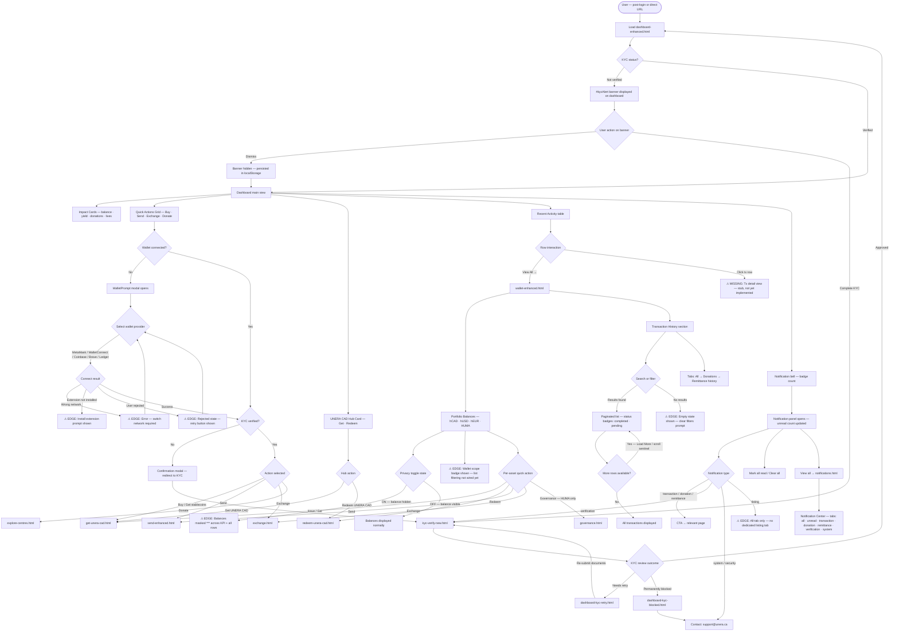
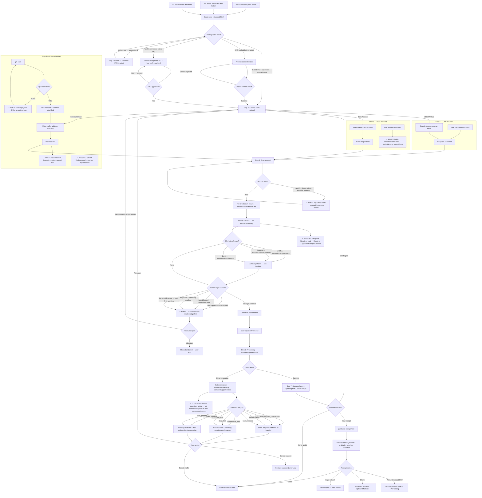

# User Flow Diagrams — Stablecoin Management & Remittance

**Last updated:** May 2026
**Source pages:** `NewUnera/dashboard-enhanced.html` · `NewUnera/wallet-enhanced.html` · `NewUnera/send-enhanced.html` · `NewUnera/notifications.html` · `NewUnera/purchase-receipt.html`
**Feature tracker rows:** Stablecoin Management · Stablecoin Remittance

---

## How to read these diagrams

| Node shape | Meaning |
|---|---|
| Rectangle `[ ]` | Screen, state, or action |
| Diamond `{ }` | Decision / branch point |
| Rounded `([ ])` | Start / end point |
| `⚠ MISSING` prefix | Feature identified in tracker but not yet implemented in the design prototype |
| `⚠ EDGE` prefix | Edge case — alternate or degenerate state |
| `⚠ PROTOTYPE` prefix | Stub behaviour present in prototype only; not production-ready |

---

## Flow 1 — Stablecoin Management

### Scope

This flow covers the six **Stablecoin Management** sub-features from the feature tracker:

1. Display current stablecoin balances — KPI hero on Dashboard + portfolio rows on Wallet
2. View recent transactions with status (completed, pending)
3. Quick buttons for sending or purchasing stablecoins
4. Simple visual summaries of activity and balances
5. Alerts for transaction statuses — notification bell + inbox
6. Access donation and remittance history in one place

**Entry points:** post-login redirect · direct URL to `dashboard-enhanced.html` · direct URL to `wallet-enhanced.html`

**Exits:** `get-unera-cad.html` · `redeem-unera-cad.html` · `send-enhanced.html` · `exchange.html` · `governance.html` · `notifications.html` · `explore-centres.html`

---

### Missing features — Flow 1

| # | Feature | Status | Notes |
|---|---------|--------|-------|
| 1 | Transaction detail view | Not implemented | Row click in activity table is a stub; `showTransactionDetail(txId)` is `/* ... */` |
| 2 | Wallet scope filtering | Not wired | `activeWalletScope` state exists but is not applied to transaction list query |
| 3 | `listing` notification tab | No dedicated tab | Listing notifications surface under All only |

---

## Flow 2 — Stablecoin Remittance (Send Flow)

### Scope

This flow covers the four **Stablecoin Remittance** sub-features from the feature tracker:

1. Send crypto to wallet address
2. Payee wallet management — **Saved wallets panel is missing** (noted in diagram)
3. Crypto-to-Crypto matching for cashing — **Recipient Receives card is missing** (noted in diagram)
4. Transfer confirmation / receipt

**Entry points:** Dashboard Quick Action "Send" · Wallet per-asset "Send" button · Top nav Transact link

**Exits:** `purchase-receipt.html` · `wallet-enhanced.html` · `kyc-verify-new.html` · support contact

---

### Missing features — Flow 2

| # | Feature | Status | Notes |
|---|---------|--------|-------|
| 1 | Saved Wallets panel | Not implemented | Feature tracker: "Extend Send to External Wallet branch with Saved wallets panel mirroring `.saved-methods-list` pattern" |
| 2 | Recipient Receives card — Crypto-to-Crypto | Not implemented | Feature tracker: "Add Recipient receives card in review step — e.g. USDC on Base" |
| 3 | Add bank account form | Prototype stub only | `showAddBankMock()` fires `alert()` — no real modal or form |
| 4 | Deep-link asset pre-selection | Not wired | `?asset=` query param from Wallet page not read in send script |
| 5 | Dynamic receipt data | Not implemented | `purchase-receipt.html` amounts/IDs are hardcoded in HTML; no URL-driven receipt state machine |
| 6 | Pending/failed delivery states on receipt | Not implemented | Delivery tracker CSS classes exist but JS state machine not built; only success specimen rendered |
